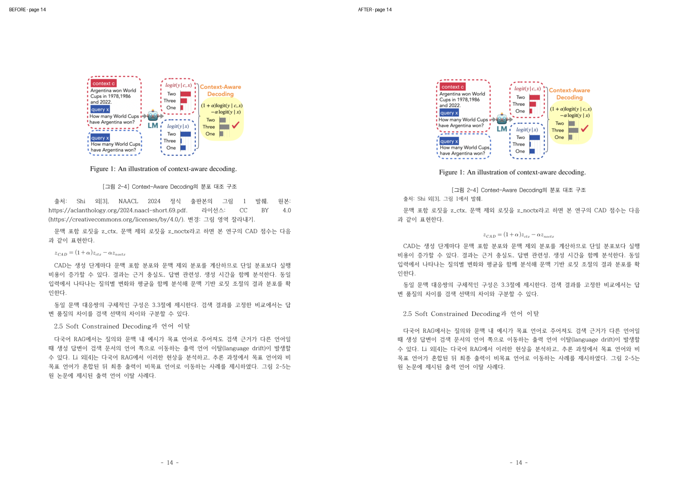
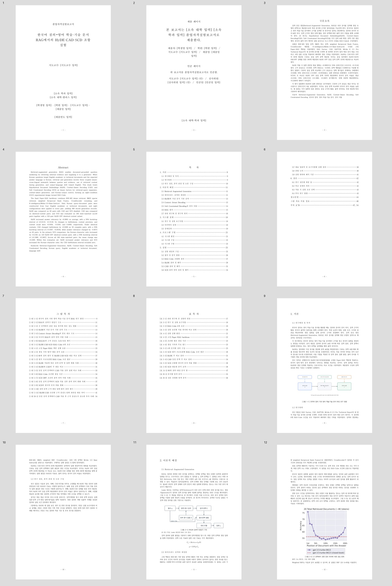
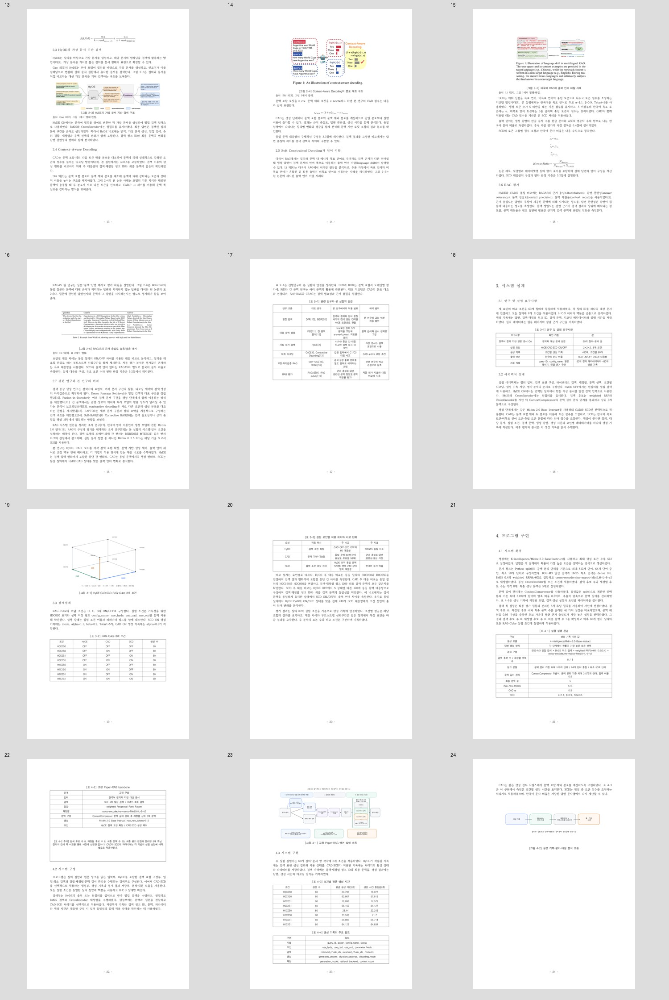
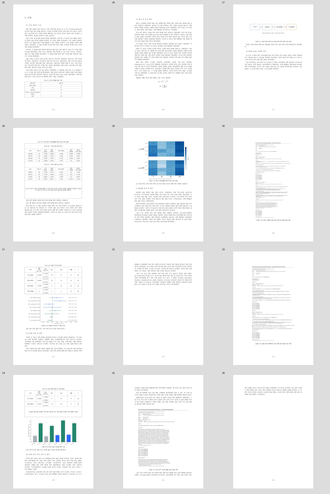
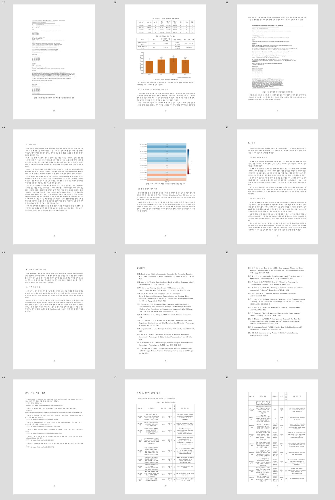
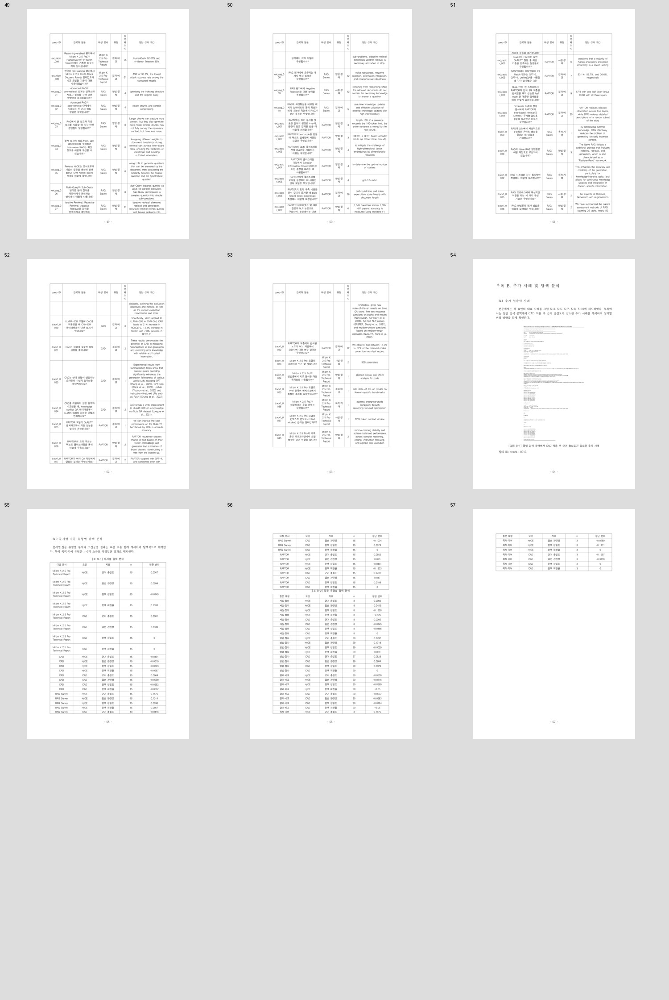

# 최종 조판·출처 표기·학술 문체 전수 교정 감사

검토일: 2026-10-09. 시작 HEAD: `02d246962d4ec6f6832602654c0621132b87844a` (당시 origin/main 일치). 최종 산출물은 아래 해시로 식별한다. 이 보고서의 커밋 자신을 본문에 쓰는 순환을 피하기 위해 최종 기록 커밋은 Git에서 이 보고서의 최신 변경 커밋으로 확인하며, 산출물 반영 커밋 및 해당 SHA의 CI는 완료 후 아래에 기록한다.

## 수행 범위와 근거

사용자의 최종 조판 요청을 기준으로 원고·HWPX 빌드·검증·웹한글 PDF를 수정했다. 원고 본문, 초록, 목차, 캡션, 참고문헌, 부록 설명을 순서대로 검토했다. 이전 문체 기준 `68f83f7`의 1.3·2.1·2.2·5.8·5.9·6.1·6.2를 현재 원고와 비교했다. 60질의 근거, 실험 수치와 현재 수정 사항을 유지했다. 이전 검증 로그를 이번 직접 실행 결과로 대신하지 않았다.

## 그림 2-4의 수정 전후

기존 웹한글 PDF 54쪽의 14쪽에서는 출처·원본 URL·라이선스 URL·수정 기록을 양쪽 정렬 문단에 나열하여 단어 사이가 과도하게 벌어졌다. 수정 PDF 57쪽의 14쪽에서는 `출처: Shi 외[3], 그림 1에서 발췌.`를 9pt·왼쪽 정렬·줄간격 130%의 별도 문단으로 두었다. 그림 제목과 출처는 같은 시각적 묶음이며 출처 아래 8pt를 두어 다음 본문과 구분했다. 실제 그림 PNG 바이트와 종횡비는 같다.



수정 전: `LAYOUT_COMPARISON/figure2-4_before.png`; 수정 후: `LAYOUT_COMPARISON/figure2-4_after.png`. 웹한글 실제 화면: `../DELIVERY/WEB_LAYOUT_REVIEW.jpg`.

## 최종 그림 출처와 이용 정보

| 그림 | 그림 바로 아래 출처 |
|---|---|
| 2-1 | 본 연구 작성. Lewis 외[1]의 RAG 구조 참고. |
| 2-2 | 출처: Liu 외[12], 그림 1에서 발췌. |
| 2-3 | 출처: Gao 외[2], 그림 1에서 발췌·편집. |
| 2-4 | 출처: Shi 외[3], 그림 1에서 발췌. |
| 2-5 | 출처: Li 외[4], 그림 1에서 발췌·편집. |
| 2-6 | 출처: Es 외[9], 표 2에서 발췌. |

참고문헌 22편을 그대로 두고, 참고문헌 뒤 46쪽에 「그림 자료 이용 정보」를 추가했다. 각 그림의 저작자·참고문헌 번호·출판본/버전·원본 개체·편집 내역·원본 URL을 연결했다. 2-2~2-6의 공통 CC BY 4.0 안내와 링크를 명시했다. 2-1은 독립 도식으로서 Lewis 외[1] 구조를 참고한 본 연구 제작물로 구분했다. 2-3 OpenAI 로고, 2-5 OpenAI·Ollama 로고 생략 기록을 이 구역에 보존했다. 라이선스와 원본 해시를 제거하지 않았다.

CC BY 4.0의 저작자·원본·라이선스·변경 표시 요구사항은 [공식 라이선스 안내](https://creativecommons.org/licenses/by/4.0/) 및 [ACL Anthology copyright FAQ](https://aclanthology.org/faq/copyright/)와 대조했다. `SUBMISSION_PROVENANCE.json`의 기존 권리·원본·버전·이미지 해시 13개 필드는 시작 HEAD와 동일하다. 하이퍼링크 7개는 실제 HWPX 필드로 저장하고 XML 목표 URL을 검사했다. 웹한글 PDF에는 URL이 모두 표시되지만 내보내기 과정에서 링크 주석은 생성되지 않았다(URI annotations=0). PDF에서도 주소를 선택·복사하여 원문과 라이선스를 확인할 수 있다.

## 실제 문단 속성과 학교 양식

학교의 원본 19개 스타일 정의와 글꼴·폭·자간·쪽 크기·여백·단을 유지하고 역할별 파생 paraPr/charPr을 참조했다. 1pt=100 HWPUNIT이며 python-hwpx의 공개 `ensure_paragraph_format`으로 `hp:case` 여백과 학교 양식에 맞는 `hp:default` 여백을 함께 저장했다. 빈 문단을 넣어 간격을 만들지 않았다. 출처·이용 정보·표 주석은 원래 학교 본문 charPr의 글꼴·자간·폭을 그대로 복제해 height=900(9pt)으로 적용했다. 본문의 원래 160% 줄간격과 정렬을 유지했다.

| 역할 | 문단 앞/뒤 pt | 줄간격 % | 정렬 | 다음 문단 유지 | 문단 줄 유지 |
|---|---|---|---|---|
| body | 0/4 | 학교 값 유지 | 학교 값 유지 | False | False |
| chapter | 0/12 | 학교 값 유지 | 학교 값 유지 | True | True |
| section | 14/7 | 학교 값 유지 | 학교 값 유지 | True | True |
| picture | 6/3 | 100 | CENTER | True | True |
| figure_caption | 0/8 | 140 | 학교 값 유지 | False | True |
| figure_caption_source | 0/2 | 140 | 학교 값 유지 | True | True |
| figure_source | 0/8 | 130 | LEFT | False | True |
| table_caption | 8/3 | 140 | 학교 값 유지 | True | True |
| table | 0/8 | 100 | 학교 값 유지 | False | False |
| equation | 6/6 | 130 | CENTER | False | True |
| reference | 3/4 | 학교 값 유지 | LEFT | False | True |
| usage | 0/5 | 140 | LEFT | False | True |
| usage_entry | 7/2 | 140 | LEFT | True | True |
| usage_url | 0/5 | 130 | LEFT | False | True |
| table_note | 0/6 | 140 | LEFT | False | True |

모든 역할에서 widowOrphan을 적용했다. 장·절은 keepWithNext/keepLines로 제목과 다음 문단을 연결했다. 그림 문단은 CENTER, 캡션과 출처는 다음 문단 연결 여부를 역할별로 구분했다. 수식은 원래 편집 가능한 개체를 가운데 정렬하고 앞뒤 6pt를 적용했다. 표 제목 앞 8pt·뒤 3pt, 표 뒤 8pt를 적용했다. 50000 HWPUNIT 이하 짧은 표는 treatAsChar=1로 제목과 함께 흐르게 하였다. 긴 부록 표는 treatAsChar=0, 셀 단위 쪽나눔과 머리글 반복을 유지했다. 첫 웹 출력에서 발견한 표 5-4 제목 분리는 이 속성으로 고쳤다.

4.3·5.3·6.3 앞의 수동 쪽나눔을 해제하여 절 제목의 유지 속성에 따라 흐르게 했다. 큰 입출력 이미지의 최대 표시 높이는 58000 HWPUNIT, 부록 B-1은 44000으로 조정하여 소개 문단·그림·캡션이 같은 쪽에 들어가도록 했다. 원본 이미지·내용·비율은 유지했다.

실제 XML 역할 검사 291개 문단. 각 문단의 ID·paraPrIDRef·역할은 `../DELIVERY/HWPX_STRUCTURAL_QA.json`의 layout.paragraphs에, 학교 styleIDRef/파생 속성 대응은 최종 build.json의 layout에 기록했다. 검증기는 ZIP에서 역할을 독립 분류하여 정렬·여백·줄간격·keep 속성·글자 크기·URL 필드를 검사한다.

## 실제 수정한 문장

### 수정 1

이전: 영어 논문에 대해 한국어로 질문할 때는 질문과 근거 문서의 언어 차이, 검색 근거의 답변 반영, 한국어 출력 유지가 함께 문제가 된다.

수정: 한국어 질의로 영어 학술·기술 문서를 활용할 때는 질의와 문서의 언어 차이, 검색 근거의 활용, 한국어 출력의 일관성을 함께 고려해야 한다.

판단: 사용자 제시 자연화 기준 적용; 정의 중복·압축형 통계 표현·후속 연구의 반복 서술 정리. 기술적 조건과 측정 대상 보존.

### 수정 2

이전: 출력 언어는 생성 답변의 한글 문자 수를 한글 문자와 ASCII 영문자 수의 합으로 나눈 한국어 문자 비율로 측정하였다. 한국어 문자 비율은 생성 답변의 출력 언어 구성을 나타내는 지표이다. 후속 사람 평가의 측정 항목은 6.4절에 제안하였다.

수정: 출력 언어는 생성 답변의 한글 문자 수를 한글 문자와 ASCII 영문자 수의 합으로 나눈 한국어 문자 비율로 측정하였다. 후속 사람 평가의 측정 항목은 6.4절에 정리하였다.

판단: 사용자 제시 자연화 기준 적용; 정의 중복·압축형 통계 표현·후속 연구의 반복 서술 정리. 기술적 조건과 측정 대상 보존.

### 수정 3

이전: 논문 제목, 모델명과 데이터셋명 등 영어 표기가 포함된 답변에도 같은 계산 규칙을 적용하였다. 따라서 한국어 문자 비율은 이러한 혼합 표기를 포함한 실제 답변의 언어 구성을 반영한다. SCD 대응쌍의 구성과 변화 판정 기준은 5.2절에 설명한다.

수정: 논문 제목, 모델명과 데이터셋명 등의 영어 표기를 포함하여 실제 답변의 언어 구성을 계산하였다. SCD 대응쌍의 구성과 변화 판정 기준은 5.2절에 설명한다.

판단: 사용자 제시 자연화 기준 적용; 정의 중복·압축형 통계 표현·후속 연구의 반복 서술 정리. 기술적 조건과 측정 대상 보존.

### 수정 4

이전: 증가/감소/동률 19/32/9이다.

수정: 증가 19쌍, 감소 32쌍, 동률 9쌍으로 나타났다.

판단: 사용자 제시 자연화 기준 적용; 정의 중복·압축형 통계 표현·후속 연구의 반복 서술 정리. 기술적 조건과 측정 대상 보존.

### 수정 5

이전: 평가는 영어 학술·기술 문서 4개의 한국어 질의 60개, K-intelligence/Midm-2.0-Base-Instruct와 CAD α=0.5 설정으로 수행하였다. 평가 집합은 각 문서의 원문 페이지와 정답 근거 구간을 확인한 답변 가능 질의 15개씩으로 구성하였다.

수정: 영어 학술·기술 문서 4종에 대해 문서별 15개씩, 총 60개의 한국어 질의를 구성하였다. 각 질의의 원문 페이지와 정답 근거 구간을 확인하고, K-intelligence/Midm-2.0-Base-Instruct와 CAD α=0.5 설정으로 평가하였다.

판단: 사용자 제시 자연화 기준 적용; 정의 중복·압축형 통계 표현·후속 연구의 반복 서술 정리. 기술적 조건과 측정 대상 보존.

### 수정 6

이전: 후속 연구에서는 답변 불가능 질의, 오문서 지정 질의와 무근거 입력을 추가하여 근거 부족 상황에서의 응답을 분석할 것을 제안한다. 문서 도메인과 생성 모델·토크나이저를 확대한 비교를 통해 현재 결과의 재현 범위를 평가할 것을 제안한다.

수정: 후속 연구는 평가 상황의 확장과 기법별 처리 과정의 분리, 사람 평가를 중심으로 진행할 수 있다. 답변 불가능 질의, 오문서 지정 질의와 무근거 입력을 추가하여 근거 부족 상황에서의 응답을 분석한다. 문서 도메인과 생성 모델·토크나이저를 확대하여 결과의 재현 범위를 평가한다.

판단: 사용자 제시 자연화 기준 적용; 정의 중복·압축형 통계 표현·후속 연구의 반복 서술 정리. 기술적 조건과 측정 대상 보존.

### 수정 7

이전: HyDE의 후속 실험으로는 번역, 가상 문서 생성과 밀집 검색 변경을 분리한 비교와 동일 질의의 반복 샘플링을 제안한다. CAD는 α와 문맥 길이를 달리하여 답변 품질과 생성 시간의 관계를 측정하고, 질문 복잡도와 정보 통합 요구에 따른 질의별 변화 분포를 분석할 것을 제안한다. SCD는 사람 블라인드 평가를 통해 자연스러움, 번역 충실도, 내용 정확성과 전문용어 보존을 각각 측정할 것을 제안한다. 다국어 재정렬 모델과 현재 CrossEncoder의 비교도 검색 구성에 따른 차이를 확인할 후속 실험으로 제안한다.

수정: HyDE는 번역, 가상 문서 생성과 밀집 검색 변경을 분리하여 비교하고, 동일 질의를 반복 샘플링하여 결과의 변동을 측정한다. CAD는 α와 문맥 길이를 달리하여 답변 품질과 생성 시간의 관계를 측정하고, 질문 복잡도와 정보 통합 요구에 따른 질의별 변화 분포를 분석한다. SCD는 사람 블라인드 평가로 자연스러움, 번역 충실도, 내용 정확성과 전문용어 보존을 각각 측정한다. 다국어 재정렬 모델과 현재 CrossEncoder를 비교하여 검색 구성에 따른 차이를 확인한다.

판단: 사용자 제시 자연화 기준 적용; 정의 중복·압축형 통계 표현·후속 연구의 반복 서술 정리. 기술적 조건과 측정 대상 보존.

### 수정 8

이전: 그림 제작: 본 연구. 개념적 근거: Lewis 외[1].

수정: 본 연구 작성. Lewis 외[1]의 RAG 구조 참고.

판단: 그림 아래 간결한 출처; 상세 이용 정보는 참고문헌 뒤 구역으로 이동.

### 수정 9

이전: 출처: Liu 외[12], TACL 정식 출판본의 그림 1 중 도표 발췌. 원본: https://aclanthology.org/2024.tacl-1.9.pdf. 라이선스: CC BY 4.0 (https://creativecommons.org/licenses/by/4.0/). 변경: 도표 영역 잘라내기.

수정: 출처: Liu 외[12], 그림 1에서 발췌.

판단: 그림 아래 간결한 출처; 상세 이용 정보는 참고문헌 뒤 구역으로 이동.

### 수정 10

이전: 출처: Gao 외[2], ACL 2023 정식 출판본의 그림 1 중 도식 발췌. 원본: https://aclanthology.org/2023.acl-long.99.pdf. 라이선스: CC BY 4.0 (https://creativecommons.org/licenses/by/4.0/). 변경: 도식 영역 잘라내기, OpenAI 로고 생략.

수정: 출처: Gao 외[2], 그림 1에서 발췌·편집.

판단: 그림 아래 간결한 출처; 상세 이용 정보는 참고문헌 뒤 구역으로 이동.

### 수정 11

이전: 출처: Shi 외[3], NAACL 2024 정식 출판본의 그림 1 발췌. 원본: https://aclanthology.org/2024.naacl-short.69.pdf. 라이선스: CC BY 4.0 (https://creativecommons.org/licenses/by/4.0/). 변경: 그림 영역 잘라내기.

수정: 출처: Shi 외[3], 그림 1에서 발췌.

판단: 그림 아래 간결한 출처; 상세 이용 정보는 참고문헌 뒤 구역으로 이동.

### 수정 12

이전: 출처: Li 외[4], arXiv:2511.09984v1의 그림 1 발췌. 원본: https://arxiv.org/pdf/2511.09984v1. 라이선스: CC BY 4.0 (https://creativecommons.org/licenses/by/4.0/). 변경: 그림 영역 잘라내기, OpenAI·Ollama 로고 생략.

수정: 출처: Li 외[4], 그림 1에서 발췌·편집.

판단: 그림 아래 간결한 출처; 상세 이용 정보는 참고문헌 뒤 구역으로 이동.

### 수정 13

이전: 출처: Es 외[9], arXiv:2309.15217v2의 표 2 발췌. 원본: https://arxiv.org/pdf/2309.15217v2. 라이선스: CC BY 4.0 (https://creativecommons.org/licenses/by/4.0/). 변경: 표 영역 잘라내기.

수정: 출처: Es 외[9], 표 2에서 발췌.

판단: 그림 아래 간결한 출처; 상세 이용 정보는 참고문헌 뒤 구역으로 이동.

## 남은 부정형·방어형 검색 후보 전수 판단

최종 561개 검토 단위 중 검색 후보 18개는 기술적 정의·통계·자료 분류에 필요한 표현이다. 모두 문맥을 읽고 유지 판단과 이유를 기록했다. 미결 후보는 0개다. 원자료 질의·저장된 답변의 부정 표현은 실험 증거이므로 편집 대상에서 분리하고 보존 검사했다. 다음은 최종 원고 후보 전부이며 이전 본문 문장 삭제 이력은 PROSE_SENTENCE_REVIEW.json의 원래 감사 기록을 보존한다.

### 후보 1: 원고 25행

근거 충실도는 +0.0436, 문맥 정밀도는 -0.0343, 문맥 재현율은 0.0000으로 지표별 방향이 달랐다.

판정: retain / F. 음수인 문맥 정밀도·CAD 답변 관련성과 58쌍의 신뢰구간을 초록에서 정확히 보고한다.

### 후보 2: 원고 25행

CAD의 동일 문맥 비교에서 근거 충실도는 양쪽 평가값이 존재하는 58쌍에서 +0.0288, 95% 신뢰구간은 [-0.0367, +0.0934]였고, 답변 관련성은 60쌍에서 -0.0073이었다.

판정: retain / F. 음수인 문맥 정밀도·CAD 답변 관련성과 58쌍의 신뢰구간을 초록에서 정확히 보고한다.

### 후보 3: 원고 27행

CAD의 근거 충실도 평균 차이는 양수였으나 신뢰구간이 0을 포함하였다.

판정: retain / F. CAD 평균 차이의 부호와 신뢰구간의 0 포함 여부는 서로 다른 통계 사실이다.

### 후보 4: 원고 184행

밀집 검색은 질의와 문서 구간의 의미적 유사성을 이용해 어휘가 정확히 일치하지 않아도 관련 후보를 찾고, BM25는 모델명·약어·수치처럼 표면 일치가 중요한 표현을 보완한다[5][6].

판정: retain / F. 밀집 검색의 의미 유사성과 BM25의 표면 일치를 구분하는 기술 설명이다.

### 후보 5: 원고 292행

그림 2-6은 WikiEval의 동일 질문과 문맥에 대해 근거가 지지하는 답변과 지지하지 않는 답변을 대비한 원 논문의 표 2이다.

판정: retain / F. 원 논문 표 2의 두 답변을 대조하여 근거 충실도 평가의 측정 대상을 설명한다.

### 후보 6: 원고 603행

근거 충실도 평균 대응 차이는 +0.0436, 95% 신뢰구간은 [-0.0262, +0.1153]이며 증가 24개, 감소 21개, 동률 15개였다.

판정: retain / F. HyDE 지표별 평균·신뢰구간·증가/감소/동률의 실제 측정 결과이다.

### 후보 7: 원고 603행

문맥 정밀도의 평균 대응 차이는 -0.0343이었고, 문맥 재현율의 평균 대응 차이는 0.0000이었다.

판정: retain / F. HyDE 지표별 평균·신뢰구간·증가/감소/동률의 실제 측정 결과이다.

### 후보 8: 원고 605행

반면 근거 충실도의 신뢰구간은 0을 포함하고 문맥 지표의 변화 방향도 달랐다.

판정: retain / F. 답변 관련성과 근거 충실도 신뢰구간의 0 포함 여부 차이를 정확히 기술한다.

### 후보 9: 원고 635행

근거 충실도는 양쪽 평가값이 존재하는 58쌍에서 평균 +0.0288이었으며, 95% 신뢰구간 [-0.0367, +0.0934]은 0을 포함하였다.

판정: retain / F. CAD 58쌍의 평균·신뢰구간의 0 포함과 증가·감소·동률을 정확히 보고한다.

### 후보 10: 원고 635행

답변 관련성은 60쌍에서 -0.0073, 신뢰구간 [-0.0855, +0.0719], 증가 19쌍, 감소 32쌍, 동률 9쌍으로 나타났다.

판정: retain / F. CAD 답변 관련성 60쌍의 음수 평균·신뢰구간·증가 19/감소 32/동률 9를 정확히 보고한다.

### 후보 11: 원고 665행

동일 질의에서 HyDE·CAD의 ON/OFF 상태를 맞춘 전체 240개 SCD 대응쌍에서는 평균 +0.2289, 95% 신뢰구간 [+0.2051, +0.2532]였으며, +0.02를 초과한 증가는 219개, -0.02보다 작은 감소는 10개, 그 사이 동률은 11개다.

판정: retain / F. SCD 240쌍의 증가·감소·동률 판정 임계값과 관측 분포를 보고한다.

### 후보 12: 원고 729행

검색 표현을 확장한 HyDE는 답변 관련성에서 양의 평균 차이를 보였지만, 문맥 정밀도는 -0.0343, 문맥 재현율은 0.0000이었다.

판정: retain / F. HyDE의 답변 관련성 증가와 문맥 정밀도 음수 결과를 함께 보존한다.

### 후보 13: 원고 731행

CAD 동일 문맥 비교에서 근거 충실도의 평균 대응 차이는 +0.0288, 답변 관련성은 -0.0073이었다.

판정: retain / F. CAD 두 지표의 부호와 95% 신뢰구간이 0을 포함한다는 통계 사실을 보존한다.

### 후보 14: 원고 731행

두 지표의 95% 부트스트랩 신뢰구간은 모두 0을 포함하였다.

판정: retain / F. CAD 두 지표의 부호와 95% 신뢰구간이 0을 포함한다는 통계 사실을 보존한다.

### 후보 15: 원고 737행

CAD의 답변 관련성 대응 차이는 H0S0 -0.0073, H1S0 -0.0588이었으며, SCD ON에서는 H0S1 -0.0377, H1S1 -0.0427이었다.

판정: retain / F. CAD의 HyDE·SCD 조건군별 음수 답변 관련성 차이를 정확히 보고한다.

### 후보 16: 원고 757행

근거 충실도는 +0.0436, 문맥 정밀도는 -0.0343, 문맥 재현율은 0.0000이었다.

판정: retain / F. HyDE의 양수·음수·0 변화 값을 결론에서 보존한다.

### 후보 17: 원고 759행

두 번째 연구 질문에서 CAD의 동일 문맥 근거 충실도 평균 대응 차이는 58개 유효쌍에서 +0.0288, 95% 신뢰구간은 [-0.0367, +0.0934]였다.

판정: retain / F. CAD의 58쌍 근거 충실도와 60쌍 답변 관련성의 값·신뢰구간을 결론에서 보고한다.

### 후보 18: 원고 759행

답변 관련성은 60쌍에서 -0.0073이었고 신뢰구간은 0을 포함하였다.

판정: retain / F. CAD의 58쌍 근거 충실도와 60쌍 답변 관련성의 값·신뢰구간을 결론에서 보고한다.

## 실제 PDF 검수와 목차

기존 54쪽 전체를 렌더링하여 문제를 조사하고, 새 조판 기준 57쪽과 최종 목차 반영 57쪽을 각각 전 페이지 렌더링하여 검수했다. 첫 56쪽 출력에서 5.3 제목 단독 쪽과 표 5-4 제목 분리를 확인하여 최종본에서 수정했다. 최종본과 조판 기준본은 1.5배 렌더 픽셀 비교에서 목차 5~8쪽만 달라지고 나머지 53쪽은 동일했다. 비교 근거는 LAYOUT_FINAL_PDF_COMPARISON.json, 전 쪽 기록은 LAYOUT_PAGE_QA.json이다.

| 최종 쪽 | 검수 결과 |
|---|---|
| 1~4 | 표지·제출/인준문·국문/영문 초록 유지. 개인 정보 입력 자리 유지. |
| 5~8 | 실제 제목·그림·표 위치와 목차 쪽번호를 확대 대조. 참고문헌 44, 이용 정보 46, 부록 A/B 47/54. |
| 9~17 | 서론·이론적 배경. 그림 2-1~2-6의 캡션과 짧은 출처 연결, 14쪽 CAD 수식·본문 간격 확인. |
| 18~24 | 시스템·구현. 절 제목 간격과 그림·표 연결, 표 4-2/4-3/4-4 제목 배치 확인. |
| 25~29 | 평가 절차·평균 결과. 5.3 제목 단독 쪽 해소, 표 5-2와 그림 5-2 읽기 흐름 확인. |
| 30~34 | HyDE/CAD 증거·통계. 큰 증거 그림의 한 쪽 배치, 표 5-4 제목과 표가 34쪽 함께 배치됨. |
| 35~41 | SCD 증거·분석. 36쪽에는 앞 문단의 이어지는 설명이 있으며 다음 전체 그림을 위해 남은 공간이 생김. 그림 5-7/5-8과 캡션은 분리되지 않음. |
| 42~43 | 결론·후속 연구. 절 제목 다음 본문 연결과 자연화 문장 확인. |
| 44~46 | 참고문헌 22개, 이용 정보 6개 항목과 URL. 왼쪽 정렬, 정상 줄넘김, 긴 URL 공간 벌어짐 없음. |
| 47~53 | 60질의 부록 A. 연속 표의 머리글 반복·셀 쪽 연결·원문 내용 유지. |
| 54 | 부록 B 소개·추가 증거 그림·캡션·query ID가 같은 쪽. |
| 55~57 | 긴 탐색 표의 연속 배치와 마지막 일부 행. 추가 blank page 없음. |

전 페이지 개관 증빙: 다음 5개 이미지에 최종 57쪽을 모두 담았다. 세부 확인은 5~8·14·34·46·54쪽을 확대하여 수행했다.











## 연구 수치·개체·학교 양식 보존

시작 Git HEAD의 데이터·표·그림·증거 파일 36개를 바이트 또는 Git LF 기준으로 대조했다. 원고 코드/표/수식 원문 fenced block 28개, 기존 그림 권리 필드, HWPX 표 셀 1,092개, 네이티브 수식 10개의 script, 내장 이미지 25개 해시(학교 자산 포함)가 동일하다. LAYOUT_DATA_PRESERVATION.json에 파일별 결과를 저장했다. 본문 표 17개·그림 22개·참고문헌 22개·60질의·8조건·480생성은 유지되었다. SCD 240대응쌍·CAD의 통계와 누락/분모·fixed alpha·동일 문맥 비교 조건도 기존 검증기가 계속 검사한다. 서비스와 실험 실행 코드를 변경하거나 모델/평가 API를 다시 실행하지 않았다.

## 이번 직접 실행 검증

실행 환경: `.venv-hwpx/Scripts/python.exe`(hwpx·openpyxl·검증); PDF 렌더/추출은 PyMuPDF가 설치된 `E:/Anaconda/python.exe`. 한국어 텍스트는 UTF-8로 처리했다.

```text
python -X utf8 FINALDOCS/VALIDATION/verify_finaldocs_60q.py  PASS
python -X utf8 FINALDOCS/BUILD/verify_thesis_hwpx.py  PASS
python -X utf8 -m unittest discover -s FINALDOCS/VALIDATION -p test_*.py  22 PASS
python -X utf8 -m unittest discover -s FINALDOCS/BUILD -p test_*.py  12 PASS
python -X utf8 -m compileall -q FINALDOCS/BUILD FINALDOCS/VALIDATION  PASS
python -m black --check <이번 변경 Python 10개>  PASS
python -m ruff check FINALDOCS/BUILD <이번 변경 VALIDATION Python 4개>  PASS
git diff --check  PASS
```

실행 출력은 `../DELIVERY/LOGS/layout-local-checks.txt`와 `layout-style-checks.txt`에 저장한다. 새 회귀 검사: 잘못된 그림 번호/참고문헌, 누락 이용 정보·URL, 길어진 출처, 출처 양쪽 정렬·간격·글자 크기, 절 keepWithNext 해제, 하이퍼링크 필드 소실, 짧은 표 treatAsChar 해제 시 실패. 처음 테스트용 XML 재직렬화가 standalone 선언을 잃어 패키지 단계에서 실패하는 것을 수정해, 의도한 조판 검증까지 도달하는지 확인했다. 기존 내용·수치 검증을 약화하지 않았다.

실제 웹한글에서 이번 최종 HWPX 업로드→문서 열림→PDF 내보내기→14쪽 이동을 수행했다. 최종 live URL: https://webhwp.hancomdocs.com/webhwp/?mode=HWP_EDITOR&docId=l6qGmLF3qGF3x9l6t5x2DTaHl2DTyGcX&lang=ko_KR . 이번에는 최종 문서의 본문/셀 수정·저장·재열기 시험을 반복하지 않았다. 편집 가능한 표·수식은 네이티브 XML 및 실제 웹 표시로 확인했다. 이전 round-trip 편집 검증은 이전 감사 기록으로 구분한다.

## 최종 파일 해시

- `GRADUATION_REPORT_60Q_FINAL.hwpx`: `3aafae443d756bee59892945be31afb9548198cddce85f6444d5dccf7b74b3cf` (5,016,755 bytes)

- `GRADUATION_REPORT_60Q_FINAL.pdf`: `39c53822d92142f293e9818eefe01ba477fbb699a36ae1ddcdd69dd0f2c24d55` (5,593,729 bytes)


최종 PDF 실제 쪽수: **57**. 원고·조판 코드 fingerprint 및 실제 PDF/HWPX 해시는 PAGE_MAP_60Q.json과 DELIVERY_FILES_SHA256.json에 반영했다. 입력 원고·조판 코드가 변경되면 기존 페이지 맵 재사용을 빌드 단계에서 거부한다.

## GitHub 반영 및 CI

최종 제출 산출물·조판 코드 반영 HEAD: `5cc480633ae1541f44b6ee4d212e20ddeea001a4`. `origin/main`으로 푸시한 뒤 이 정확한 SHA의 세 워크플로가 모두 성공했다. 기록 전용 후속 커밋은 제출 파일을 변경하지 않으며, 마지막 저장소 HEAD는 `git rev-parse HEAD`, 본 보고서의 최신 기록 SHA는 `git log -1 --format=%H -- FINALDOCS/VALIDATION/FINAL_LAYOUT_AND_ATTRIBUTION_AUDIT.md`로 확인한다.

| 워크플로 | 결과 | 근거 |
|---|---|---|
| Thesis HWPX validation | success | [실제 run](https://github.com/LxNx-Hn/M_RAG/actions/runs/37830172564) |
| Publish Backend Image | success | [실제 run](https://github.com/LxNx-Hn/M_RAG/actions/runs/37830172718) |
| CI | success | [실제 run](https://github.com/LxNx-Hn/M_RAG/actions/runs/37830172586) |

논문 CI는 커밋된 산출물 검사·회귀 테스트 34개·학교 양식에서 재빌드·재검증까지 성공했다. 일반 CI는 프런트엔드 lint/TypeScript build/image와 백엔드 Ruff/Black/pytest/image를 성공했다. 이미지 게시도 성공했다. 원문 CI 상태는 `../DELIVERY/LOGS/layout-ci-artifacts.json`에 보존했다.

## 제출 전 남은 입력과 변경 시 주의

학교·학과·성명·학번·지도교수·심사위원·제출일 등의 사용자 제공 개인 정보 입력 자리를 유지했다. 이 정보의 입력은 아직 필요하다. 본문 내용이나 서식을 편집하면 쪽수가 달라질 수 있으므로 실제 웹한글 재출력과 PAGE_MAP 갱신이 필요하다. 큰 증거 그림 앞의 남은 공간과 마지막 표의 일부 행 페이지는 내용 보존과 그림/캡션·표 셀 연결을 따른 결과다. PDF 링크는 표시 URL로 확인한다. 기존 미추적 DOCX·DOCX 생성기·tmp는 보존하고 이번 커밋에 넣지 않는다.
