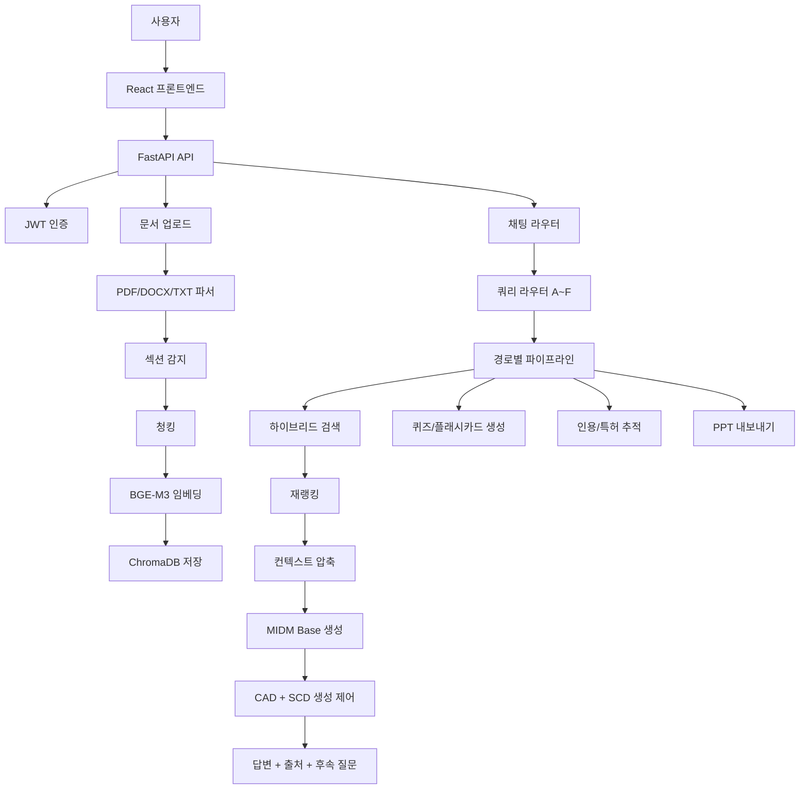

# M-RAG 아키텍처

## 문서 목적

이 문서는 현재 코드 기준으로 M-RAG가 어떤 층으로 나뉘고, 질문 유형 A~F마다 어떤 모듈이 실제로 동작하는지 설명한다

코드 근거

- 라우팅 정의 `backend/modules/query_router.py`
- 파이프라인 구현 `backend/pipelines/pipeline_a_simple_qa.py` ~ `backend/pipelines/pipeline_f_quiz.py`
- API 연결부 `backend/api/routers/chat.py`
- 모듈 구현 `backend/modules`

---

## 전체 흐름

---

## 런타임 계층

| 계층 | 주요 경로 | 역할 |
|---|---|---|
| API | `backend/api` | 인증, 문서 업로드, 채팅, 검색, 평가, 이력 |
| 모듈 | `backend/modules` | 파싱, 검색, 생성, 디코딩 제어, 추적, 질문 생성 |
| 파이프라인 | `backend/pipelines` | A~F 질문 유형별 실행 순서 |
| 실험 | `backend/evaluation` | Track 1/2 실험, RAGAS 평가, ablation |
| 스크립트 | `backend/scripts` | 모델 다운로드, 문서 인덱싱, 전체 실험 실행 |
| 프론트엔드 | `frontend/src` | 업로드, 채팅, PDF 뷰어, 출처, 퀴즈/플래시카드 표시 |

---

## 모듈 분류

현재 `backend/modules` 기준 실제 모듈 파일은 18개다

### 연구 핵심 모듈

| 모듈 | 파일 | 역할 |
|---|---|---|
| 임베딩 | `embedder.py` | BGE-M3 [2]로 문서와 질문을 1024차원 벡터로 변환 |
| 청킹 | `chunker.py` | 섹션 단위, 고정 크기, 문장 단위 청킹 [5, 24, 28] |
| 재랭커 | `reranker.py` | Cross-encoder로 검색 결과 재정렬 [14, 21] |
| 하이브리드 검색 | `hybrid_retriever.py` | Dense + BM25 + RRF 결합 검색 [22, 23] |
| 쿼리 라우터 | `query_router.py` | 질문을 A~F 경로로 분류 [7, 8, 17] |
| 섹션 감지 | `section_detector.py` | 논문/강의/특허/일반 문서의 섹션 구분 |
| 생성기 | `generator.py` | MIDM-2.0 Base Instruct 기반 답변 생성과 judge 보조 |
| CAD 디코더 | `cad_decoder.py` | 파라메트릭 지식 개입 억제 (logit 차감) [3, 4] |
| SCD 디코더 | `scd_decoder.py` | Language Drift 억제 (비목표 언어 토큰 패널티) [34] |
| 컨텍스트 압축 | `context_compressor.py` | 검색 결과를 생성 가능한 길이로 압축 [11, 12, 19] |
| 쿼리 확장 | `query_expander.py` | HyDE [6], 다중 쿼리 [26], 한영 번역 |
| 인용 추적 | `citation_tracker.py` | arXiv/Semantic Scholar 기반 인용 정보 추적 |
| 후속 질문 생성 | `followup_generator.py` | 답변 이후 후속 질문 후보 생성 |

### 확장/운영 모듈

| 모듈 | 파일 | 역할 |
|---|---|---|
| PDF 파서 | `pdf_parser.py` | PDF 텍스트 추출 |
| DOCX 파서 | `docx_parser.py` | DOCX/TXT 텍스트 추출 |
| 특허 추적 | `patent_tracker.py` | 특허 문서와 특허 질의 보조 |
| PPTX 내보내기 | `pptx_exporter.py` | 답변/출처를 발표 자료로 변환 |
| 벡터 저장소 | `vector_store.py` | ChromaDB collection 생성, 조회, 삭제 |

### 질문 생성 계층

질문 생성 계층은 사용자가 논문을 읽고 다음 탐색으로 넘어가게 하는 대화형 학습 계층이다

현재 구현은 두 갈래로 구성된다

| 기능 | 현재 코드 위치 | 분류 |
|---|---|---|
| 후속 질문 제안 | `backend/modules/followup_generator.py` | 대화 모듈 |
| 퀴즈/플래시카드 생성 | `backend/pipelines/pipeline_f_quiz.py` | F 경로 생성 파이프라인 |

후속 질문은 모든 답변 경로 뒤에서 다음 탐색 후보를 만든다

퀴즈/플래시카드 생성은 F 경로에서 검색, 재랭킹, 압축, 퀴즈 프롬프트, 생성기를 묶어 실행한다

---

## A~F 경로별 활성 모듈

| 경로 | 질문 유형 | 라우터 기준 | 주로 동작하는 모듈 | 출력 |
|---|---|---|---|---|
| A | 단순 QA | 일반 질문 | 쿼리 확장, 하이브리드 검색, 재랭커, 압축, 생성기, CAD, SCD, 후속 질문 | 근거 기반 답변 |
| B | 섹션 특화 | 방법론, 결과, 한계, 결론 | 섹션 감지, 섹션 필터 검색, 재랭커, 생성기, CAD, SCD, 후속 질문 | 특정 섹션 중심 답변 |
| C | 문서 비교 | 비교, 차이, vs | 문서별 검색, 비교 합성, 생성기, CAD, SCD, 후속 질문 | 여러 논문 비교 답변 |
| D | 인용/특허 | 인용, 참고문헌, 특허, prior art | 인용 추적, 특허 추적, 하이브리드 검색, 생성기, CAD, SCD, 후속 질문 | 인용/특허 맥락 답변 |
| E | 전체 요약 | 요약, overview | 계층적 청킹, 컨텍스트 압축, 생성기, CAD, SCD, 후속 질문 | 문서 요약 |
| F | 퀴즈/플래시카드 | 퀴즈, 문제, flashcard | 하이브리드 검색, 재랭커, 압축, 퀴즈 프롬프트, 생성기, CAD, SCD | 객관식 문제 또는 플래시카드 |

---

## 경로별 모듈 매트릭스

| 모듈 | A QA | B 섹션 | C 비교 | D 인용/특허 | E 요약 | F 퀴즈 |
|---|---:|---:|---:|---:|---:|---:|
| `query_router.py` | O | O | O | O | O | O |
| `query_expander.py` | O | 선택 | - | - | - | - |
| `section_detector.py` | 색인 시 | O | 색인 시 | 색인 시 | 색인 시 | 색인 시 |
| `hybrid_retriever.py` | O | O | O | O | O | O |
| `reranker.py` | O | O | 선택 | - | - | O |
| `context_compressor.py` | O | O | 선택 | 선택 | O | O |
| `citation_tracker.py` | - | - | - | O | - | - |
| `patent_tracker.py` | - | - | - | 특허 질의 시 | - | - |
| `generator.py` | O | O | O | O | O | O |
| `cad_decoder.py` | O | O | O | O | O | O |
| `scd_decoder.py` | O | O | O | O | O | O |
| `followup_generator.py` | O | O | O | O | O | O |
| `pipeline_f_quiz.py` 내부 퀴즈 생성 | - | - | - | - | - | O |

표기 기준

- `O`는 해당 경로에서 명시적으로 사용하는 모듈
- `선택`은 코드 경로나 설정에 따라 사용되는 모듈
- `색인 시`는 업로드/인덱싱 단계에서 적용되는 모듈
- `-`는 해당 경로의 핵심 동작이 아닌 모듈

---

## 채팅 API와 파이프라인 연결

| API | 역할 |
|---|---|
| `POST /api/chat/query` | 라우터 결정 후 A~F 파이프라인 실행 |
| `POST /api/chat/query/stream` | SSE 기반 스트리밍 답변 |
| `POST /api/chat/search` | 검색 결과 확인 |
| `POST /api/chat/judge` | 실험 평가용 judge 텍스트 생성 |
| `POST /api/chat/export/ppt` | 답변/출처를 PPTX로 내보내기 |

`backend/api/routers/chat.py`는 `RouteType`에 따라 `pipeline_a_simple_qa.py`부터 `pipeline_f_quiz.py`까지 분기한다

---

## 모델 정책

- 논문 실험 경로는 `K-intelligence/Midm-2.0-Base-Instruct`와 transformers 직접 디코딩을 기준으로 한다
- 로컬 스모크 검증 경로는 `K-intelligence/Midm-2.0-Mini-Instruct`를 사용한다
- CAD/SCD 실험은 생성 logits 제어가 가능한 직접 디코딩 경로에서 수행한다
- vLLM과 외부 LLM API 논의는 `docs/PAPER/NEXT_STAGE_VLLM_CLAIM.md`에서 다룬다

---

## 데이터베이스 정책

- 논문 실험의 빠른 실행은 SQLite + SQLAlchemy
- 운영/서비스 경로는 PostgreSQL + SQLAlchemy
- 벡터 데이터는 ChromaDB에 저장
- 문서 collection은 사용자 기준으로 격리

---

## 문서 해석 주의

13개 연구 핵심 모듈은 논문 실험과 클레임의 중심 모듈이다

18개 전체 모듈 파일은 연구 핵심 모듈과 운영/입출력 모듈을 합친 현재 구현 단위다

F 경로의 퀴즈 생성은 `pipeline_f_quiz.py`가 담당한다. 후속 질문 생성은 `followup_generator.py`가 담당한다

참고문헌 번호(`[N]`)는 `docs/PAPER/THESIS.md`의 참고문헌 목록 기준이다 (총 39편)
