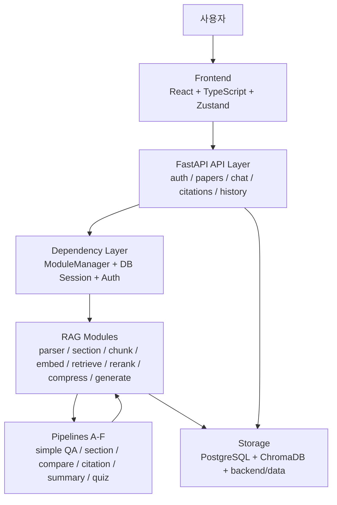
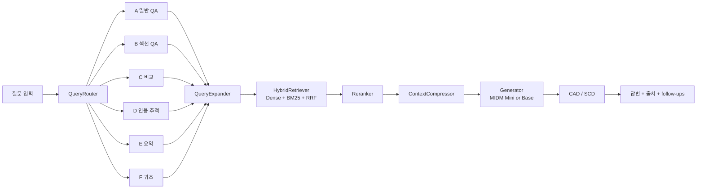

# M-RAG 아키텍처

- 문서 기준 2026-04-25
- 현재 저장소의 실제 실행 경로와 디렉터리 구조 기준

## 전체 구조도

## 질의응답 흐름도

## 계층 구조

### 1 프론트엔드

- 위치 `frontend/src`
- React + TypeScript + Zustand 기반
- 문서 목록, PDF 뷰어, 채팅, 인용 패널, 대화 이력을 담당

### 2 API 계층

- 위치 `backend/api`
- FastAPI 기반
- 인증, 업로드, 검색, 스트리밍, 인용, 대화 이력 API 제공

### 3 RAG 모듈 계층

- 위치 `backend/modules`
- 파서, 섹션 감지, 청킹, 임베딩, 벡터 저장, 검색, 리랭킹, 압축, 생성, 디코더를 담당

### 4 파이프라인 계층

- 위치 `backend/pipelines`
- 질의 유형에 따라 A~F 경로를 선택

### 5 실험과 자동 실행 계층

- 위치 `backend/evaluation`, `backend/scripts`
- 데이터 준비, track 실행, 결과 변환, 전체 자동 실행 담당

## 요청 흐름

### 문서 업로드 흐름

1. `routers/papers.py` 가 업로드 파일과 사용자 권한 검증
2. `pdf_parser.py` 또는 `docx_parser.py` 가 원문 추출
3. `section_detector.py` 가 문서 유형과 섹션 태깅
4. `chunker.py` 가 검색 단위 생성
5. `embedder.py` 가 임베딩 생성
6. `vector_store.py` 가 ChromaDB 저장
7. `models.py` 의 `Paper` 레코드에 메타데이터 저장

### 질의응답 흐름

1. `routers/chat.py` 가 요청과 인증 정보 수신
2. `query_router.py` 가 의도에 맞는 파이프라인 선택
3. `query_expander.py` 가 HyDE와 다중 질의 확장 수행
4. `hybrid_retriever.py` 가 Dense와 BM25를 결합 검색
5. `reranker.py` 가 상위 문맥 재정렬
6. `context_compressor.py` 가 LLM 입력 길이에 맞게 컨텍스트 압축
7. `generator.py` 가 최종 응답 생성
8. 필요 시 `cad_decoder.py` 와 `scd_decoder.py` 가 로짓 보정

## 파이프라인 맵

- Route A `pipeline_a_simple_qa.py`
  - 일반 QA
- Route B `pipeline_b_section.py`
  - 섹션 필터 기반 QA
- Route C `pipeline_c_compare.py`
  - 다중 문서 비교
- Route D `pipeline_d_citation.py`
  - 참고문헌과 특허 추적
- Route E `pipeline_e_summary.py`
  - 전체 요약
- Route F `pipeline_f_quiz.py`
  - 퀴즈와 플래시카드 생성

## 저장소 경계

- 업로드 원본 파일 `backend/data`
- 벡터 저장소 `backend/chroma_db`
- 실험 입력과 결과 `backend/evaluation`
- 애플리케이션 로그 `backend/logs`
- DB 모델과 대화 이력은 SQLAlchemy 세션을 통해 관리

## 모델 운영 정책

- 기본 로컬 생성 모델은 `K-intelligence/Midm-2.0-Mini-Instruct`
- Base 모델은 `GENERATION_MODEL` 환경변수로 선택형 유지
- Mini와 Base 모두 `bfloat16 + device_map=auto`
- 현재 아키텍처에는 양자화 경로를 포함하지 않음

## 실행 기준

- 연구용 로컬 실험의 기준 러너는 `backend/scripts/master_run.py`
- 결과 검증은 `backend/evaluation/results/*.json` 과 `TABLES.md`
- 로그 기준 완료 문구는 `MASTER RUN COMPLETE`

## 확장 가이드

- 새 라우트를 추가할 때는 `config.ROUTE_MAP`, `query_router.py`, `pipelines/`, `routers/chat.py` 를 함께 갱신
- 새 문서 파서를 추가할 때는 업로드 라우터와 메타데이터 저장 구조를 함께 갱신
- 새 평가 지표를 추가할 때는 `ragas_eval.py`, `run_track1.py`, `run_track2.py`, `results_to_markdown.py` 를 함께 갱신
- 코드나 문서 삭제는 사용자 확인 후 진행
