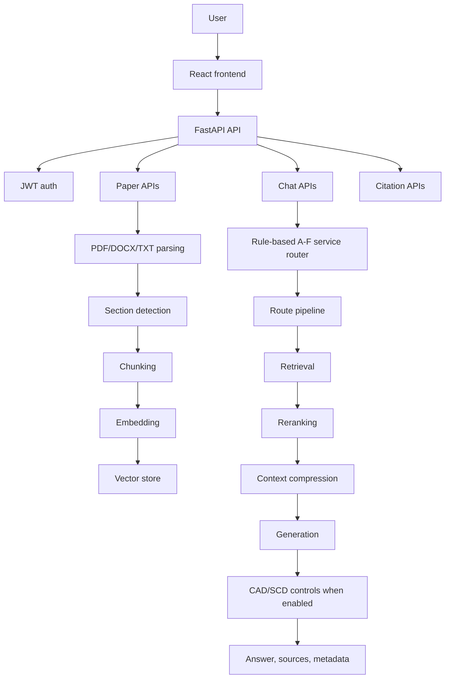

# M-RAG Architecture

## Purpose

This document describes the current service runtime and the separated experiment layer after Phase 5. The runtime remains a graduation-project paper-review service. The thesis experiment is the fixed Paper-RAG backbone plus HyDE/CAD/SCD factor analysis under `experiments/`.

## Layer Map

| Layer | Paths | Responsibility |
|---|---|---|
| Frontend | `frontend/src` | upload, chat, PDF viewer, source display, quiz/flashcard UI |
| API | `backend/api` | authentication, papers, chat, streaming, search, judge, citation APIs |
| Service modules | `backend/modules` | parsing, indexing, retrieval, reranking, generation, decoding control, citations |
| Service pipelines | `backend/pipelines` | A-F route execution for paper-review features |
| Experiment framework | `experiments` | fixed backbone config, 8-config matrix, query splits, schemas, dry-run validation |
| Legacy evaluation archive | `experiments/archive/legacy_backend_evaluation` | older evaluation utilities and checked-in legacy assets, not active runtime |

## Runtime Flow


```mermaid
flowchart TD
    U["User"] --> FE["React frontend"]
    FE --> API["FastAPI API"]
    API --> AUTH["JWT auth"]
    API --> PAPERS["Paper APIs"]
    API --> CHAT["Chat APIs"]
    API --> CITES["Citation APIs"]

    PAPERS --> PARSE["PDF/DOCX/TXT parsing"]
    PARSE --> SECTION["Section detection"]
    SECTION --> CHUNK["Chunking"]
    CHUNK --> EMBED["Embedding"]
    EMBED --> STORE["Vector store"]

    CHAT --> ROUTER["Rule-based A-F service router"]
    ROUTER --> PIPE["Route pipeline"]
    PIPE --> RET["Retrieval"]
    RET --> RERANK["Reranking"]
    RERANK --> COMP["Context compression"]
    COMP --> GEN["Generation"]
    GEN --> CTRL["CAD/SCD controls when enabled"]
    CTRL --> OUT["Answer, sources, metadata"]
```

## Service Route Status

A-F routes are runtime service features. They are preserved for the graduation-project application and for qualitative demonstrations.

| Route | Runtime purpose | Thesis status |
|---|---|---|
| A | simple QA | service feature |
| B | section-focused QA | service feature |
| C | document comparison | service feature |
| D | citation / patent-oriented lookup | service feature |
| E | structured summary | service feature |
| F | quiz / flashcard generation | service feature |

The route policy should be derived from the HyDE/CAD/SCD analysis by query type. The router is not claimed as the core thesis algorithm.

## Experiment Layer

The separated experiment framework is under `experiments/`.

Key files:

- `experiments/configs/fixed_backbone.yaml`
- `experiments/configs/main_hyde_cad_scd_matrix.yaml`
- `experiments/runners/generate_main_hyde_cad_scd_matrix.py`
- `experiments/runners/dry_run_matrix.py`
- `experiments/data/query_audit.json`
- `experiments/data/query_splits/*.json`
- `experiments/analyzers/result_schema.md`
- `experiments/evaluators/*`

The main matrix has exactly eight configs and varies only HyDE, CAD, and SCD.

## Compatibility Contract

Phase 3 preserved runtime compatibility:

- `QueryRequest` remains compatible; compare target fields are additive.
- `QueryResponse` remains compatible.
- SSE preserves `metadata`, `token`, `done`, and `error` behavior.
- `activePaperId` continues to map to `doc_id_filter`.
- Paper APIs and citation APIs remain service APIs.
- Compare route target selection reports target IDs and selection metadata where possible.

## Method Boundaries

CAD logic belongs to `backend/modules/cad_decoder.py` and must keep the exact formula:

```text
cad_scores = (1 + alpha) * context_scores - alpha * no_context_scores
```

SCD logic belongs to `backend/modules/scd_decoder.py` and is Korean-target Soft Constrained Decoding with neutral-token and technical-term whitelist policy.

HyDE remains the retrieval-side expansion axis and must not be reframed as multi-query fusion in the thesis experiment.

## Safe Validation

Phase 5 validation may run:

```powershell
python -m compileall backend experiments
python experiments/runners/dry_run_matrix.py --experiment main-hyde-cad-scd --estimate-cost --dry-run
python experiments/runners/dry_run_matrix.py --experiment all --estimate-cost --dry-run
```

Frontend validation may run only if dependencies are already installed:

```powershell
npm run typecheck
# or
npm run build
```
