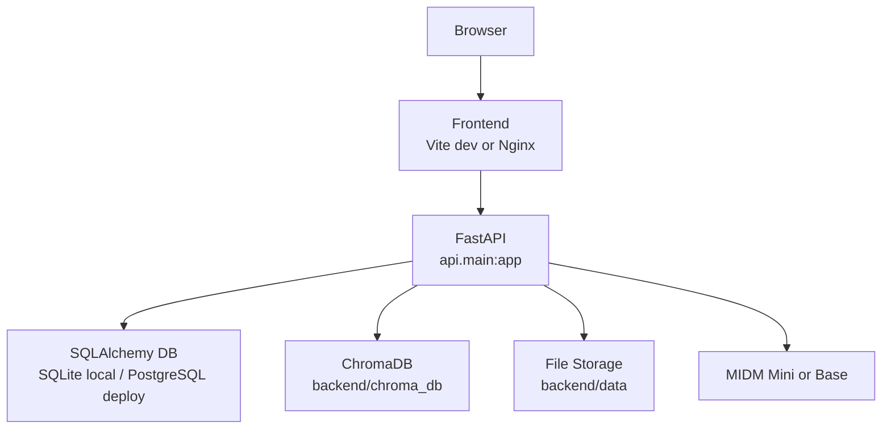

# M-RAG 배포와 실행 가이드

- 문서 기준 2026-04-25
- 현재 기준 연구용 로컬 실행과 GPU 서버 실행 절차 정리

## 배포 구조도



## 로컬 실험 흐름도


## 운영 모드

| 모드 | 기본 생성 모델 | 권장 환경 | 용도 |
|---|---|---|---|
| 로컬 연구 | Mini | 12GB급 GPU | 전체 실험 실행 |
| 로컬 시연 | Mini | 12GB급 GPU | UI와 API 시연 |
| GPU 서버 | Base 또는 Mini | 24GB 이상 GPU 권장 | 대형 모델 시연과 비교 실험 |

## 기본 원칙

- 기본 모델은 Mini
- Base 모델은 환경변수로만 선택
- 양자화는 사용하지 않음
- 전체 로컬 실험 기준 러너는 `backend/scripts/master_run.py`

## 필수 환경변수

```env
LOAD_GPU_MODELS=true
JWT_SECRET_KEY=change-this-secret
GENERATION_MODEL=K-intelligence/Midm-2.0-Mini-Instruct
CORS_ALLOW_ORIGINS=http://localhost:3000,http://localhost:5173
CORS_ALLOW_CREDENTIALS=true
LOG_LEVEL=INFO
ENV=development
```

- 로컬 기본 DB는 `DATABASE_URL` 미지정 시 `sqlite+aiosqlite:///./mrag.db`
- PostgreSQL을 쓰면 `DATABASE_URL=postgresql+asyncpg://...` 로 덮어씀

## 로컬 실행

### 1 의존성 설치

```powershell
cd C:\Users\KiKi\Desktop\CODE\M_RAG
python -m venv .venv
.venv\Scripts\Activate.ps1
pip install torch --index-url https://download.pytorch.org/whl/cu121
pip install -r backend\requirements.txt
cd frontend
npm ci
cd ..
```

### 2 모델 캐시

```powershell
cd C:\Users\KiKi\Desktop\CODE\M_RAG\backend
python scripts\download_models.py
python scripts\download_models.py --llm-model K-intelligence/Midm-2.0-Base-Instruct
```

### 3 개발 서버

```powershell
cd C:\Users\KiKi\Desktop\CODE\M_RAG\backend
$env:JWT_SECRET_KEY = "change-this-secret"
uvicorn api.main:app --host 0.0.0.0 --port 8000
```

```powershell
cd C:\Users\KiKi\Desktop\CODE\M_RAG\frontend
npm run dev
```

### 4 전체 실험

```powershell
cd C:\Users\KiKi\Desktop\CODE\M_RAG\backend
$env:JWT_SECRET_KEY = "change-this-secret"
$env:LOAD_GPU_MODELS = "true"
python scripts\master_run.py --skip-download
```

## Docker Compose

```powershell
docker compose up --build
```

- GPU 모델을 쓸 때는 `LOAD_GPU_MODELS=true`
- Base 모델을 쓸 때는 `GENERATION_MODEL=K-intelligence/Midm-2.0-Base-Instruct`
- Docker 실행에서도 양자화는 사용하지 않음

## RunPod 또는 원격 GPU 서버

### 권장 설정

- GPU A100 40GB 또는 동급
- Python 3.10 이상
- HuggingFace 캐시용 별도 볼륨
- `LOAD_GPU_MODELS=true`

### 예시

```bash
export LOAD_GPU_MODELS=true
export GENERATION_MODEL=K-intelligence/Midm-2.0-Base-Instruct
uvicorn api.main:app --host 0.0.0.0 --port 8000
```

## 검증 체크리스트

- `/health` 가 200 응답
- `/docs` 접근 가능
- 로그인 후 `/api/auth/me` 확인 가능
- 문서 업로드 가능
- `/api/chat/query` 응답 가능
- `backend/scripts/master_run.log` 에 완료 문구 확인
- `backend/evaluation/results/TABLES.md` 생성 확인

## 운영 메모

- stale `uvicorn` 정리는 `master_run.py` 가 먼저 시도
- 결과 파일과 실험 PDF는 삭제 전 사용자 확인 필요
- 문서 삭제와 코드 삭제는 사용자 승인 후 진행
