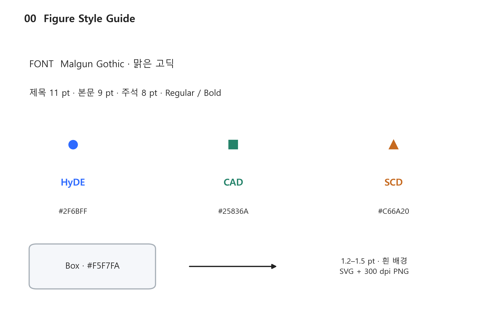
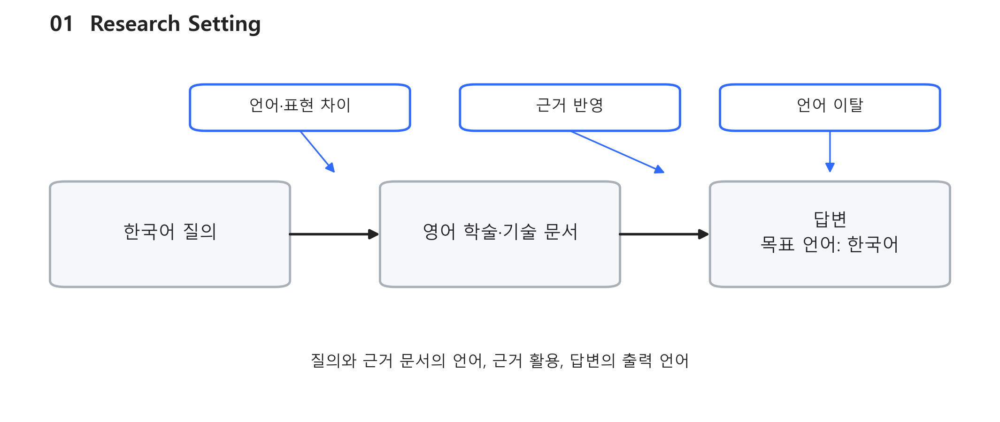
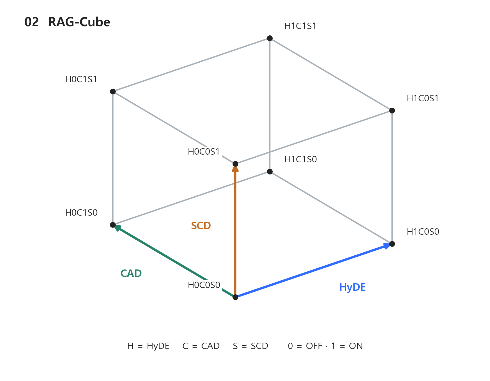
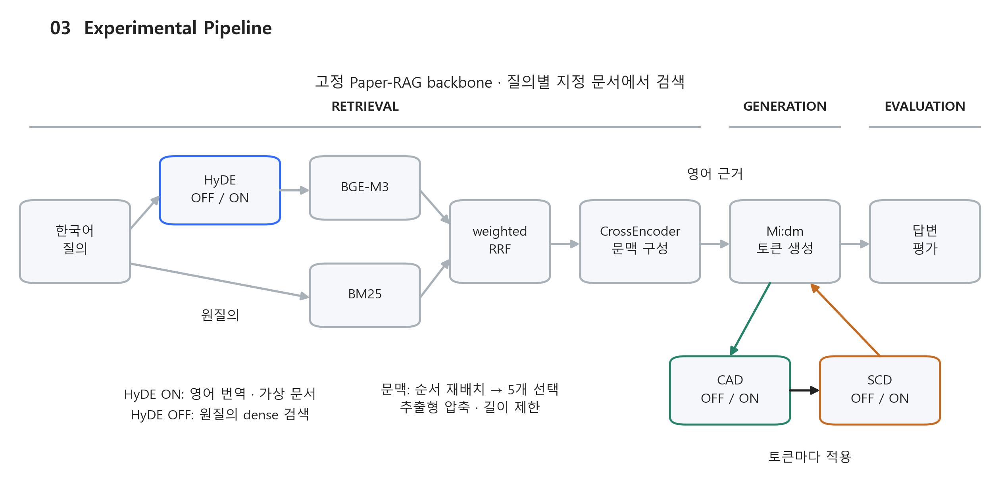
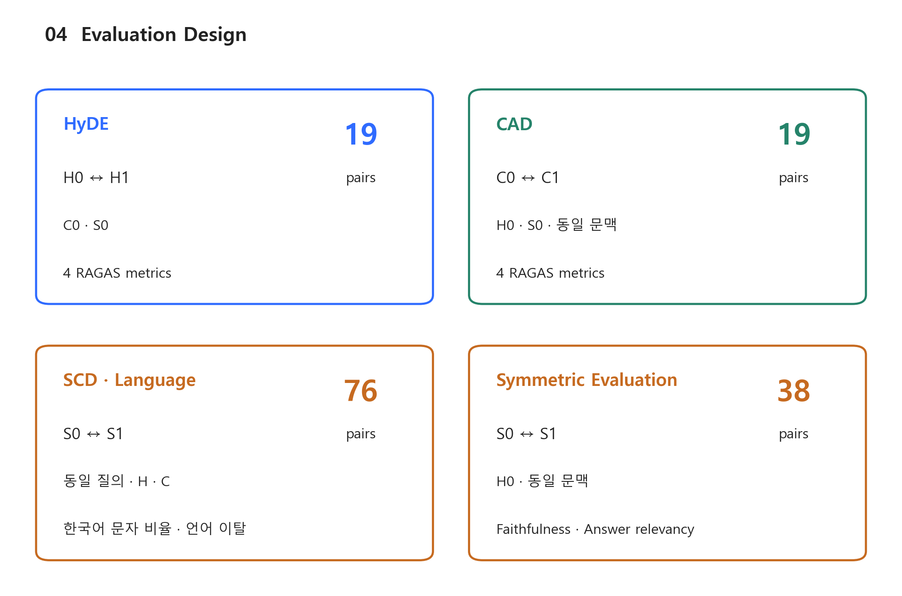
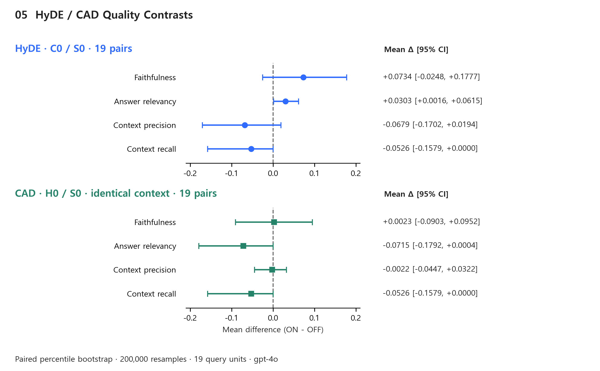
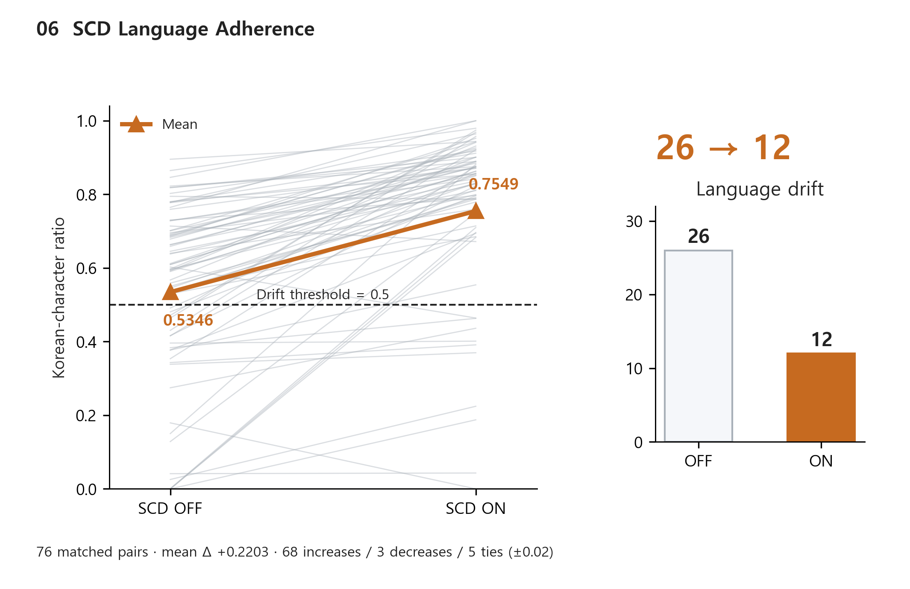
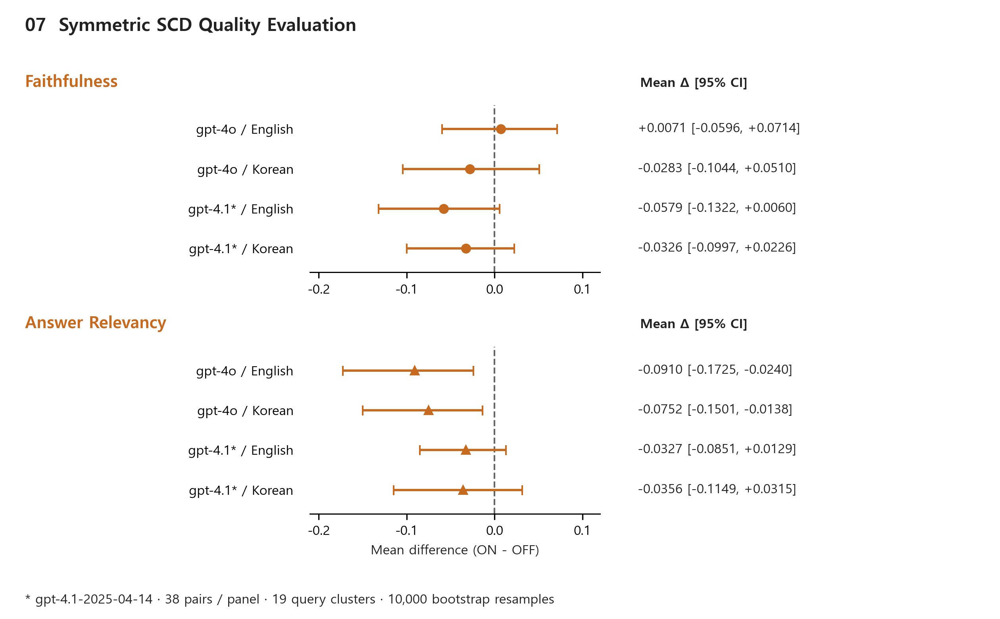

# 논문 그림 모음

본문: [THESIS_KO.md](THESIS_KO.md). 아래 7개 그림은 동일한 폰트·색상·선·여백 규칙으로 구성하였다. SVG는 편집·인쇄용이며 PNG는 300 dpi 미리보기용이다.

## 공통 스타일



- 맑은 고딕, 제목 11 pt, 일반 라벨 9 pt, 작은 주석 8 pt를 기본으로 사용한다.
- HyDE는 파랑·원, CAD는 초록·사각형, SCD는 주황·삼각형으로 구분한다. 도식에는 해당 기법 이름도 함께 표시한다.
- 흰 배경, 옅은 회색 박스, 1.2–1.5 pt 중심의 선과 화살표를 사용한다.
- SVG의 텍스트를 편집하려면 맑은 고딕 폰트가 필요하다. 다른 기기에서는 폰트 치환 여부를 확인한다.
- 그림 3·5·7은 넓은 본문 폭에 배치한다. 최종 문서에 축소 삽입한 뒤 주석 크기와 줄 겹침을 다시 확인한다.

## 그림 1. 연구 환경



**캡션:** 한국어 질의로 영어 학술·기술 문서를 검색하고 한국어 답변을 생성하는 연구 환경. 질의와 문서 간 언어·표현 차이, 검색 근거의 답변 반영, 목표 출력 언어의 유지라는 세 가지 검토 지점을 표시하였다.

배치: 서론의 연구 문제 설명 직후. [SVG](figures/fig01_research_setting.svg)

## 그림 2. RAG-Cube 실험 구성



**캡션:** HyDE(H), CAD(C), SCD(S)의 적용 여부를 세 축으로 나타낸 2×2×2 실험 구성. 각 꼭짓점은 하나의 조합이며 0과 1은 각각 미적용과 적용을 의미한다. 19개 질의에 8개 조합을 적용하여 총 152개의 답변을 생성하였다.

배치: 실험 요인과 조합 설명 직후. [SVG](figures/fig02_rag_cube.svg)

## 그림 3. 실험 파이프라인



**캡션:** 고정 Paper-RAG backbone에서 세 실험 요인이 적용되는 위치. HyDE는 영어 번역 및 가상 문서를 이용하는 dense 검색 경로에 적용되며, BM25에는 원질의를 사용한다. 검색 결과를 weighted RRF와 CrossEncoder로 결합·재정렬한 뒤 순서 재배치, 5개 문맥 선택, 추출형 압축 및 길이 제한을 거쳐 생성 문맥을 구성한다. CAD와 SCD는 Mi:dm의 토큰 생성 과정에서 적용된다. 검색 범위는 질의별 지정 문서이다.

배치: 방법의 backbone 설명. [SVG](figures/fig03_experimental_pipeline.svg)

## 그림 4. 평가 설계



**캡션:** 각 실험 요인의 비교 조건과 대응쌍 수. HyDE는 CAD·SCD 미적용 조건의 19쌍, CAD는 HyDE·SCD 미적용 및 동일 문맥 조건의 19쌍으로 비교한다. SCD의 출력 언어 분석은 동일 질의·HyDE·CAD 조건의 76쌍을 사용한다. 대칭 정규화 평가는 HyDE 미적용의 동일 문맥 38쌍을 대상으로 영어·한국어 평가와 두 평가 모델을 적용한다. 이 38쌍은 19개 질의의 두 CAD 조건을 포함한다.

배치: 실험 및 평가 설계. [SVG](figures/fig04_evaluation_design.svg)

## 그림 5. HyDE와 CAD의 품질 지표 차이



**캡션:** HyDE 및 CAD 적용에 따른 RAGAS 지표의 대응 평균 차이(ON−OFF). 점은 평균 차이, 가로선은 19개 질의를 단위로 200,000회 재표집한 percentile bootstrap 95% 신뢰구간이다. 오른쪽 열에 평균 차이와 신뢰구간을 함께 표시하였다. 평가 모델은 gpt-4o이며 비교 조건은 각 패널 제목과 같다.

배치: HyDE·CAD 결과. [SVG](figures/fig05_hyde_cad_contrasts.svg)

## 그림 6. SCD의 한국어 출력 유지



**캡션:** SCD 미적용·적용 답변 76쌍의 한국어 문자 비율. 회색 선은 개별 대응쌍, 주황 선은 평균이며 평균 차이는 +0.2203이다. 비율 0.5 미만의 언어 이탈 출력은 26개에서 12개로 감소하였다. 변화량 ±0.02를 동률 범위로 분류하면 증가 68쌍, 감소 3쌍, 동률 5쌍이다. 한국어 문자 비율은 한글 문자 수를 한글과 ASCII 영문자 수의 합으로 나눈 값이며, 기존 분석과 동일하게 소수 넷째 자리로 반올림한다.

**집계 주석:** `track1_0035`의 `hyde_on__scd_only` 답변은 숫자 반복으로 한글·영문자 분모가 0이다. 해당 1개 답변은 기존 최종 검증 함수 `korean_ratio`의 0 집계 규칙을 그대로 적용하였다. 원문 해시와 처리 규칙은 검증 기록에 남겼다. 따라서 이 비율은 답변 내용의 적절성을 함께 설명하는 지표로 해석할 수 없으며, 원문 사례도 함께 검토해야 한다.

배치: SCD 출력 언어 결과. [SVG](figures/fig06_scd_language_adherence.svg)

## 그림 7. 평가 언어·모델별 SCD 품질 차이



**캡션:** 동일 문맥 38개 SCD 대응쌍에 대한 영어·한국어 대칭 정규화 평가 결과. 평가 모델은 gpt-4o와 gpt-4.1-2025-04-14이며, 점과 가로선은 SCD 적용에 따른 평균 차이(ON−OFF)와 95% 신뢰구간을 나타낸다. 신뢰구간은 19개 질의를 군집 단위로 10,000회 재표집한 bootstrap 결과이다. 두 지표는 위·아래 패널과 점 모양으로 구분하고, SCD를 나타내는 주황색을 공통으로 사용하였다.

배치: 추가 검증 결과. [SVG](figures/fig07_symmetric_quality.svg)

## 재현 및 근거

저장소 루트에서 다음 명령을 실행한다. 기존 생성·평가 결과를 읽어 그림을 생성하며 모델 호출이나 새 실험 실행은 포함하지 않는다.

```powershell
python -X utf8 docs/PAPER/FINAL/build_figures.py
```

필요 환경: Python, matplotlib, numpy, Windows 맑은 고딕. 수치 재검증에는 저장소의 `verify_current_thesis_results.py`를 사용한다.

- 생성 원문: `experiments/results/main_generation/main-hyde-cad-scd-reference-scd__decoder_main_queries__main_generation.jsonl`
- 품질 점수: `experiments/results/evaluation/main-hyde-cad-scd-reference-scd-gpt4o-official/merged.ragas_scores.json`
- 대칭 평가: `experiments/results/analysis/reference_scd_symmetric_gpt4o.json`
- 교차 모델 평가: `experiments/results/analysis/reference_scd_symmetric_gpt41_2025_04_14.json`
- 구현 흐름: `experiments/runners/main_generation_executor.py`
- [검증 기록](figures/evidence_manifest.json): 입력 파일 SHA-256, 76개 대응쌍, 분모 0 사례의 원문 해시·기존 처리 규칙.

최종 인쇄 폭에서의 판독성과 본문 그림 번호·참조 연결은 문서 조판 단계에서 확인한다.
