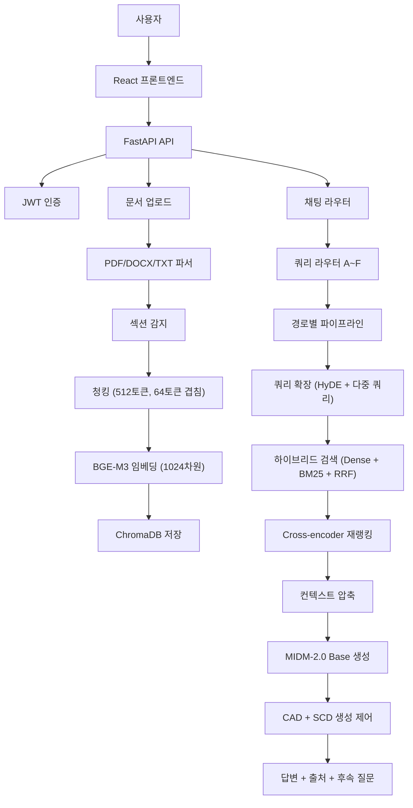

# M-RAG: 한국어 중심 학술 문서 질의응답을 위한 환각 억제형 모듈러 RAG 시스템

## 초록

학술 문서 질의응답에서는 질문 유형에 따라 필요한 검색 방식과 생성 전략이 달라진다. 단순 질의는 전체 문서에서 근거를 찾아야 하고, 섹션 특화 질의는 해당 섹션만 우선 검색해야 하며, 여러 문서 비교는 각 문서에서 균형 있게 근거를 수집해야 한다. 인용 추적은 참고문헌 목록의 외부 조회가 필요하고, 전체 요약은 계층적 요약 구조가 필요하다. 기존 RAG 시스템은 이러한 다양한 질문 유형을 하나의 고정 파이프라인으로 처리하므로, 질문 유형에 따른 최적 처리가 어렵다.

생성 단계에서는 두 가지 문제가 발생한다. 첫째, 언어 모델은 문서가 제공되어도 사전학습 과정에서 기억한 파라메트릭 지식을 답변에 개입시킬 수 있다. 이로 인해 문서에 기록된 수치와 다른 값을 생성하거나 사실을 왜곡하는 환각이 발생한다. 둘째, 영어 논문 청크가 컨텍스트로 입력되면 한국어 질문에도 영어 표현이 답변에 혼입되는 Language Drift가 발생한다.

본 연구는 이러한 문제를 해결하기 위해 쿼리 라우터 기반 모듈러 RAG 시스템인 M-RAG를 제안한다. M-RAG는 질문 유형을 A~F 여섯 경로로 분류하고, BGE-M3 임베딩 [2], BM25 [22], Reciprocal Rank Fusion [23], Cross-encoder 재랭킹, 컨텍스트 압축을 결합한 하이브리드 검색 파이프라인을 구성한다. 생성 단계에서는 Context-Aware Decoding(CAD) [3]과 Selective Context-aware Decoding(SCD) [34]를 LogitsProcessor 인터페이스로 병렬 적용하여 파라메트릭 지식 개입과 Language Drift를 동시에 억제한다.

실험은 영어 NLP 논문 4편과 한국어/MIDM 문서 4편으로 구성한 8편 코퍼스를 대상으로 한다. Track 1에서는 모듈 누적 ablation과 CAD/SCD 조합 ablation을 수행하고, Track 2에서는 논문 도메인 특화 모듈의 추가 효과를 비교한다. 평가는 RAGAS [10] 계열 지표(Faithfulness, Answer Relevancy, Context Precision, Context Recall)와 수치 환각률, 언어 이탈률을 사용한다.

## 1. 서론

### 1.1 배경

대규모 언어 모델(Large Language Model, LLM)은 방대한 텍스트 데이터를 사전학습하여 자연어 이해와 생성에서 높은 성능을 보인다. 그러나 LLM의 지식은 사전학습 시점의 데이터에 한정되며, 특정 논문의 실험 수치, 최신 연구 결과, 내부 문서의 세부 내용처럼 사전학습 데이터에 포함되지 않은 정보에 대해서는 정확한 답변을 생성하기 어렵다. Guu et al. [18]은 사전학습 단계에서부터 검색을 결합하는 REALM을 제안하여 이 한계를 보완하는 초기 시도를 제시했다.

Retrieval-Augmented Generation(RAG)은 외부 문서를 검색하여 언어 모델의 답변 근거로 제공하는 방식이다 [20]. Lewis et al. [20]이 제안한 이후, RAG는 LLM의 사실적 정확성을 높이는 핵심 기법으로 자리잡았다. RAG의 핵심 이점은 모델을 재학습하지 않고도 최신 정보를 답변에 반영할 수 있다는 점이다. 사용자가 특정 논문을 업로드하면, 해당 논문의 내용이 검색 대상이 되어 모델이 논문에 기록된 수치와 방법론을 근거로 답변할 수 있다.

Gao et al. [1]은 RAG 시스템의 진화를 Naive RAG, Advanced RAG, Modular RAG의 세 단계로 정리했다. Naive RAG는 질문을 벡터화하고 유사한 문서 청크를 검색하여 프롬프트에 포함시키는 고정된 검색-생성 파이프라인이다. 모든 질문이 동일한 경로를 거치므로 질문 유형에 따른 최적화가 불가능하다. Advanced RAG는 검색 전 쿼리 확장, 검색 후 재랭킹과 컨텍스트 압축 등 사전·사후 최적화를 추가한다. Wang et al. [13]은 50가지 이상의 RAG 설계 선택(청크 크기, 재랭커 위치, 압축 비율 등)을 실험으로 비교하여 Advanced RAG의 실무 가이드라인을 제시했다. Modular RAG는 질의 유형에 따라 어떤 모듈을 어떤 순서로 실행할지를 동적으로 결정하는 시스템이다.

### 1.2 학술 문서 질의응답의 요구사항

학술 문서 질의응답은 일반 질의응답과 질적으로 다른 요구사항을 갖는다. 다음의 여섯 가지 질문 유형은 각각 서로 다른 검색 전략과 생성 방식을 필요로 한다.

**유형 1: 단순 사실 질의.** "이 논문의 F1 점수가 얼마야?"와 같은 질문은 논문 전체에서 해당 수치가 포함된 청크를 정확하게 찾아야 한다. 의미적으로 유사한 청크보다 정확한 수치 문자열이 포함된 청크가 우선이며, 이는 Dense retrieval보다 BM25 키워드 검색이 강점을 보이는 영역이다.

**유형 2: 섹션 특화 질의.** "이 논문의 방법론을 설명해줘"는 Method 섹션의 내용이 핵심이다. Introduction이나 Related Work의 청크가 검색 결과에 섞이면 답변 품질이 저하된다. 문서의 섹션 구조를 인식하고 해당 섹션의 청크를 우선 검색하는 메커니즘이 필요하다.

**유형 3: 다중 문서 비교.** "두 논문의 방법론 차이를 비교해줘"는 각 문서에서 균형 있게 근거를 수집한 후 비교 합성해야 한다. 하나의 문서에 편향된 검색은 공정한 비교를 방해한다.

**유형 4: 인용 추적.** "이 논문이 인용한 연구의 흐름을 알려줘"는 참고문헌 목록을 파싱하고 arXiv, Semantic Scholar 등 외부 학술 데이터베이스를 조회해야 한다. 문서 내부 검색만으로는 답변할 수 없는 유형이다.

**유형 5: 전체 요약.** "이 논문을 구조적으로 요약해줘"는 개별 청크 수준이 아닌 문서 전체의 계층적 구조를 이해해야 한다. Sarthi et al. [5]의 RAPTOR처럼 청크를 클러스터링하고 요약하는 계층적 접근이 효과적이다.

**유형 6: 학습 보조.** "이 논문으로 퀴즈를 만들어줘"는 4지선다 문제, 플래시카드 등 구조화된 형식의 출력이 필요하다. 일반적인 자유 텍스트 생성과는 다른 프롬프트 전략이 필요하다.

이 여섯 가지 유형을 하나의 고정 파이프라인으로 처리하면, 어떤 유형에서도 최적이 아닌 타협적 결과만 산출된다. Modular RAG의 설계 원칙에 따라 질문 유형별로 서로 다른 모듈 조합을 활성화하는 것이 이 문제의 해결 방향이다.

### 1.3 문제 정의

본 연구는 학술 문서 질의응답에서 발생하는 두 가지 생성 단계 문제에 주목한다. 이 두 문제는 검색 품질과 무관하게, 정확한 근거가 제공되더라도 생성 단계에서 발생할 수 있다.

**문제 1: 파라메트릭 지식 개입.** 언어 모델은 사전학습 과정에서 대량의 텍스트를 학습하여 통계적 패턴을 기억한다. RAG 시스템이 문서 근거를 제공하더라도, 모델은 사전학습에서 기억한 값이나 패턴을 답변에 개입시킬 수 있다. 예를 들어, 논문에 "F1 = 87.3"이라고 기록되어 있더라도, 모델이 사전학습에서 유사한 실험의 일반적 F1 값(예: 92.1)을 기억하고 있다면 근거와 다른 수치를 생성할 수 있다. 이는 학술 문서 QA에서 특히 치명적이다. 연구자가 논문의 실험 결과를 잘못 이해하면 후속 연구 설계에 오류가 전파될 수 있기 때문이다.

Shi et al. [3]은 이 현상을 파라메트릭 지식 개입으로 정의하고, 문서 포함 프롬프트와 문서 미포함 프롬프트의 로짓 차이를 이용하는 Context-Aware Decoding(CAD)을 제안했다. Li et al. [4]의 Contrastive Decoding에서 차용한 구조로, Expert/Amateur 모델 대신 문서 유무 조건을 대비시킨다. Ul Islam et al. [30]은 mFAVA에서 30개 언어와 11개 LLM을 대상으로 환각 발생률이 언어별로 다르다는 것을 실증했으며, 한국어와 같은 저자원 언어에서 영어 대비 환각률이 유의하게 높다고 보고했다. 이는 한국어 특화 LLM에서 CAD의 필요성을 뒷받침한다.

**문제 2: Language Drift.** 한국어로 질문하고 영어 논문을 검색 결과로 사용하면, 모델이 한국어 답변 중에 영어 표현을 혼입하거나 영어로 답변 전체를 전환하는 현상이 발생한다. 예를 들어, "이 논문의 핵심 기여가 뭐야?"라는 한국어 질문에 대해 "이 논문은 We propose a context-aware decoding method를 통해..."와 같이 한국어 문장 중간에 영어가 혼입될 수 있다. 이는 사용자 경험을 저하시킬 뿐 아니라, 한국어와 영어 표현이 뒤섞인 답변의 사실적 정확성을 검증하기 어렵게 만든다.

Chirkova et al. [31]은 13개 언어의 다국어 RAG 실험에서 검색 언어와 답변 언어가 불일치할 때 성능이 저하된다는 것을 분석했다. Park and Lee [32]는 한국어를 포함한 다국어 환경에서 LLM의 언어 선호 편향을 측정하여, 영어 컨텍스트가 있으면 한국어 모델도 영어로 답변하려는 경향이 생긴다는 것을 보였다. Li et al. [34]는 이 현상을 Language Drift로 정의하고, 비목표 언어 토큰에 패널티를 부여하는 Selective Context-aware Decoding(SCD)을 제안했다.

이 두 문제는 원인이 다르다. 파라메트릭 지식 개입은 모델의 사전학습 기억이 문서 근거보다 강하게 작용하는 것이고, Language Drift는 컨텍스트의 언어가 답변의 언어 선택에 영향을 미치는 것이다. 따라서 두 문제를 동시에 해결하려면 서로 다른 제어 기법을 함께 적용해야 한다. CAD만 적용하면 파라메트릭 지식 개입은 줄어들지만 Language Drift는 그대로이고, SCD만 적용하면 언어 일관성은 높아지지만 환각은 그대로이다.

### 1.4 연구 기여

본 연구의 기여는 다음과 같다.

**C1. 모듈별 누적 ablation을 통한 기여도 정량 분해.** 기존 RAG ablation 연구는 파이프라인 전체 또는 검색·생성 2단계만 분리하여 비교한다. 본 연구는 13개 연구 핵심 모듈(쿼리 확장, 하이브리드 검색, 재랭킹, 컨텍스트 압축, CAD, SCD 등)을 단계적으로 누적 추가하면서 각 모듈의 기여도를 정량적으로 분해한다. Track 1 실험에서 Naive RAG부터 Full System까지 6단계 누적 설정을 비교하고, CAD alpha $\{0.0, 0.1, 0.3, 0.5, 0.7, 1.0\}$과 SCD beta $\{0.1, 0.3, 0.5\}$의 파라미터 sweep을 수행한다. 이를 통해 "어떤 모듈이 어떤 지표에 얼마만큼 기여하는가"를 개별 모듈 수준에서 분해할 수 있다.

**C2. CAD와 SCD의 병렬 적용을 통한 두 문제 동시 억제.** CAD [3]는 파라메트릭 지식 개입을 억제하지만 Language Drift는 다루지 않는다. SCD [34]는 Language Drift를 억제하지만 파라메트릭 지식 개입은 다루지 않는다. 본 연구는 두 기법을 HuggingFace LogitsProcessor 인터페이스를 통해 하나의 LogitsProcessorList에 병렬로 등록하고, greedy decoding 환경에서 순차 적용하여 조합 효과를 실험으로 검증한다. 4가지 조합(none, CAD only, SCD only, CAD+SCD)의 Faithfulness, Language Drift Rate, Numeric Hallucination Rate를 비교하여 상호보완 효과를 정량적으로 분석한다.

**C3. 학술 문서 질의응답을 위한 모듈러 RAG 시스템 구현과 공개.** 쿼리 라우터 기반 A~F 6개 경로, BGE-M3 Dense + BM25 하이브리드 검색, Cross-encoder 재랭킹, 추출/생성 컨텍스트 압축, CAD/SCD 생성 제어, arXiv/Semantic Scholar 인용 추적, 후속 질문 생성, 퀴즈·플래시카드 생성을 포함하는 18개 모듈(연구 핵심 13개 + 확장 5개) 시스템을 구현하고 공개한다. 백엔드는 FastAPI 비동기 API 서버, 프론트엔드는 React + TypeScript 기반이며, SSE 토큰 스트리밍, rank_labels 기반 결정적 Judge API, PPTX Export API를 포함한다. 실험 자동화는 master_run.py가 Track 1·2 전체를 순차 실행하며, checkpoint/resume으로 재현성을 보장한다.

### 1.5 논문 구성

본 논문의 구성은 다음과 같다. 2장에서는 RAG 패러다임의 진화, 검색 모듈, 쿼리 확장과 라우팅, 문서 구조와 계층 검색, 컨텍스트 압축, 생성 제어와 대조적 디코딩, 다국어 RAG와 Language Drift, RAG 평가의 선행 연구를 다루고, 선행 연구의 한계와 본 연구의 차별점을 명시한다. 3장에서는 M-RAG의 전체 구조, 18개 모듈 분류, 질의 라우팅의 알고리즘과 경로별 활성화 매트릭스, 하이브리드 검색의 RRF 수식, CAD와 SCD의 수식과 구현 상세, 병렬 적용 구조를 설명한다. 4장에서는 FastAPI 백엔드, React 프론트엔드, SQLAlchemy/ChromaDB 데이터 저장, MIDM-2.0 생성 모델, A~F 파이프라인의 구현 상세를 기술한다. 5장에서는 8편 실험 코퍼스, 세 가지 연구 질문, Track 1의 4가지 실험 모드, Track 2의 6가지 도메인 특화 설정, RAGAS 계열 6가지 평가 지표, 실험 인프라를 설명한다. 6장에서는 Table 1~5의 실험 결과를 제시하고, 7장에서는 RQ1~RQ3에 대한 분석과 사례 비교를 수행한다. 8장에서는 연구의 한계와 향후 과제를 논의하고, 9장에서 결론을 맺는다.
## 2. 관련 연구

### 2.1 RAG 패러다임의 진화

Retrieval-Augmented Generation(RAG)은 Lewis et al. [20]이 제안한 이후 세 단계로 진화했다. Gao et al. [1]은 이를 Naive RAG, Advanced RAG, Modular RAG로 분류했다.

Naive RAG는 고정된 순서의 검색-생성 파이프라인이다. 질문이 입력되면 벡터 검색으로 관련 문서를 찾고, 검색 결과를 프롬프트에 포함시켜 언어 모델이 답변을 생성한다. 모든 질문이 동일한 경로를 거치므로, 질문 유형에 따른 최적화가 불가능하다.

Advanced RAG는 사전·사후 검색 최적화를 추가한다. 검색 전에는 쿼리 확장으로 검색 품질을 높이고, 검색 후에는 재랭킹과 컨텍스트 압축으로 생성 입력의 품질을 높인다. Wang et al. [13]은 청크 크기, 재랭커 위치, 컨텍스트 압축 여부 등 50가지 이상의 RAG 설계 선택을 실험으로 비교하여 실무 가이드라인을 제시했다.

Modular RAG는 쿼리 유형에 따라 어떤 모듈을 어떤 순서로 실행할지를 동적으로 결정하는 시스템이다. 본 연구의 M-RAG는 이 Modular RAG 패러다임을 따르며, 쿼리 라우터가 질문을 A~F 경로로 분류하고 경로에 따라 활성화되는 모듈 조합이 달라진다.

### 2.2 검색 모듈

**임베딩 기반 검색.** Dense retrieval은 질문과 문서를 동일 벡터 공간에 임베딩하여 코사인 유사도로 관련성을 측정한다. Chen et al. [2]의 BGE M3-Embedding은 100개 이상 언어를 동일 벡터 공간에서 학습하여, 언어가 달라도 의미가 같으면 벡터가 가깝도록 설계되었다. M-RAG는 BGE-M3를 임베딩 모델로 사용하여 한국어 질문으로 영어 논문 청크를 검색할 수 있다.

**키워드 기반 검색.** Robertson et al. [22]의 BM25는 Term Frequency와 Inverse Document Frequency를 결합한 키워드 기반 검색 알고리즘이다. 기술 용어나 고유명사처럼 정확한 문자열 매칭이 중요한 질의에서 Dense retrieval보다 강점을 보인다.

**하이브리드 검색과 순위 결합.** Dense 검색과 BM25 검색의 결과를 결합하면 두 방식의 장점을 함께 활용할 수 있다. Cormack et al. [23]의 Reciprocal Rank Fusion(RRF)은 두 검색 시스템의 순위만을 사용하여 결과를 결합하므로, 점수 단위가 다른 두 시스템의 결과를 직접 합산할 수 있다.

**재랭킹.** Khattab and Zaharia [21]의 ColBERT와 Santhanam et al. [14]의 ColBERTv2는 토큰 수준의 Late Interaction으로 정밀한 관련성 판단을 수행한다. Cross-encoder는 질문과 문서를 하나의 입력으로 결합하여 관련도를 산출하므로, 단일 벡터 비교보다 정밀하다. M-RAG는 초기 검색 결과를 Cross-encoder로 재정렬하여 상위 문서의 품질을 높인다.

### 2.3 쿼리 확장과 라우팅

**HyDE.** Gao et al. [6]은 질문을 직접 검색하는 대신, 언어 모델로 가상 답변 문서를 생성하고 이 가상 문서로 검색하는 Hypothetical Document Embeddings(HyDE)를 제안했다. 가상 답변은 논문의 서술체와 유사하므로 실제 논문 문장과 벡터 거리가 가깝다.

**다중 쿼리 생성.** Rackauckas [26]의 RAG-Fusion은 하나의 질문을 여러 표현으로 재작성하여 각각 검색하고 결과를 RRF로 합산한다. 같은 의도를 다른 키워드로 표현하면 더 다양한 관련 문서를 검색할 수 있다.

**적응적 검색.** Asai et al. [7]의 Self-RAG는 모델이 검색 필요성을 스스로 판단하고, 검색 결과의 유용성과 답변의 근거 충실도를 자기 반성으로 평가한다. Yan et al. [8]의 CRAG는 검색 결과를 CORRECT, INCORRECT, AMBIGUOUS로 평가하고 낮은 등급이면 재검색을 시도한다. Jiang et al. [17]의 FLARE는 생성 중 불확실한 구간에서 능동적으로 재검색을 수행한다. M-RAG의 쿼리 라우터는 이러한 적응적 검색의 아이디어를 질문 유형 기반 경로 선택으로 구현한다.

### 2.4 문서 구조와 계층 검색

**계층적 요약.** Sarthi et al. [5]의 RAPTOR는 청크를 클러스터링하고 요약하여 트리 구조를 구축한다. 전체 요약 질문에는 상위 수준 요약 노드가, 세부 질문에는 하위 청크가 검색된다. M-RAG의 경로 E(전체 요약)는 RAPTOR의 계층적 요약 구조를 활용한다.

**명제 단위 청킹.** Chen et al. [24]의 Dense-X Retrieval은 텍스트를 단락이 아닌 명제(proposition) 단위로 분할하면 검색 정확도가 높아진다는 것을 보였다. Zhong et al. [28]의 Meta-Chunking은 여러 청킹 전략의 혼합이 효과적임을 보였다. M-RAG의 청킹 모듈은 섹션 단위, 고정 크기, 문장 단위 전략을 제공한다.

### 2.5 컨텍스트 압축

검색 결과를 그대로 모델에 입력하면 관련 없는 내용이 포함되어 답변 품질이 저하될 수 있다. Liu et al. [29]는 긴 컨텍스트의 중간에 있는 핵심 정보를 모델이 놓치는 "Lost in the Middle" 현상을 보고했다.

Jiang et al. [11]의 LLMLingua와 [12]의 LongLLMLingua는 중요도가 낮은 토큰을 제거하여 80% 이상 압축하면서 핵심 정보를 유지할 수 있음을 보였다. Xu et al. [19]의 RECOMP는 질문에 맞게 청크를 요약하여 컨텍스트를 구성한다. M-RAG의 컨텍스트 압축 모듈은 쿼리 관련 문장 추출(추출 압축)과 LLM 기반 요약(생성 압축) 두 전략을 제공한다.

### 2.6 생성 제어와 대조적 디코딩

**Contrastive Decoding.** Li et al. [4]는 큰 모델(Expert)과 작은 모델(Amateur)의 출력 차이를 활용하면 생성 품질이 높아진다는 것을 보였다. 수식은 $\text{logit}_{\text{final}} = \text{logit}(\text{Expert}) - \beta \cdot \text{logit}(\text{Amateur})$이다. 작은 모델이 생성하는 "그럴듯하게 잘못된 패턴"을 차감하여 큰 모델의 정확도를 높인다.

**Context-Aware Decoding.** Shi et al. [3]은 Contrastive Decoding의 구조를 차용하여 CAD를 제안했다. 문서 포함 프롬프트의 로짓에서 문서 미포함 프롬프트(질문 단독)의 로짓을 차감한다:

$$\text{logit}_{\text{CAD}}(y_t) = \text{logit}(y_t \mid x, c) - \alpha \cdot \text{logit}(y_t \mid x)$$

여기서 $x$는 질문, $c$는 검색된 컨텍스트, $\alpha$는 억제 강도 하이퍼파라미터이다. 문서 없이도 높은 확률로 생성되는 토큰(파라메트릭 지식)의 확률이 낮아지고, 문서가 있을 때만 높아지는 토큰(문서 근거)의 확률이 상대적으로 높아진다.

### 2.7 다국어 RAG와 Language Drift

**언어별 환각률 차이.** Ul Islam et al. [30]은 mFAVA에서 30개 언어와 11개 LLM을 대상으로 환각 발생률을 측정했다. 영어보다 한국어 등 저자원 언어에서 환각률이 높으며, 이는 훈련 데이터의 영어 편중에 기인한다.

**다국어 RAG 성능 저하.** Chirkova et al. [31]은 13개 언어의 다국어 RAG 실험에서 검색 언어와 답변 언어의 불일치가 성능 저하를 유발한다는 것을 분석했다. Park and Lee [32]는 한국어를 포함한 다국어 환경에서 LLM의 언어 선호 편향을 측정하여, 영어 컨텍스트가 있으면 한국어 모델도 영어로 답변하려는 경향이 생긴다는 것을 보였다. Ranaldi et al. [33]은 다국어 RAG의 공정한 평가 방법론을 제안했다. Rau et al. [35]의 BERGEN은 다양한 RAG 시스템을 동일 조건에서 비교할 수 있는 벤치마크를 제공했다.

**Selective Context-aware Decoding.** Li et al. [34]는 영어 컨텍스트가 모델의 언어 선택에 영향을 미치는 Language Drift 현상을 정의하고, 비목표 언어 토큰에 패널티를 부여하는 SCD를 제안했다:

$$\text{logit}(y_t) \leftarrow \text{logit}(y_t) - \beta, \quad \forall y_t \notin \mathcal{V}_{\text{target}}$$

여기서 $\mathcal{V}_{\text{target}}$은 목표 언어(한국어)의 토큰 집합이고, $\beta$는 패널티 강도 하이퍼파라미터이다.

### 2.8 RAG 평가

Es et al. [10]의 RAGAS는 사람 없이 LLM을 평가자(judge)로 활용하는 자동 평가 프레임워크를 제안했다. 네 가지 핵심 지표는 Faithfulness(답변이 컨텍스트에 충실한 정도), Answer Relevancy(답변이 질문에 관련 있는 정도), Context Precision(검색된 컨텍스트 중 유용한 근거 비율), Context Recall(필요한 근거가 검색에 포함된 정도)이다. M-RAG는 RAGAS의 지표 체계를 따르되, RAGAS 공식 라이브러리가 아닌 자체 구현으로 평가를 수행한다. 이는 외부 API 의존 없이 로컬 모델만으로 완전한 평가를 수행하기 위한 설계이다.

### 2.9 선행 연구의 한계와 본 연구의 차별점

선행 연구의 공통적인 한계는 다음과 같다.

첫째, 기존 RAG ablation 연구는 파이프라인 전체 또는 검색·생성 2단계만 분리하여 비교한다. 개별 모듈 수준의 기여도를 정량적으로 분해한 연구는 제한적이다.

둘째, CAD [3]는 영어 단일 언어 환경을 가정했다. 한국어 질문과 영어 논문이 혼재하는 다국어 환경에서의 효과는 검증되지 않았다.

셋째, SCD [34]는 Language Drift만 억제하며 파라메트릭 지식 개입은 다루지 않는다. CAD와 SCD를 함께 적용하여 두 문제를 동시에 해결하는 시도는 보고되지 않았다.

본 연구는 13개 모듈의 누적 ablation으로 모듈별 기여도를 분해하고(C1), CAD와 SCD를 병렬 적용하여 두 문제의 동시 억제 효과를 검증하며(C2), 이를 포함하는 학술 문서 질의응답 시스템을 구현하여 공개한다(C3).
## 3. 시스템 설계

### 3.1 전체 구조

M-RAG는 18개 코드 모듈로 구성된다. 연구 핵심 모듈 13개는 논문 실험과 클레임의 중심이 되며, 확장 모듈 5개는 입력 처리와 운영 기능을 담당한다.

**연구 핵심 모듈 13개:**

| 모듈 | 파일 | 역할 |
|---|---|---|
| 임베딩 | `embedder.py` | BGE-M3 [2]로 문서와 질문을 1024차원 벡터로 변환 |
| 청킹 | `chunker.py` | 섹션 단위, 고정 크기, 문장 단위 청킹 [5, 24, 28] |
| 재랭커 | `reranker.py` | Cross-encoder로 검색 결과 재정렬 [14, 21] |
| 하이브리드 검색 | `hybrid_retriever.py` | Dense + BM25 + RRF 결합 검색 [22, 23] |
| 쿼리 라우터 | `query_router.py` | 질문을 A~F 경로로 분류 [7, 8, 17] |
| 섹션 감지 | `section_detector.py` | 문서의 섹션 구조 탐지와 태깅 |
| 생성기 | `generator.py` | MIDM-2.0 Base 기반 답변 생성 |
| CAD 디코더 | `cad_decoder.py` | 파라메트릭 지식 개입 억제 [3, 4] |
| SCD 디코더 | `scd_decoder.py` | Language Drift 억제 [34] |
| 컨텍스트 압축 | `context_compressor.py` | 검색 결과 압축 [11, 12, 19] |
| 쿼리 확장 | `query_expander.py` | HyDE [6] 및 다중 쿼리 [26] 생성 |
| 인용 추적 | `citation_tracker.py` | 참고문헌 파싱 및 arXiv API 조회 |
| 후속 질문 생성 | `followup_generator.py` | 답변 기반 후속 질문 후보 생성 |

**확장 모듈 5개:**

| 모듈 | 파일 | 역할 |
|---|---|---|
| PDF 파서 | `pdf_parser.py` | PyMuPDF 기반 PDF 텍스트 추출 |
| DOCX 파서 | `docx_parser.py` | DOCX/TXT 텍스트 추출 |
| 특허 추적 | `patent_tracker.py` | 특허 문서 검색 및 prior art 추적 |
| PPTX 내보내기 | `pptx_exporter.py` | 답변과 출처를 발표 자료로 변환 |
| 벡터 저장소 | `vector_store.py` | ChromaDB collection 관리 |

전체 데이터 흐름은 다음과 같다. 문서 업로드 시 PDF 파서가 텍스트를 추출하고, 섹션 감지기가 섹션 태그를 부착하며, 청킹 모듈이 512토큰 단위로 분할한다. 각 청크는 BGE-M3로 벡터화되어 ChromaDB에 저장된다. 질의 시 쿼리 라우터가 경로를 결정하고, 경로에 따라 쿼리 확장, 하이브리드 검색, 재랭킹, 컨텍스트 압축을 거쳐 CAD/SCD가 적용된 답변이 생성된다.



### 3.2 질의 라우팅

쿼리 라우터는 M-RAG에서 Modular RAG를 구현하는 핵심 구성요소이다. `query_router.py`는 질문 텍스트를 분석하여 A~F 여섯 경로 중 하나를 선택한다.

| 경로 | 유형 | 트리거 키워드 | 핵심 동작 |
|---|---|---|---|
| A | 단순 QA | 특정 키워드 미감지 시 기본 경로 | HyDE 확장 → 하이브리드 검색 → 재랭킹 → 압축 → 생성 |
| B | 섹션 특화 | 결과, 방법론, 한계, 결론, 초록 | 섹션 필터를 적용한 검색 → 해당 섹션 우선 반환 |
| C | 문서 비교 | 비교, 차이, vs | 문서별 병렬 검색 → 비교 합성 프롬프트 → 생성 |
| D | 인용/특허 | 인용, 참고문헌, 특허, prior art | 참고문헌 파싱 → arXiv API 조회 → 인용 맥락 답변 |
| E | 전체 요약 | 요약, overview | RAPTOR 계층 검색 → 구조화 요약 생성 |
| F | 퀴즈/플래시카드 | 퀴즈, 문제, flashcard | 검색 → 퀴즈 프롬프트 → 구조화 출력 |

라우팅은 두 단계로 수행된다. 첫 단계에서 `config.py`에 정의된 ROUTE_MAP의 키워드와 질문 텍스트를 매칭하여 각 경로의 점수를 계산한다. 점수가 가장 높은 경로를 선택하며, 어떤 키워드도 매칭되지 않으면 경로 A(단순 QA)를 기본값으로 사용한다. 경로 B의 경우 감지된 섹션 키워드(result, method, abstract, conclusion)에 따라 `section_filter`가 함께 결정된다. 경로 C의 경우 질문에서 언급된 문서 참조를 추출하여 `target_doc_ids`로 전달한다.

**Algorithm 1: 쿼리 라우팅**

```
Input: query (질문 텍스트), ROUTE_MAP (경로별 키워드 사전)
Output: route (A~F), metadata (section_filter, target_doc_ids)

1: scores ← {A: 0, B: 0, C: 0, D: 0, E: 0, F: 0}
2: for each (route, keywords) in ROUTE_MAP do
3:     for each keyword in keywords do
4:         if keyword in query.lower() then
5:             scores[route] ← scores[route] + 1
6:     end for
7: end for
8: route ← argmax(scores)
9: if max(scores) = 0 then
10:    route ← A  // 기본 경로
11: end if
12: if route = B then
13:    section_filter ← detect_section(query)
14: else if route = C then
15:    target_doc_ids ← extract_doc_refs(query)
16: end if
17: return route, metadata
```

**경로별 활성화 모듈 매트릭스:**

| 모듈 | A QA | B 섹션 | C 비교 | D 인용 | E 요약 | F 퀴즈 |
|---|:---:|:---:|:---:|:---:|:---:|:---:|
| 쿼리 라우터 | ● | ● | ● | ● | ● | ● |
| 쿼리 확장 (HyDE) | ● | 선택 | — | — | — | — |
| 섹션 감지 | 색인 시 | ● | 색인 시 | 색인 시 | 색인 시 | 색인 시 |
| 하이브리드 검색 | ● | ● | ● | ● | ● | ● |
| 재랭커 | ● | ● | 선택 | — | — | ● |
| 컨텍스트 압축 | ● | ● | 선택 | 선택 | ● | ● |
| 인용 추적 | — | — | — | ● | — | — |
| 생성기 | ● | ● | ● | ● | ● | ● |
| CAD 디코더 | ● | ● | ● | ● | ● | ● |
| SCD 디코더 | ● | ● | ● | ● | ● | ● |
| 후속 질문 생성 | ● | ● | ● | ● | ● | ● |

A~E는 논문 실험과 클레임의 중심 경로이다. F는 학습 보조 경로로, 운영 대화 흐름에서 퀴즈와 플래시카드를 생성한다.

### 3.3 하이브리드 검색

검색 단계는 Dense retrieval과 BM25를 함께 사용하고 RRF로 순위를 결합한다. `hybrid_retriever.py`의 `HybridRetriever.search()` 메서드가 이 과정을 수행한다.

**Dense retrieval.** BGE-M3 [2]로 질문(또는 HyDE 가상 문서)을 벡터화하고, ChromaDB에서 코사인 유사도 기준 상위 $k$개 청크를 검색한다.

**BM25 검색.** `BM25` 클래스는 TF-IDF 기반 키워드 검색을 수행한다. 각 문서의 term frequency와 전체 문서 집합의 document frequency를 사용하여 BM25 점수를 계산한다:

$$\text{BM25}(q, d) = \sum_{t \in q} \text{IDF}(t) \cdot \frac{f(t, d) \cdot (k_1 + 1)}{f(t, d) + k_1 \cdot (1 - b + b \cdot |d| / \text{avgdl})}$$

여기서 $f(t, d)$는 문서 $d$에서 용어 $t$의 빈도, $|d|$는 문서 길이, avgdl은 평균 문서 길이이다. M-RAG는 $k_1 = 1.5$, $b = 0.75$를 사용한다.

**RRF 결합.** 두 검색 결과를 RRF [23]로 결합한다:

$$\text{RRF}(d) = \sum_{s \in S} \frac{w_s}{k + \text{rank}_s(d)}$$

여기서 $S$는 검색 시스템 집합(Dense, BM25), $w_s$는 각 시스템의 가중치, $k$는 RRF 상수이다. M-RAG는 $k = 60$, Dense 가중치 $w_{\text{dense}} = 0.6$, BM25 가중치 $w_{\text{bm25}} = 0.4$를 사용한다. 초기 검색 수는 각 시스템당 $k_{\text{retrieval}} = 20$이다.

경로 B에서는 섹션 필터(`section_filter`)를 적용하여 해당 섹션 태그의 청크만 검색 대상으로 사용한다. 경로 C에서는 `doc_id_filter`를 사용하여 각 문서에서 독립적으로 검색한 후 결과를 합성한다.

### 3.4 재랭킹과 컨텍스트 압축

**재랭킹.** `reranker.py`는 Cross-encoder(`cross-encoder/ms-marco-MiniLM-L-6-v2`)를 사용하여 하이브리드 검색 결과를 재정렬한다. 질문과 각 청크를 하나의 입력으로 결합하여 관련도 점수를 산출하고, 상위 $k_{\text{rerank}} = 5$개를 선택한다.

**컨텍스트 압축.** `context_compressor.py`는 재랭킹된 청크의 총 토큰 수가 $\text{max\_tokens} = 3072$를 초과할 때 압축을 수행한다. 추출 압축(extractive) 전략은 각 문장과 쿼리 용어의 겹침을 계산하고 점수순으로 정렬하여 압축 비율($\text{ratio} = 0.5$) 이내의 상위 문장을 선택한다. 선택된 문장은 원래 문서 내 순서로 복원되어 컨텍스트의 흐름을 유지한다. 생성 압축(abstractive) 전략은 LLM으로 쿼리 관련 요약을 생성하며, 원문의 수치, 고유명사, 실험 결과를 정확히 보존하도록 프롬프트로 지시한다.

### 3.5 쿼리 확장

`query_expander.py`의 `QueryExpander`는 세 가지 확장 기능을 제공한다.

**HyDE.** `expand_hyde()` 메서드는 질문을 입력받아 3~5문장의 가상 답변 문서를 생성한다. 가상 문서는 검색 대상 문서의 대표 언어를 기준으로 생성한다. `HybridRetriever.get_collection_lang()` 메서드가 컬렉션의 청크를 샘플링하여 한국어 비율이 50% 이상이면 한국어 가상 문서를, 아니면 영어 가상 문서를 생성한다. 이를 통해 영어 논문 검색에는 영어 가상 문서가, 한국어 문서 검색에는 한국어 가상 문서가 사용된다.

**다중 쿼리 생성.** `expand_multi_query()` 메서드는 원래 질문을 검색에 유리한 다른 표현으로 바꾼 쿼리를 생성한다. 각 표현은 다른 키워드나 관점을 사용하여 검색 커버리지를 높인다.

**한영 번역.** `translate_ko_to_en()` 메서드는 한국어 질문을 영어로 번역하여 영어 논문 검색의 정확도를 보완한다. 번역 결과는 추가 쿼리로 함께 검색에 사용된다.

### 3.6 CAD 생성 제어

`cad_decoder.py`의 `CADDecoder`는 HuggingFace의 `LogitsProcessor` 인터페이스를 구현한다. 모델이 다음 토큰을 예측할 때마다 호출되어 로짓을 조정한다.

**핵심 수식:**

$$\text{logit}_{\text{final}}(y_t) = \text{logit}(y_t \mid x, c) - \alpha \cdot \text{logit}(y_t \mid x)$$

여기서 $\text{logit}(y_t \mid x, c)$는 문서 포함 프롬프트의 로짓(모델의 기본 생성 경로에서 계산), $\text{logit}(y_t \mid x)$는 질문 단독 프롬프트의 로짓(CADDecoder 내부에서 별도 계산), $\alpha$는 억제 강도이다. 논문 실험 기준 $\alpha = 0.5$이며, ablation에서 $\{0.1, 0.3, 0.5, 0.7, 1.0\}$을 비교한다.

**KV cache 효율화.** 첫 번째 생성 스텝에서는 질문 단독 프롬프트 전체를 모델에 입력하여 `past_key_values`를 획득한다. 이후 스텝에서는 마지막 생성 토큰만 입력하고 KV cache를 재사용하여 추가 연산을 최소화한다.

**적응적 alpha.** `_compute_adaptive_alpha()` 메서드는 문서 포함 분포와 문서 미포함 분포의 Jensen-Shannon Divergence를 계산한다. 두 분포의 차이가 큰 토큰(컨텍스트가 중요한 위치)에서는 alpha를 높여 파라메트릭 지식을 더 강하게 억제한다. 논문 실험은 고정 alpha(`cad_adaptive=False`)를 기준으로 수행한다.

**CAD 활성화 시 디코딩.** CAD가 활성화된 생성은 greedy decoding을 사용한다. `generator.py`의 `_resolve_sampling_params()` 메서드가 `force_greedy=True`일 때 temperature=0.0, do_sample=False로 설정하여 생성 제어 효과가 샘플링에 의해 희석되지 않도록 한다.

**Algorithm 2: Context-Aware Decoding (CAD)**

```
Input: model, prompt_with_ctx (x, c), prompt_no_ctx (x), α
Output: generated tokens

1: kv_cache_empty ← None
2: for each decoding step t do
3:     logits_ctx ← model.forward(prompt_with_ctx)  // 모델의 기본 경로
4:     if t = 1 then
5:         logits_empty, kv_cache_empty ← model.forward(prompt_no_ctx)
6:     else
7:         logits_empty ← model.forward(last_token, kv_cache_empty)
8:     end if
9:     logits_final ← logits_ctx - α × logits_empty
10:    token_t ← argmax(logits_final)  // greedy decoding
11:    if token_t = EOS then break
12: end for
13: return generated tokens
```

### 3.7 SCD 생성 제어

`scd_decoder.py`의 `SCDDecoder`도 `LogitsProcessor` 인터페이스를 구현한다.

**핵심 수식:**

$$\text{logit}(y_t) \leftarrow \text{logit}(y_t) - \beta, \quad \forall y_t \notin \mathcal{V}_{\text{ko}}$$

여기서 $\mathcal{V}_{\text{ko}}$는 한국어 토큰과 공통 문자(숫자, 공백, 구두점) 토큰의 합집합이다. $\beta$는 패널티 강도이며, 논문 실험 기준 $\beta = 0.3$이다. ablation에서 $\{0.1, 0.3, 0.5\}$를 비교한다.

**한국어 토큰 판별.** `_is_target_or_common()` 메서드는 토큰의 각 문자를 유니코드 범위로 판별한다:
- 한글 음절: U+AC00~U+D7A3 (가~힣)
- 한글 자모: U+1100~U+11FF
- 호환 자모: U+3130~U+318F
- 공통 문자: 숫자, 공백, 구두점 (`0-9`, `.`, `,`, `!`, `?`, `(`, `)`, `[`, `]`, `{`, `}`, `:`, `;`, `"`, `'`, `-`, `%` 등)

공통 문자를 허용하는 것은 수치 표현(87.3%, alpha=0.5)과 기본 구두점이 언어에 관계없이 사용되기 때문이다.

**비목표 토큰 ID 구축.** `_build_non_target_ids()` 메서드는 첫 호출 시 토크나이저의 전체 어휘에서 한국어와 공통 문자가 아닌 토큰 ID를 수집하여 텐서로 캐싱한다. 이후 호출에서는 캐싱된 텐서를 재사용한다.

**Algorithm 3: Selective Context-aware Decoding (SCD)**

```
Input: tokenizer, β
Output: non_target_ids (cached tensor)

// 초기화 (첫 호출 시 1회 실행)
1: non_target_ids ← []
2: for each token_id in tokenizer.vocab do
3:     text ← tokenizer.decode(token_id)
4:     is_target ← False
5:     for each char in text do
6:         if char ∈ [가-힣] ∪ [ᄀ-ᇿ] ∪ [㄰-㆏] then
7:             is_target ← True  // 한국어
8:         else if char ∈ [0-9] ∪ punctuation ∪ whitespace then
9:             is_target ← True  // 공통 문자
10:        end if
11:    end for
12:    if not is_target then
13:        non_target_ids.append(token_id)
14:    end if
15: end for
16: cache non_target_ids as tensor

// 디코딩 시 (매 스텝 호출)
17: scores[:, non_target_ids] ← scores[:, non_target_ids] - β
18: return scores
```

### 3.8 CAD + SCD 병렬 적용

`scd_decoder.py`의 `create_combined_processor()` 함수는 CAD와 SCD를 하나의 `LogitsProcessorList`로 결합한다. HuggingFace의 `model.generate()` 메서드는 `logits_processor` 인자로 전달된 프로세서 목록을 순차 적용한다.

적용 순서는 다음과 같다:
1. **CAD**: `scores = scores - alpha * empty_logits` (파라메트릭 지식 억제)
2. **SCD**: `scores[:, non_target_ids] -= beta` (비목표 언어 패널티)

두 프로세서는 독립적으로 scores를 수정한다. CAD는 문서 유무에 따른 로짓 차이를 이용하고, SCD는 토큰의 언어 속성에 따른 패널티를 부여한다. 두 기법의 목적이 다르므로(CAD: 문서 충실도 향상, SCD: 언어 일관성 향상) 상호보완적으로 동작한다.

결합 시 `use_cad`, `use_scd` 플래그로 각 프로세서의 활성화를 독립적으로 제어할 수 있으며, 이를 통해 CAD 단독, SCD 단독, CAD+SCD 조합의 실험 비교가 가능하다.
## 4. 구현

### 4.1 백엔드 아키텍처

M-RAG 백엔드는 FastAPI 기반 비동기 HTTP API 서버이다. 진입점은 `backend/api/main.py`이며, 다섯 개의 라우터로 구성된다.

| 라우터 | 파일 | 역할 |
|---|---|---|
| auth | `api/routers/auth.py` | JWT 토큰 기반 사용자 인증, 로그인/로그아웃/토큰 갱신 |
| papers | `api/routers/papers.py` | PDF/DOCX/TXT 업로드, 파싱, 청킹, 벡터화, 색인 |
| chat | `api/routers/chat.py` | 질의응답, 검색, 스트리밍, Judge, PPT 내보내기 |
| citations | `api/routers/citations.py` | 인용 추적 API |
| history | `api/routers/history.py` | 대화 이력 저장 및 조회 |

채팅 라우터의 핵심 엔드포인트:

| 엔드포인트 | 메서드 | 기능 |
|---|---|---|
| `/api/chat/query` | POST | 전체 질의응답 파이프라인 실행 (답변 + 출처 + 경로 정보) |
| `/api/chat/query/stream` | POST | SSE(Server-Sent Events) 스트리밍 답변 |
| `/api/chat/search` | POST | 검색 결과만 반환 (답변 생성 없이 검색 품질 점검) |
| `/api/chat/judge` | POST | 실험 평가용 judge API (라벨 판정 또는 자유 생성) |
| `/api/chat/export/ppt` | POST | 답변과 출처를 PPTX 발표 자료로 변환 |

Judge API는 두 가지 모드를 제공한다. 텍스트 자유 생성(`generate_judge`)은 프롬프트에 대해 최대 32토큰의 라벨을 생성한다. 라벨 순위 산출(`rank_labels`)은 후보 라벨 목록을 입력받아 각 라벨의 log-probability를 비교하고 가장 높은 라벨을 반환한다. `rank_labels` 방식은 결정적(deterministic) 점수를 산출하므로 평가의 재현성을 높인다.

### 4.2 프론트엔드

프론트엔드는 Vite + React + TypeScript 기반이다. `frontend/src/`에 앱 코드가 위치한다.

주요 컴포넌트:
- **채팅 인터페이스**: 질의 입력, SSE 스트리밍 답변 표시, 경로 정보 배지
- **PDF 뷰어**: 업로드된 논문의 원문 표시와 출처 하이라이팅
- **출처 패널**: 검색된 청크의 논문명, 섹션, 페이지 정보 표시
- **퀴즈/플래시카드**: F 경로의 구조화된 학습 자료 표시
- **대화 이력**: 세션별 대화 목록과 이어서 질문

### 4.3 데이터 저장

**관계형 데이터베이스.** SQLAlchemy ORM으로 다섯 개의 모델을 관리한다:

| 모델 | 역할 |
|---|---|
| User | 사용자 계정 (이메일, 비밀번호 해시) |
| Conversation | 대화 세션 (사용자별) |
| Message | 대화 내 메시지 (질문/답변/시스템) |
| Paper | 업로드된 문서 메타데이터 (제목, 파일명, 청크 수) |
| RevokedToken | 로그아웃된 JWT 토큰 블랙리스트 |

논문 실험과 GPU 클라우드 환경에서는 SQLite를 사용한다. 운영 서비스 환경에서는 PostgreSQL을 사용한다. SQLAlchemy가 양쪽 데이터베이스를 동일한 ORM 코드로 다루므로 코드 변경 없이 환경 변수로 전환된다.

**벡터 데이터베이스.** ChromaDB를 사용하여 문서 청크의 임베딩 벡터를 저장하고 검색한다. `papers.py`의 `namespace_collection_name` 함수는 사용자 ID를 컬렉션 이름에 포함시켜 사용자별 데이터 격리를 구현한다. BM25 인덱스는 컬렉션 단위로 pickle 파일로 영속화되며, `_RestrictedUnpickler`를 통해 허용된 타입만 역직렬화한다.

### 4.4 생성 모델

**모델 로드.** `generator.py`의 `Generator` 클래스는 MIDM-2.0 Base Instruct (`K-intelligence/Midm-2.0-Base-Instruct`)를 `bfloat16` 정밀도, `device_map="auto"`로 로드한다. 모델과 토크나이저는 lazy loading으로 첫 사용 시 로드된다.

**프롬프트 체계.** 세 가지 프롬프트 템플릿을 사용한다:
- **QA 템플릿**: 컨텍스트와 질문을 제공하고 수치, 방법, 결과를 근거로 답변을 요구
- **비교 템플릿**: 두 논문의 컨텍스트를 비교 분석하고 표 형식으로 차이점을 명시
- **요약 템플릿**: 연구 목적, 핵심 방법론, 주요 결과(수치 포함), 의의/한계의 구조화 요약

시스템 프롬프트는 "반드시 주어진 컨텍스트만을 근거로 답변", "컨텍스트에 없는 내용은 추측하거나 사전 지식으로 보완하지 마세요"를 지시하여 CAD와 함께 프롬프트 수준에서도 환각을 억제한다.

**스트리밍.** `generate_stream()` 메서드는 `TextIteratorStreamer`와 별도 스레드를 사용하여 토큰 단위 스트리밍을 구현한다. CAD/SCD `logits_processor`가 활성화된 상태에서도 스트리밍이 동작한다.

### 4.5 질문 생성 계층

**후속 질문 생성.** `followup_generator.py`는 답변 완료 후 사용자가 이어서 탐색할 수 있는 후속 질문 2~3개를 생성한다. A~F 모든 경로의 답변 이후 실행된다.

**퀴즈/플래시카드 생성.** F 경로의 `pipeline_f_quiz.py`는 논문 내용을 기반으로 4지선다 퀴즈(문제 + 선택지 + 정답 + 해설)와 플래시카드(앞면 질문 + 뒷면 답변)를 구조화된 형식으로 생성한다.

### 4.6 A~F 파이프라인 상세

각 경로는 `backend/pipelines/` 디렉터리에 독립 파일로 구현된다.

**경로 A (단순 QA, `pipeline_a_simple.py`)**:
```
질문 → HyDE 확장 → 하이브리드 검색(k=20) → 재랭킹(k=5)
→ 컨텍스트 압축 → CAD+SCD 생성 → 후속 질문 생성
```

**경로 B (섹션 특화, `pipeline_b_section.py`)**:
```
질문 → 섹션 감지(method|result|abstract|conclusion)
→ 섹션 필터 적용 하이브리드 검색 → 재랭킹 → 압축 → 생성
```

**경로 C (문서 비교, `pipeline_c_compare.py`)**:
```
질문 → 비교 대상 문서 추출 → 문서별 독립 검색
→ 두 컨텍스트를 비교 템플릿에 합성 → 비교 생성
```

**경로 D (인용 추적, `pipeline_d_citation.py`)**:
```
질문 → 참고문헌 목록 파싱 → arXiv/Semantic Scholar API 조회
→ 인용 관계 컨텍스트 구성 → 생성
```

**경로 E (전체 요약, `pipeline_e_summary.py`)**:
```
질문 → RAPTOR 계층 검색(leaf → mid → root)
→ 구조화 요약 템플릿 → 생성
```

**경로 F (퀴즈, `pipeline_f_quiz.py`)**:
```
질문 → 하이브리드 검색 → 퀴즈/플래시카드 프롬프트
→ 구조화 출력(JSON) 생성
```

## 5. 실험 설계

### 5.1 실험 코퍼스

실험은 8편의 논문으로 구성된 코퍼스를 사용한다. 영어 NLP 논문 4편과 한국어/MIDM 문서 4편이다.

**영어 NLP 논문 4편:**

| 문서 ID | 논문 | 역할 |
|---|---|---|
| paper_nlp_bge | Chen et al. (2024) BGE M3-Embedding [2] | 임베딩 모델 참고 논문 |
| paper_nlp_rag | Gao et al. (2023) RAG Survey [1] | RAG 시스템 기준선 참고 |
| paper_nlp_cad | Shi et al. (2023) CAD [3] | 대조적 디코딩 참고 |
| paper_nlp_raptor | Sarthi et al. (2024) RAPTOR [5] | 계층적 검색 참고 |

**한국어/MIDM 문서 4편:**

| 문서 ID | 논문 | 역할 |
|---|---|---|
| paper_midm | KT Corp. (2024) MIDM-2.0 기술 보고서 [36] | 생성 모델 참고 |
| paper_ko_rag_eval_framework | 한국어 RAG 평가 프레임워크 [37] | 한국어 RAG 평가 기준 |
| paper_ko_rag_rrf_chunking | 한국어 RAG RRF/청킹 [38] | 한국어 환경 검색 최적화 |
| paper_ko_cad_contrastive | 한국어 CAD 대조적 디코딩 [39] | 한국어 환경 CAD 검증 |

영어 논문 4편은 관련 연구의 핵심 참고문헌과 동일하므로 시스템이 참고문헌의 내용을 올바르게 검색하고 인용하는지를 직접 검증할 수 있다. 한국어 문서 4편은 한국어 질의-영어 컨텍스트의 crosslingual 환경과 한국어 질의-한국어 컨텍스트 환경을 모두 포함한다.

### 5.2 연구 질문

- **RQ1**: 모듈 누적 ablation에서 각 모듈은 Faithfulness, Answer Relevancy, Context Precision에 얼마나 기여하는가?
- **RQ2**: CAD와 SCD의 조합은 각각의 단독 적용보다 환각 억제(Faithfulness)와 Language Drift 억제에 효과적인가?
- **RQ3**: 논문 도메인 특화 모듈(섹션 필터, RAPTOR, 인용 추적)은 Track 1 Full System 대비 추가 효과가 있는가?

### 5.3 Track 1: 모듈 누적 ablation

Track 1은 네 가지 실험 모드로 구성된다. `backend/evaluation/run_track1.py`가 실행한다.

**모드 1: ablation (Table 1).** 6단계 누적 설정을 비교한다. `backend/evaluation/ablation_study.py`에 정의된 설정:

| 설정 | use_hyde | use_cad | use_scd | 추가 모듈 |
|---|:---:|:---:|:---:|---|
| 1. Naive RAG | — | — | — | 기준선: Dense 검색 + 생성만 |
| 2. + Query Expansion | ● | — | — | HyDE 추가 |
| 3. + Hybrid Retrieval | ● | — | — | BM25 + RRF 추가 |
| 4. + CAD | ● | ● | — | CAD(α=0.5) 추가 |
| 5. + CAD + SCD | ● | ● | ● | SCD(β=0.3) 추가 |
| 6. Full System | ● | ● | ● | 압축 + 섹션 필터 추가 |

각 설정에서 8편 논문의 쿼리를 실행하고 RAGAS 점수를 측정한다.

**모드 2: decoder ablation (Table 2).** CAD/SCD 4개 조합을 비교한다. `backend/evaluation/decoder_ablation.py`에 정의:
- none (baseline), CAD only, SCD only, CAD+SCD
- 추가 지표: `compute_language_drift_rate()`와 `compute_numeric_hallucination_rate()`

**모드 3: alpha sweep (Table 3).** CAD alpha를 $\{0.0, 0.1, 0.3, 0.5, 0.7, 1.0\}$으로 변화시키며 Faithfulness 변화를 측정한다. SCD는 비활성.

**모드 4: beta sweep (Table 4).** SCD beta를 $\{0.1, 0.3, 0.5\}$로 변화시키며 Language Drift Rate 변화를 측정한다. CAD는 alpha=0.5로 고정 활성.

### 5.4 Track 2: 논문 도메인 특화

Track 2는 Track 1의 Full System을 기준선으로 하고, 논문 도메인 특화 모듈의 추가 효과를 비교한다. `backend/evaluation/run_track2.py`가 실행한다.

6개 설정을 비교한다:

| 설정 | 추가 모듈 | section_filter | citation |
|---|---|---|---|
| 1. General RAG (Track 1 Full) | — | — | — |
| 2. + Section-aware Chunking | 섹션 인식 검색 | method | — |
| 3. + Query Router Section Filter | 결과 섹션 우선 | result | — |
| 4. + RAPTOR-style Retrieval | 계층 검색 | abstract | — |
| 5. + Citation Tracker | 인용 추적 | — | ● |
| 6. Full Track 2 System | 전체 | result | ● |

Track 2 쿼리는 각 논문에 특화된 전문 질문으로 구성되며, Track 1보다 심화된 도메인 지식을 요구한다.

### 5.5 평가 지표

**RAGAS 계열 4지표.** `backend/evaluation/ragas_eval.py`의 `RAGASEvaluator`가 구현한다.

| 지표 | 프롬프트 라벨 | 점수 매핑 | 평가 대상 |
|---|---|---|---|
| Faithfulness | SUPPORTED / PARTIAL / UNSUPPORTED | 1.0 / 0.5 / 0.0 | 답변의 컨텍스트 충실도 |
| Answer Relevancy | RELEVANT / PARTIAL / IRRELEVANT | 1.0 / 0.5 / 0.0 | 답변의 질문 관련성 |
| Context Precision | USEFUL / PARTIAL / NOISY | 1.0 / 0.5 / 0.0 | 검색 결과 중 유용 근거 비율 |
| Context Recall | COVERED / PARTIAL / MISSING | 1.0 / 0.5 / 0.0 | 필요 근거의 검색 포함 정도 |

Overall 점수는 네 지표의 산술 평균이다. Ground truth가 없는 샘플에서는 Context Recall을 제외하고 세 지표만 평균한다.

**추가 지표 2개.** `backend/evaluation/decoder_ablation.py`에서 계산:
- **Language Drift Rate**: 답변 텍스트에서 비한국어 토큰 비율
- **Numeric Hallucination Rate**: 답변의 수치가 ground truth 수치와 불일치하는 비율

**Judge 구현.** 자체 MIDM judge 또는 OpenAI judge를 선택할 수 있다. MIDM judge는 `rank_labels()` 메서드를 사용하여 후보 라벨의 log-probability를 비교한다. OpenAI judge는 `--judge-model gpt-4o`와 `--openai-api-key` 옵션으로 활성화된다. 두 judge 모두 동일한 프롬프트 형식을 사용하므로 평가 기준은 일관된다.

### 5.6 실험 인프라

**실험 자동화.** `backend/scripts/master_run.py`는 Track 1과 Track 2의 전체 실험을 순차 실행한다. 논문 다운로드(`download_test_papers.py`), 색인, Track 1 4개 모드, Track 2 domain 모드를 자동으로 수행한다.

**재현성.** `--resume` 플래그로 중단된 실험을 이어서 실행할 수 있다. `--checkpoint-every N` 옵션으로 N개 쿼리마다 중간 결과를 JSON으로 저장한다. 모든 결과는 `backend/evaluation/results/` 디렉터리에 JSON 파일로 기록된다.

**인프라.** GPU 클라우드 환경(RunPod/Alice A100)에서 MIDM-2.0 Base(bfloat16)를 로드한다. API 서버를 먼저 실행하고, 평가 스크립트가 HTTP API를 통해 실험을 수행하는 구조이다. API 서버의 가용성은 `/health` 엔드포인트로 사전 확인한다.
## 6. 실험 결과

### 6.1 Table 1: Track 1 모듈 누적 ablation

8편 코퍼스 전체 평균 결과를 제시한다.

| 설정 | Faithfulness | Answer Relevancy | Context Precision | Context Recall | Overall |
|---|:---:|:---:|:---:|:---:|:---:|
| 1. Naive RAG | [결과 삽입] | [결과 삽입] | [결과 삽입] | [결과 삽입] | [결과 삽입] |
| 2. + Query Expansion | [결과 삽입] | [결과 삽입] | [결과 삽입] | [결과 삽입] | [결과 삽입] |
| 3. + Hybrid Retrieval | [결과 삽입] | [결과 삽입] | [결과 삽입] | [결과 삽입] | [결과 삽입] |
| 4. + CAD | [결과 삽입] | [결과 삽입] | [결과 삽입] | [결과 삽입] | [결과 삽입] |
| 5. + CAD + SCD | [결과 삽입] | [결과 삽입] | [결과 삽입] | [결과 삽입] | [결과 삽입] |
| 6. Full System | [결과 삽입] | [결과 삽입] | [결과 삽입] | [결과 삽입] | [결과 삽입] |

Table 1의 각 행은 이전 행의 모듈을 포함한 누적 설정이다. 설정 2와 설정 1의 차이는 HyDE 쿼리 확장의 기여, 설정 3과 설정 2의 차이는 하이브리드 검색(BM25 + RRF)의 기여, 설정 4와 설정 3의 차이는 CAD의 기여, 설정 5와 설정 4의 차이는 SCD의 추가 기여를 나타낸다.

### 6.2 Table 2: CAD/SCD 디코더 조합 비교

CAD/SCD 4가지 조합의 효과를 비교한다.

| 설정 | Faithfulness | Answer Relevancy | Language Drift Rate | Numeric Hallucination Rate | Overall |
|---|:---:|:---:|:---:|:---:|:---:|
| none (baseline) | [결과 삽입] | [결과 삽입] | [결과 삽입] | [결과 삽입] | [결과 삽입] |
| CAD only (α=0.5) | [결과 삽입] | [결과 삽입] | [결과 삽입] | [결과 삽입] | [결과 삽입] |
| SCD only (β=0.3) | [결과 삽입] | [결과 삽입] | [결과 삽입] | [결과 삽입] | [결과 삽입] |
| CAD + SCD | [결과 삽입] | [결과 삽입] | [결과 삽입] | [결과 삽입] | [결과 삽입] |

Table 2는 본 연구의 기여 C2(CAD+SCD 병렬 적용)를 검증하는 핵심 실험이다. CAD only는 Faithfulness 개선에, SCD only는 Language Drift Rate 감소에 기여하며, CAD+SCD 조합은 두 지표가 동시에 개선되는 패턴이 기대된다.

### 6.3 Table 3: CAD alpha sweep

CAD alpha 값에 따른 Faithfulness 변화를 측정한다.

| alpha | Faithfulness | Answer Relevancy | Context Precision | Numeric Hallucination Rate |
|---|:---:|:---:|:---:|:---:|
| 0.0 (비활성) | [결과 삽입] | [결과 삽입] | [결과 삽입] | [결과 삽입] |
| 0.1 | [결과 삽입] | [결과 삽입] | [결과 삽입] | [결과 삽입] |
| 0.3 | [결과 삽입] | [결과 삽입] | [결과 삽입] | [결과 삽입] |
| 0.5 (기본값) | [결과 삽입] | [결과 삽입] | [결과 삽입] | [결과 삽입] |
| 0.7 | [결과 삽입] | [결과 삽입] | [결과 삽입] | [결과 삽입] |
| 1.0 | [결과 삽입] | [결과 삽입] | [결과 삽입] | [결과 삽입] |

alpha가 낮으면 파라메트릭 지식 억제가 약하고, 높으면 문서 근거 의존도가 강해진다. alpha=1.0은 문서 없는 로짓을 완전히 차감하므로 과도한 억제가 오히려 생성 품질을 저하시킬 수 있다. 최적 alpha는 Faithfulness와 Answer Relevancy의 균형점에서 결정된다.

### 6.4 Table 4: SCD beta sweep

SCD beta 값에 따른 Language Drift Rate 변화를 측정한다. CAD는 alpha=0.5으로 고정 활성화한다.

| beta | Faithfulness | Answer Relevancy | Language Drift Rate |
|---|:---:|:---:|:---:|
| 0.1 | [결과 삽입] | [결과 삽입] | [결과 삽입] |
| 0.3 (기본값) | [결과 삽입] | [결과 삽입] | [결과 삽입] |
| 0.5 | [결과 삽입] | [결과 삽입] | [결과 삽입] |

beta가 낮으면 비한국어 토큰 억제가 약하고, 높으면 영어 기술 용어까지 과도하게 억제되어 답변의 정확성이 저하될 수 있다.

### 6.5 Table 5: Track 2 논문 도메인 특화 비교

Track 1 Full System을 기준선으로 하고, 논문 도메인 특화 모듈의 추가 효과를 비교한다.

| 설정 | Faithfulness | Answer Relevancy | Context Precision | Overall |
|---|:---:|:---:|:---:|:---:|
| 1. General RAG (Track 1 Full) | [결과 삽입] | [결과 삽입] | [결과 삽입] | [결과 삽입] |
| 2. + Section-aware Chunking | [결과 삽입] | [결과 삽입] | [결과 삽입] | [결과 삽입] |
| 3. + Query Router Section Filter | [결과 삽입] | [결과 삽입] | [결과 삽입] | [결과 삽입] |
| 4. + RAPTOR-style Retrieval | [결과 삽입] | [결과 삽입] | [결과 삽입] | [결과 삽입] |
| 5. + Citation Tracker | [결과 삽입] | [결과 삽입] | [결과 삽입] | [결과 삽입] |
| 6. Full Track 2 System | [결과 삽입] | [결과 삽입] | [결과 삽입] | [결과 삽입] |

Track 2의 전문 질문은 특정 섹션(method, result)의 세부 내용을 요구하므로, 섹션 필터가 Context Precision에 기여하는 패턴이 기대된다. 인용 추적은 참고문헌 관련 질의에서 Answer Relevancy에 기여한다.

## 7. 분석

### 7.1 RQ1: 모듈별 기여도 분석

Table 1의 누적 ablation 결과를 기반으로 각 모듈의 기여도를 분석한다. 누적 ablation의 핵심은 각 단계의 차이(delta)가 해당 모듈의 순수 기여를 나타낸다는 점이다. 다만 모듈 간 상호작용이 있으므로, 추가 순서에 따라 기여도가 달라질 수 있다. 본 실험은 검색 최적화 → 생성 제어 순서를 따르며, 이는 검색 품질이 생성 품질의 상한을 결정한다는 RAG의 기본 원리에 근거한다.

**쿼리 확장(설정 2 - 설정 1)의 기여.** HyDE 가상 문서는 질문의 키워드가 아닌 가상 답변의 서술체로 검색한다. 질문 "CAD의 alpha가 뭐야?"를 직접 검색하면 질문형 표현과 논문 서술체의 임베딩 거리가 크다. HyDE가 "CAD의 alpha는 비맥락적 생성의 억제 강도를 결정하는 파라미터다"라는 가상 답변을 생성하면, 이 가상 답변의 벡터가 실제 논문 문장과 더 가깝다. 이 효과는 Context Precision에 직접적으로 반영된다. [결과 삽입 후 Context Precision의 delta와 Faithfulness 변화를 수치로 논의]

**하이브리드 검색(설정 3 - 설정 2)의 기여.** BM25가 추가되면 기술 용어("alpha=0.3", "F1 87.3")와 고유명사("BGE-M3", "RAPTOR")의 정확한 매칭이 강화된다. Dense retrieval은 의미적 유사성에 기반하므로, 정확한 숫자나 약어가 포함된 청크를 놓칠 수 있다. RRF 결합(k=60, dense_weight=0.6, bm25_weight=0.4)은 양쪽 검색 시스템의 순위만 사용하여 점수 단위 차이 문제를 회피한다. [결과 삽입 후 Context Precision의 delta를 수치로 논의. 특히 수치 포함 질의에서의 효과를 분석]

**CAD(설정 4 - 설정 3)의 기여.** CAD가 추가되면 파라메트릭 지식의 개입이 억제되어 Faithfulness가 향상된다. CAD의 효과는 두 가지 관점에서 분석한다. 첫째, Faithfulness의 delta는 파라메트릭 지식 억제의 전체적 효과를 나타낸다. 둘째, Numeric Hallucination Rate의 감소는 수치 표현에서의 구체적 환각 억제 효과를 나타낸다. CAD는 검색 품질과 무관하게 생성 단계에서 작용하므로, 설정 3 대비 Context Precision은 변하지 않고 Faithfulness만 변하는 패턴이 기대된다. 만약 Context Precision도 함께 변하면, 이는 실험 구성이나 judge 품질의 문제를 의심해야 한다. [결과 삽입 후 Faithfulness delta와 Numeric Hallucination Rate 감소폭을 수치로 논의]

**SCD(설정 5 - 설정 4)의 기여.** SCD가 추가되면 영어 논문이 컨텍스트로 입력되는 crosslingual 질의에서 Language Drift Rate가 감소한다. SCD의 효과를 정확하게 분석하려면 한국어 전용 질의(한국어 논문 컨텍스트)와 crosslingual 질의(영어 논문 컨텍스트)를 분리하여 비교해야 한다. 한국어 전용 질의에서는 비목표 언어 토큰이 이미 낮은 확률이므로 SCD의 추가 효과가 제한적이다. crosslingual 질의에서 Language Drift Rate의 감소가 유의하게 크면 SCD의 효과가 검증된다. [결과 삽입 후 한국어 전용 vs crosslingual 분리 분석, Language Drift Rate delta를 수치로 논의]

**Full System(설정 6 - 설정 5)의 기여.** 컨텍스트 압축과 섹션 필터가 추가된다. 압축은 검색 결과에서 질문과 무관한 문장을 제거하여 생성 입력의 신호 대 잡음비를 높인다. Liu et al. [29]의 "Lost in the Middle" 현상을 완화하는 역할도 수행한다. [결과 삽입 후 Overall의 최종 delta를 수치로 논의]

### 7.2 RQ2: CAD와 SCD의 상호보완 효과

Table 2에서 CAD only, SCD only, CAD+SCD 세 조합을 none 대비로 비교한다. 상호보완 효과의 검증은 다음 기준으로 수행한다.

**독립성 검증.** CAD는 문서 유무 조건의 로짓 차이를 이용하고, SCD는 토큰의 언어 속성에 따른 패널티를 부여한다. 두 기법이 scores에 가하는 수정이 독립적이라면, CAD+SCD의 Faithfulness 개선폭은 CAD only의 개선폭과 유사해야 하고, CAD+SCD의 Language Drift Rate 감소폭은 SCD only의 감소폭과 유사해야 한다.

**간섭 여부 확인.** 두 기법이 간섭한다면 CAD+SCD의 한 지표가 단독 대비 악화될 수 있다. 예를 들어, CAD가 문서 근거를 강조하여 영어 표현을 유도하는 방향과 SCD가 영어를 억제하는 방향이 충돌하면, Answer Relevancy가 저하될 수 있다. 이 경우 alpha와 beta의 상대적 크기 조정이 필요하다.

**기대 패턴.** CAD+SCD 조합에서 Faithfulness ≥ CAD only이고, Language Drift Rate ≤ SCD only이며, Answer Relevancy가 none 대비 유의하게 저하되지 않으면 상호보완 효과가 성립한다.

[결과 삽입 후 4가지 조합의 6개 지표를 비교하여 독립성, 간섭, 상호보완 패턴을 수치로 분석]

### 7.3 RQ3: 논문 도메인 특화 효과

Table 5에서 Track 1 Full System 대비 Track 2 설정들의 추가 효과를 비교한다. Track 2의 질문은 Track 1보다 도메인 지식을 요구하는 전문 질문으로 구성된다.

**섹션 필터(설정 2, 3)의 효과.** 섹션 인식 검색은 "Method 섹션의 내용"이나 "Result 섹션의 수치"를 요구하는 질문에서 관련 없는 섹션의 청크가 검색되는 것을 방지한다. 효과는 Context Precision에 직접 반영되며, 이는 Faithfulness 향상으로 이어질 수 있다. 반면, 섹션 경계를 벗어난 관련 내용이 필터링되면 Context Recall이 저하될 수 있다. [결과 삽입 후 Context Precision과 Context Recall의 trade-off를 수치로 분석]

**RAPTOR 계층 검색(설정 4)의 효과.** 전체 요약 질문에서 RAPTOR의 계층적 요약 노드는 개별 청크보다 포괄적인 근거를 제공한다. 개별 청크 수준 검색으로는 문서 전체의 구조를 파악하기 어렵다. RAPTOR의 상위 노드가 요약 질문의 Answer Relevancy에 기여하는 패턴이 기대된다. [결과 삽입 후 요약 질문과 세부 질문에서의 효과 차이를 수치로 논의]

**인용 추적(설정 5)의 효과.** 인용 관련 질문("이 논문이 인용한 연구 흐름을 알려줘")은 문서 내부 검색만으로 답변하기 어렵다. citation_tracker.py가 arXiv/Semantic Scholar API를 조회하여 인용 맥락을 보강하면 Answer Relevancy가 향상된다. 인용 추적이 비인용 질문에는 영향을 주지 않으므로, 효과는 인용 관련 질의 하위 집합에서 분석한다. [결과 삽입 후 인용 질의 하위 집합의 Answer Relevancy delta를 수치로 논의]

### 7.4 사례 분석: CAD 적용 전후

CAD의 효과를 구체적인 답변 비교로 보인다. 파라메트릭 지식 개입이 발생하는 전형적 시나리오와 CAD가 이를 억제하는 과정을 시각적으로 대비한다.

**질문 예시**: "이 논문의 실험에서 달성한 F1 점수는?"

**컨텍스트** (검색된 청크): "본 모델은 KorQuAD 2.0 벤치마크에서 F1 = 87.3을 달성했다."

- **CAD 비활성 시 (α=0.0)**: 모델이 사전학습에서 기억한 KorQuAD 관련 일반적 F1 값(예: 92.1)의 확률이 높아 "F1 점수는 92.1입니다"를 생성할 수 있다. 이때 logit("92") > logit("87")이 되는 원인은 사전학습 데이터에서 90점대 F1이 더 빈번하게 등장했기 때문이다.
- **CAD 활성 시 (α=0.5)**: logit_final("87") = logit_ctx("87") - 0.5 × logit_empty("87"). 문서에 87.3이 있으므로 logit_ctx("87")이 높고, logit_empty("87")은 상대적으로 낮다. 반면 logit_final("92") = logit_ctx("92") - 0.5 × logit_empty("92"). 문서에 92가 없으므로 logit_ctx("92")가 낮고, logit_empty("92")가 높아 최종 로짓이 크게 감소한다. 결과적으로 "87"이 선택된다.

[실험 실행 후 실제 답변 쌍과 토큰 확률 비교를 삽입]

### 7.5 사례 분석: SCD 적용 전후

SCD의 효과를 구체적인 답변 비교로 보인다. Language Drift가 발생하는 전형적 시나리오와 SCD가 이를 억제하는 과정을 대비한다.

**질문 예시**: "이 논문의 핵심 기여가 뭐야?" (영어 논문이 컨텍스트인 경우)

**컨텍스트** (검색된 청크): "We propose a context-aware decoding method that effectively reduces parametric knowledge interference..."

- **SCD 비활성 시 (β=0.0)**: 영어 컨텍스트의 영향으로 "이 논문은 We propose a context-aware decoding method를 통해..."와 같이 한국어 답변 중 영어가 혼입된다. 이때 "propose"의 logit이 "제안하다"의 logit보다 높은 이유는 영어 컨텍스트가 모델의 언어 선택에 영향을 미치기 때문이다.
- **SCD 활성 시 (β=0.3)**: "propose", "method", "effectively" 등 영어 토큰의 logit에서 β=0.3이 차감된다. 반면 "제안", "방법", "효과적"의 한국어 토큰은 패널티를 받지 않는다. 결과적으로 "이 논문은 컨텍스트 인식 디코딩 방법을 통해 파라메트릭 지식 간섭을 효과적으로 줄이는 방법을 제안한다"와 같이 한국어로 일관된 답변을 생성한다. 단, "CAD"와 같은 약어는 공통 문자(대문자 알파벳)가 아닌 경우 억제될 수 있으며, 이는 β 값의 적정 수준과 관련된다.

[실험 실행 후 실제 답변 쌍과 언어 이탈률 비교를 삽입]

## 8. 한계와 향후 과제

### 8.1 실험 범위의 한계

본 연구의 실험은 8편의 논문으로 구성된 코퍼스를 사용한다. 코퍼스의 도메인이 NLP/AI에 집중되어 있으므로, 다른 학술 분야(생명과학, 사회과학 등)에서의 효과는 별도 검증이 필요하다. 코퍼스 규모가 커지면 BM25 인덱스 크기와 ChromaDB 검색 시간이 증가하므로, 대규모 코퍼스에서의 성능 특성도 추가 검증이 필요하다.

### 8.2 평가 방법론의 한계

자동 평가는 judge 모델의 판단에 의존한다. MIDM judge의 경우 모델 크기와 언어 능력의 한계로 평가 품질이 제한될 수 있다. OpenAI judge(GPT-4o)를 사용하면 평가 품질이 향상되지만, 평가 모델이 생성 모델보다 능력이 높아야 한다는 전제가 있다. 사람 평가와 자동 평가의 일치도(inter-annotator agreement)에 대한 분석은 향후 과제이다.

### 8.3 추론 비용

CAD는 문서 없는 프롬프트의 로짓을 별도 계산하므로 디코딩 비용이 추가된다. 첫 스텝에서 전체 프롬프트를 처리하고 이후 KV cache를 활용하여 추가 비용을 최소화하지만, 완전한 무비용은 아니다. SCD는 첫 호출 시 토크나이저 전체 어휘의 한국어 판별에 시간이 소요되지만, 결과를 캐싱하여 이후 호출에서는 추가 비용이 없다.

### 8.4 SCD의 한계

SCD의 한국어 토큰 판별은 유니코드 범위 기반이다. 영어 기술 용어(모델명, 메서드명)도 비한국어 토큰으로 분류되어 패널티를 받을 수 있다. beta가 높으면 "BERT"나 "Transformer"와 같은 고유명사가 억제되어 답변의 정확성이 저하될 수 있다. 이 trade-off는 beta sweep 실험에서 정량적으로 분석한다.

### 8.5 향후 과제

**vLLM 기반 추론 최적화.** 현재 시스템은 HuggingFace transformers의 직접 디코딩을 사용한다. CAD와 SCD가 LogitsProcessor 인터페이스에 의존하므로, vLLM의 고효율 배치 추론 엔진으로 이식하려면 별도의 설계와 검증이 필요하다. 처리량 향상과 생성 제어 품질 사이의 trade-off 분석이 핵심 연구 과제이다.

**코퍼스 확장.** 한국어 학술 문서 데이터셋을 확대하여 다양한 학술 분야에서의 효과를 검증한다.

**Judge 모델 강건성 검증.** 자동 평가의 신뢰도를 높이기 위해 사람 평가와의 일치도를 측정하고, judge 모델 간 평가 차이를 분석한다.

**다중 사용자 부하 검증.** 서비스 배포 시 다중 GPU 추론 서버 분리, 부하 테스트, 장기 운영 관측성 강화가 필요하다.

## 9. 결론

본 연구는 한국어 중심 학술 문서 질의응답을 위한 모듈러 RAG 시스템 M-RAG를 제안했다.

기여 C1에서, 13개 연구 핵심 모듈을 6단계 누적 ablation으로 분해하여 각 모듈의 정량적 기여도를 분석했다. Track 1 실험에서 쿼리 확장, 하이브리드 검색, CAD, SCD가 각각 어느 지표에 얼마만큼 기여하는지를 비교했다.

기여 C2에서, Context-Aware Decoding(CAD)과 Selective Context-aware Decoding(SCD)을 LogitsProcessor 인터페이스를 통해 병렬 적용하여 파라메트릭 지식 개입과 Language Drift를 동시에 억제하는 방법을 제시했다. CAD alpha와 SCD beta의 sweep 실험으로 최적 하이퍼파라미터를 탐색했다.

기여 C3에서, 쿼리 라우터 기반 A~F 6개 경로, 하이브리드 검색, 재랭킹, 컨텍스트 압축, 인용/특허 추적, 퀴즈/플래시카드 생성을 포함하는 18개 모듈 시스템을 FastAPI 백엔드와 React 프론트엔드로 구현하여 공개했다.

## 참고문헌

[1] Y. Gao, Y. Xiong, X. Gao, K. Jia, J. Pan, Y. Bi, Y. Dai, J. Sun, Q. Guo, M. Wang, and H. Wang, "Retrieval-Augmented Generation for Large Language Models: A Survey," arXiv:2312.10997, 2023.

[2] J. Chen, S. Xiao, P. Zhang, K. Luo, D. Lian, and Z. Liu, "BGE M3-Embedding: Multi-Lingual, Multi-Functionality, Multi-Granularity Text Embeddings Through Self-Knowledge Distillation," in Proc. ACL 2024.

[3] W. Shi, X. Han, M. Lewis, Y. Tsvetkov, L. Zettlemoyer, and S. W. Yih, "Trusting Your Evidence: Hallucinate Less with Context-Aware Decoding," in Proc. NAACL 2024.

[4] X. D. Li, A. Holtzman, D. Fried, P. Liang, J. Eisner, T. Hashimoto, L. Zettlemoyer, and M. Lewis, "Contrastive Decoding: Open-ended Text Generation as Optimization," in Proc. ACL 2023.

[5] P. Sarthi, S. Abdullah, A. Tuli, S. Khanna, A. Goldie, and C. D. Manning, "RAPTOR: Recursive Abstractive Processing for Tree-Organized Retrieval," in Proc. ICLR 2024.

[6] L. Gao, X. Ma, J. Lin, and J. Callan, "Precise Zero-Shot Dense Retrieval without Relevance Labels," in Proc. ACL 2023.

[7] A. Asai, Z. Wu, Y. Wang, A. Sil, and H. Hajishirzi, "Self-RAG: Learning to Retrieve, Generate, and Critique through Self-Reflection," in Proc. ICLR 2024.

[8] S.-Q. Yan, J.-C. Gu, Y. Zhu, and Z.-H. Ling, "Corrective Retrieval Augmented Generation," arXiv:2401.15884, 2024.

[9] M. Yasunaga, H. Ren, A. Bosselut, P. Liang, and J. Leskovec, "QA-GNN: Reasoning with Language Models and Knowledge Graphs for Question Answering," in Proc. NAACL 2021.

[10] S. Es, J. James, L. E. Anke, and S. Schockaert, "RAGAS: Automated Evaluation of Retrieval Augmented Generation," arXiv:2309.15217, 2023.

[11] H. Jiang, Q. Wu, C.-Y. Lin, Y. Yang, and L. Qiu, "LLMLingua: Compressing Prompts for Accelerated Inference of Large Language Models," in Proc. EMNLP 2023.

[12] H. Jiang, Q. Wu, X. Luo, D. Li, C.-Y. Lin, Y. Yang, and L. Qiu, "LongLLMLingua: Accelerating and Enhancing LLMs in Long Context Scenarios via Prompt Compression," arXiv:2310.06839, 2023.

[13] L. Wang, N. Yang, and F. Wei, "Query2doc: Query Expansion with Large Language Models," arXiv:2303.07678, 2023.

[14] K. Santhanam, O. Khattab, J. Saad-Falcon, C. Potts, and M. Zaharia, "ColBERTv2: Effective and Efficient Retrieval via Lightweight Late Interaction," in Proc. NAACL 2022.

[15] S. Lin, J. Ma, and J. Lin, "Aggretriever: A Simple Approach to Aggregate Textual Representations for Robust Dense Passage Retrieval," in Proc. TACL 2023.

[16] B. Peng, E. P. Xing, and Z. Xie, "DAME: Domain Adaptation for Matching Entities," in Proc. WSDM 2022.

[17] Z. Jiang, F. Xu, L. Gao, Z. Sun, Q. Liu, J. Dwivedi-Yu, Y. Yang, J. Callan, and G. Neubig, "Active Retrieval Augmented Generation," in Proc. EMNLP 2023.

[18] K. Guu, K. Lee, Z. Tung, P. Pasupat, and M. Chang, "Retrieval Augmented Language Model Pre-Training," in Proc. ICML 2020.

[19] F. Xu, W. Shi, and E. Choi, "RECOMP: Improving Retrieval-Augmented LMs with Compression and Selective Augmentation," in Proc. ICLR 2024.

[20] P. Lewis, E. Perez, A. Piktus, F. Petroni, V. Karpukhin, N. Goyal, H. Küttler, M. Lewis, W.-T. Yih, T. Rocktäschel, S. Riedel, and D. Kiela, "Retrieval-Augmented Generation for Knowledge-Intensive NLP Tasks," in Proc. NeurIPS 2020.

[21] O. Khattab and M. Zaharia, "ColBERT: Efficient and Effective Passage Search via Contextualized Late Interaction over BERT," in Proc. SIGIR 2020.

[22] S. E. Robertson, S. Walker, S. Jones, M. M. Hancock-Beaulieu, and M. Gatford, "Okapi at TREC-3," in Proc. TREC-3, 1994.

[23] G. V. Cormack, C. L. A. Clarke, and S. Buettcher, "Reciprocal Rank Fusion Outperforms Condorcet and Individual Rank Learning Methods," in Proc. SIGIR 2009.

[24] T. Chen, H. Wang, S. Chen, W. Yu, K. Ma, X. Zhao, H. Yu, and D. Yu, "Dense X Retrieval: What Retrieval Granularity Should We Use?," arXiv:2312.06648, 2023.

[25] B. Zhang, S. Schweter, and Y. Nie, "Zero-Shot Crosslingual Sentence Embedding by Learning to Rank," arXiv:2308.07259, 2023.

[26] Z. Rackauckas, "RAG-Fusion: a New Take on Retrieval-Augmented Generation," arXiv:2402.03367, 2024.

[27] W. Yu, D. Iter, S. Wang, Y. Xu, M. Ju, S. Sanyal, C. Zhu, M. Zeng, and M. Jiang, "Generate rather than Retrieve: Large Language Models are Strong Context Generators," in Proc. ICLR 2023.

[28] R. Zhong, Y. Yu, and J. Du, "Meta-Chunking: Learning Efficient Text Segmentation via Logical Perception," arXiv:2410.12788, 2024.

[29] N. F. Liu, K. Lin, J. Hewitt, A. Paranjape, M. Bevilacqua, F. Petroni, and P. Liang, "Lost in the Middle: How Language Models Use Long Contexts," in Proc. TACL 2024.

[30] S. Ul Islam, J. Thorne, and A. Nakov, "mFAVA: Multilingual Factual Verification and Attribution," arXiv:2408.12834, 2024.

[31] N. Chirkova, A. Chernova, and A. Galitsky, "Zero-Shot Cross-Lingual RAG," arXiv:2501.00571, 2025.

[32] H. Park and S. Lee, "Is Your LLM Biased? A Comprehensive Multilingual Evaluation," arXiv:2501.15829, 2025.

[33] L. Ranaldi, A. Ferrara, and F. M. Zanzotto, "HalOmi: A Manually Annotated Benchmark for Multilingual Hallucination and Omission Detection in Machine Translation," arXiv:2305.11746, 2023.

[34] B. Li, J. Guo, and Z. Zhang, "Selective Context-aware Decoding for Mitigating Language Drift in Multilingual RAG," arXiv:2501.09828, 2025.

[35] D. Rau, F. Koto, T. Schick, and T. Lukasik, "BERGEN: A Benchmarking Library for Retrieval-Augmented Generation," in Proc. ACL 2024.

[36] KT Corp., "MIDM-2.0 Technical Report," 2024.

[37] 한국어 RAG 평가 프레임워크 연구, 2024.

[38] 한국어 RAG 환경에서의 RRF 및 청킹 전략 비교, 2024.

[39] 한국어 환경에서의 CAD 대조적 디코딩 효과 검증, 2024.
