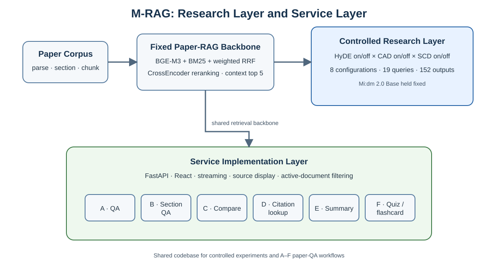
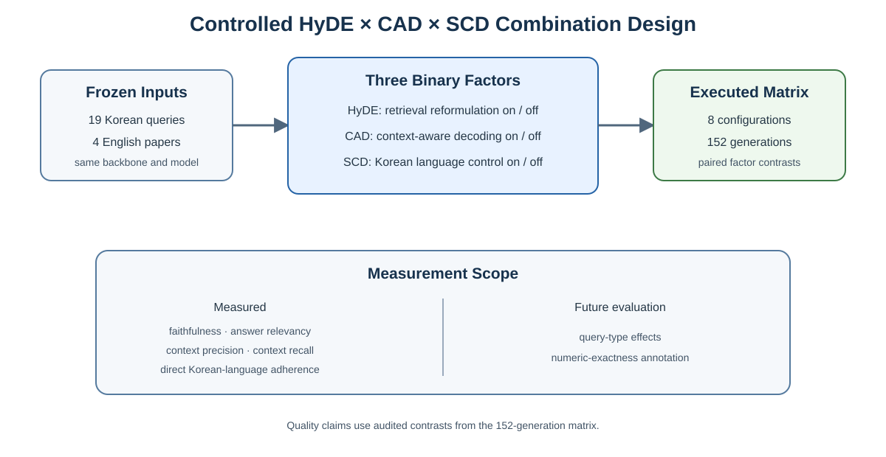

# M-RAG: 한국어 질의 기반 영문 학술논문 질의응답 시스템 구현과 HyDE × CAD × SCD 조합 평가

## 1. 초록

검색 증강 생성(Retrieval-Augmented Generation, RAG)은 외부 문서를 검색하고 그 근거에 조건화하여 답변을 생성한다. 한국어 사용자가 영어 학술논문을 질의하는 환경에서는 한국어 질의와 영어 학술 문장 사이의 표현 차이를 넘어 관련 근거를 찾아야 하며, 검색된 영어 근거에 충실하면서도 안정적인 한국어 답변을 생성해야 한다. 본 논문은 이 문제를 검색 확장, 근거 충실도 제어, 출력 언어 제어의 세 축으로 나누고, 이를 실제 논문 질의응답 시스템에 통합한 M-RAG를 제시한다.

연구 대상은 HyDE(Hypothetical Document Embeddings), CAD(Context-Aware Decoding), 한국어 대상 SCD(Soft Constrained Decoding)이다. HyDE는 가상 답변형 문서로 검색 표현을 확장하고, CAD는 문맥 조건부 분포와 무문맥 분포를 대조하며, SCD는 목표·방해·중립 토큰으로 나눈 raw logit에 언어별 계수를 적용한다. BGE-M3, BM25, 가중 RRF, CrossEncoder reranking으로 구성한 Paper-RAG backbone과 Mi:dm 2.0 Base 생성 모델을 고정하고, 세 요인의 on/off 조합 8개를 19개 질의에 적용하여 152개 답변을 생성하였다.

동일한 SCD-off 기준에서 수행한 19개 질의 대응 비교에서 HyDE의 answer relevancy 차이는 `+0.0303`(95% CI `[+0.0016, +0.0615]`)이었고, faithfulness·context precision·context recall 구간은 0을 포함했다. 검색 문맥이 19/19 완전히 같은 HyDE-off·SCD-off 비교에서 CAD의 faithfulness 차이는 `+0.0023`(95% CI `[−0.0903, +0.0952]`)으로 뚜렷한 개선이 확인되지 않았다. SCD 분석에서는 76개 대응쌍의 한국어 비율이 평균 `+0.2203` 증가했고 68쌍이 개선되었다. 한국어 비율 0.5 미만인 언어 이탈 출력은 26개에서 12개로 감소했으며, HyDE와 CAD의 네 조합 모두에서 평균 차이가 양수였다. 동일 검색 문맥을 사용한 HyDE-off 38쌍에서도 `+0.2198`이 유지되었다.

M-RAG는 FastAPI backend와 React frontend 위에 논문 업로드, hybrid retrieval, reranking, 답변 생성, 출처 표시, 스트리밍, 비교, 요약, 인용, 퀴즈 기능을 A–F 질의 경로로 구현한다. 연구용 실행 경로는 HyDE, CAD, SCD를 명시적으로 조합하고, 서비스 경로는 필요한 모듈을 선택할 수 있는 지점을 제공한다. 본 연구는 한국어 질의-영어 학술문헌 RAG에서 세 기법을 하나의 2×2×2 생성 행렬로 실행하고, 기법별 목표에 맞는 통제 대비와 직접 언어 지표로 평가한 구현 연구다.

**주제어:** 검색 증강 생성, 학술논문 질의응답, HyDE, Context-Aware Decoding, Soft Constrained Decoding, 한국어, 언어 이탈, RAGAS

## 2. 서론

학술논문은 초록, 서론, 방법, 실험, 결과, 한계, 참고문헌처럼 기능이 다른 구역으로 구성된다. 정확한 수치를 묻는 질문에는 결과 절의 근거가 필요하고, 방법론 질문에는 방법 절의 문맥이 필요하다. 문서 비교는 여러 논문에서 균형 있게 근거를 가져와야 하며, 인용 질의는 서지정보와 출처 연결을 보존해야 한다.

RAG는 외부 문서를 생성 모델에 제공하지만 검색 성공만으로 답변 품질이 보장되지는 않는다. 다국어 dense retrieval은 한국어 질의와 영어 문단의 의미를 연결할 수 있지만 숫자·약어·모델명 같은 표면 문자열을 놓칠 수 있다. Sparse retrieval은 정확한 용어에 강하지만 언어가 다른 의미 표현에는 약하다. 검색 결과가 충분해도 생성 모델은 검색 근거보다 파라미터 기억을 우선하거나 영어 문장을 그대로 이어 쓸 수 있다.

본 연구는 검색과 생성을 다음 세 요소로 분해한다.

- **HyDE:** 질의를 가상의 답변형 문서로 확장하여 영어 논문 근거 검색을 조절한다.
- **CAD:** 같은 모델의 문맥 조건부 점수와 무문맥 점수를 대조하여 근거와 무관한 생성을 억제한다.
- **SCD:** 한국어 목표 토큰, 비목표 방해 토큰, 기호 중심 중립 토큰으로 어휘를 나누고 각 raw logit에 정해진 계수를 적용한다.

논문의 연구 계층은 세 기법의 2×2×2 조합을 실행하고, 비교 조건이 통제된 대비와 기법별 목표 지표를 분석한다. 시스템 계층은 동일 코드베이스에서 논문 질의응답 기능과 모듈 선택 지점을 제공한다. 이에 따라 본 논문은 조합 실험, 결과 해석, 실제 시스템 구현을 하나의 흐름으로 다룬다.

## 3. 배경

### 3.1 검색 증강 생성

RAG는 질의 `q`에 대해 문서 집합 `D`에서 문맥 `Cq`를 검색하고, 생성 모델이 질의와 문맥에 조건화된 답변 `y`를 생성한다 [1].

```text
y = LM(q, Cq)
```

검색이 관련 근거를 놓치면 생성 모델은 그 정보를 사용할 수 없고, 검색이 성공해도 모델이 근거를 무시하면 환각이 발생할 수 있다. 따라서 검색 측 제어와 생성 측 제어를 구분해 평가해야 한다.

### 3.2 Dense·Sparse·Hybrid Retrieval

BGE-M3는 한국어 질의와 영어 문단을 공유 벡터 공간에 표현하여 다국어 의미 검색을 지원한다 [3]. BM25는 어휘 중복을 이용하므로 정확한 용어, 숫자, 약어에 강하다 [4]. 본 시스템은 두 순위의 raw score를 직접 합하지 않고 dense 0.6, BM25 0.4 가중 Reciprocal Rank Fusion을 사용한다 [5].

```text
weighted_RRF(d) = 0.6 / (k + rank_dense(d))
                + 0.4 / (k + rank_BM25(d))
```

후보 문단은 `ms-marco-MiniLM-L-6-v2` CrossEncoder로 reranking한다 [6,7].

### 3.3 HyDE

HyDE는 원 질의를 바로 embedding하는 대신 생성 모델이 만든 가상 답변형 문서를 embedding하여 관련 문서를 검색한다 [8]. 한국어 질의와 영어 학술 문장 사이의 표현 차이를 줄일 수 있지만, 가상 문서가 불필요한 개념을 추가하면 context precision이 낮아질 수 있다.

### 3.4 CAD

CAD는 문맥이 있을 때와 없을 때의 토큰 점수를 대조한다 [9].

```text
score_CAD = (1 + alpha) * logits_context - alpha * logits_no_context
```

문서가 없어도 모델이 쉽게 생성하는 토큰보다 실제 문맥에서 강해지는 토큰을 상대적으로 우선한다. 본 구현은 동일한 생성 prefix로 무문맥 분기를 매 단계 계산하는 정확성 우선 경로를 사용한다.

### 3.5 SCD와 언어 이탈

SCD는 다국어 RAG에서 출력이 근거 언어로 이동하는 language drift를 완화하는 training-free 디코딩 기법이다 [11]. 본 구현은 한국어 목표 토큰의 raw logit에 `alpha=1.1`, 비목표 방해 토큰의 raw logit에 `beta=0.9`를 곱하고, generated-token warm-up `Tstart=5`를 사용한다. 목적은 한국어 답변의 주된 서술이 불필요하게 다른 언어의 문장으로 전환되는 현상을 줄이는 것이다.

## 4. 관련 연구

Lewis 등 [1]은 검색 문서에 조건화된 생성의 기본 구조를 제시했고, RAG survey [2]는 검색·증강·생성 단계의 설계 선택을 정리했다. BGE-M3 [3], BM25 [4], RRF [5], BERT reranking [6]은 본 연구의 고정 검색 backbone을 구성한다. MS MARCO [7]는 passage reranking 계열의 대표 학습·평가 자료이며, 긴 문맥에서 중간 근거가 덜 사용되는 현상 [13]은 문맥 구성과 순서 제어의 필요성을 뒷받침한다. BERGEN [14]은 RAG 비교 평가의 재현 가능한 도구 방향을 보여준다.

HyDE [8]는 relevance label 없이 가상 문서를 이용해 dense retrieval을 개선하며, 국내 연구도 HyDE 기반 멀티홉 검색을 분석한다 [17]. CAD [9]와 contrastive decoding [10]은 생성 단계에서 분포를 대조하여 근거 외 생성을 억제하는 방향을 제시한다. 국내 Contrastive CAD 연구 [18]도 관련 생성 제어를 다룬다.

Li 등 [11]은 다국어 RAG의 language drift를 분석하고 SCD를 제안한다. 본 연구는 이를 한국어 질의-영어 논문 환경의 언어 제어 요인으로 적용한다. 생성 backbone인 Mi:dm 2.0은 한국어 중심 이중언어 모델 연구 [15]와 연결된다. RAGAS [12]는 faithfulness, answer relevancy, context precision, context recall을 자동 평가하며, 국내 자동 평가 데이터셋 생성 연구 [16]도 한국어 RAG 평가의 필요성을 다룬다. 다국어 LLM judge는 언어에 따라 신뢰성이 달라질 수 있으므로 [20], 본 연구는 동일 조건의 paired delta와 직접 측정 지표를 우선한다.

## 5. 문제 정의와 연구질문

한국어 질의 `q_ko`, 영어 논문 chunk 집합 `D_en`, 검색 문맥 `C`, 한국어 목표 답변 `y_ko`를 가정한다. 원하는 답변은 관련 근거 검색, 근거 충실성, 질문 관련성, 한국어 안정성을 만족해야 한다.

- **RQ1:** CAD와 SCD를 끈 기준 조건에서 HyDE는 종단간 RAG 품질을 어떻게 변화시키는가?
- **RQ2:** HyDE와 SCD를 끄고 검색 문맥을 동일하게 유지할 때 CAD는 답변 품질을 어떻게 변화시키는가?
- **RQ3:** 한국어 대상 SCD는 HyDE와 CAD의 포함 여부에 따라 언어 이탈을 줄이는가?
- **RQ4:** 세 요인의 결합에서 어떤 품질·언어 trade-off가 나타나는가?
- **RQ5:** 세 기법과 A–F 질의 기능은 M-RAG 코드베이스에서 어떻게 구현되는가?

HyDE와 CAD는 faithfulness, answer relevancy, context precision, context recall을 모두 보고하되 통제된 19질의 대비를 사용한다. SCD는 직접 한국어 비율과 언어 이탈률을 1차 지표로 사용하고, 동일 문맥 대칭 패널에서 faithfulness와 answer relevancy를 별도로 확인한다.

## 6. 시스템 개요



**그림 1.** M-RAG의 연구 계층과 서비스 계층. 연구 계층은 HyDE × CAD × SCD 조합을 평가하고, 서비스 계층은 A–F 논문 질의 기능을 구현한다.

연구 계층은 `experiments/`의 고정 Paper-RAG backbone, 생성 runner, RAGAS evaluator, 언어 준수 analyzer로 구성된다. 서비스 계층은 FastAPI backend와 React frontend로 논문 업로드, 텍스트 추출, chunking, vector indexing, hybrid retrieval, reranking, 답변 생성, SSE streaming, 출처 표시, 후속 질문, 인용, 비교, 요약, 퀴즈 기능을 제공한다.

문서는 parsing과 section detection을 거쳐 chunk로 분할되고 dense·sparse 색인에 저장된다. 사용자 질의는 서비스 경로가 제공하는 검색, 재정렬, 문맥 구성, 생성 단계를 거친다. 연구용 runner는 같은 모듈 구현을 사용하면서 실험에 필요한 HyDE, CAD, SCD 설정을 명시적으로 고정한다.

## 7. 고정 Paper-RAG Backbone

실험에서 변하지 않는 구성은 다음과 같다.

- Dense retrieval: BGE-M3
- Sparse retrieval: BM25
- Fusion: dense 0.6 / BM25 0.4 weighted RRF
- Reranking: `ms-marco-MiniLM-L-6-v2`
- Retrieval pool: 8
- Rerank top-n: 8
- Generation context: 5개 문단
- Generation model: `K-intelligence/Midm-2.0-Base-Instruct`
- Decoding: greedy, 최대 512 tokens

HyDE, CAD, SCD 외의 검색 방식과 생성 모델을 고정한다. 다만 품질 해석은 검색 문맥과 점수 입력 조건까지 확인된 통제 대비에 한정한다.

## 8. 조합 실험 방법



**그림 2.** 세 이진 기법의 8개 조합. 고정 입력과 backbone으로 19개 질의에 대한 152개 답변을 생성하고, 대칭 품질 분석은 이 중 HyDE-off 38개 대응쌍을 사용한다.

### 8.1 HyDE

HyDE-on에서는 한국어 질의를 영어 학술 답변 형태의 가상 문서로 확장하고, 이를 BGE-M3로 embedding한다. 이후 dense·BM25 후보, weighted RRF, CrossEncoder reranking은 HyDE-off와 동일하게 적용한다.

### 8.2 CAD

CAD는 같은 생성 prefix에 대해 문맥 조건부 logits와 무문맥 logits를 계산하고 `alpha=0.5`로 대조한다. CAD는 검색 결과를 변경하지 않고 생성 분포만 조절한다.

### 8.3 SCD

SCD는 생성 step이 `Tstart=5`에 도달한 뒤 raw logits에 다음 규칙을 적용한다.

```text
z'_i = z_i,          if generated step t < Tstart
z'_i = alpha * z_i,  if t >= Tstart and i is a Korean target token
z'_i = z_i,          if t >= Tstart and i is neutral
z'_i = beta * z_i,   if t >= Tstart and i is a non-target distractor token
```

여기서 `alpha=1.1`, `beta=0.9`이다. 공백, 문장부호, 숫자, 수식, 괄호, 인용 표시는 중립 토큰으로 처리한다. 일반 영문 기술어를 별도의 whitelist로 중립화하지 않는다. CAD와 SCD를 함께 사용할 때는 processor 순서를 고정한다.

## 9. 실험 설계

**표 1. HyDE × CAD × SCD의 2×2×2 생성 설정**

| 설정 | HyDE | CAD | SCD |
|---|---:|---:|---:|
| `hyde_off__no_decoder_control` | off | off | off |
| `hyde_off__cad_only` | off | on | off |
| `hyde_off__scd_only` | off | off | on |
| `hyde_off__cad_scd` | off | on | on |
| `hyde_on__no_decoder_control` | on | off | off |
| `hyde_on__cad_only` | on | on | off |
| `hyde_on__scd_only` | on | off | on |
| `hyde_on__cad_scd` | on | on | on |

`decoder_main_queries`는 4개 영어 논문에 대한 19개 한국어 질의로 구성된다. 8개 설정을 모두 실행하여 152개 답변과 76개 SCD on/off 대응쌍을 얻었다. Tuning 질의는 본 평가에 재사용하지 않았고, 질의를 복제해 표본 수를 늘리지 않았다.

하나의 생성 행렬에서 세 기법을 목적에 맞는 보완적 대비로 분석한다.

1. **HyDE 품질 대비:** CAD와 SCD를 끈 상태에서 HyDE on/off 19쌍을 비교한다. 검색 문맥 변화까지 포함한 종단간 HyDE 효과다.
2. **CAD 품질 대비:** HyDE와 SCD를 끈 상태에서 CAD on/off 19쌍을 비교한다. 두 조건의 검색 문맥, 검색 ID, reranking ID가 모두 일치한다.
3. **SCD 언어 대비:** 8개 설정에서 동일 질의·HyDE·CAD 조건의 SCD on/off 76쌍을 비교한다.
4. **SCD 대칭 품질 대비:** 검색 문맥이 byte 단위로 같은 HyDE-off 38쌍을 영어·한국어 패널로 정규화하고 두 judge에서 paired bootstrap을 수행한다.

## 10. 평가 방법

RAGAS 0.2.15로 faithfulness, answer relevancy, context precision, context recall을 계산한다 [12]. `gpt-4o` judge [19]로 152개 답변 전체를 점수화한 산출물에서 품질 대비에는 SCD-off 레코드만 사용하고, answer relevancy embedding은 로컬 BGE-M3를 사용한다. 전체 산출물의 608개 지표 셀은 모두 유효하다. 각 대비의 동일한 19개 질의를 200,000회 복원추출하는 paired percentile bootstrap으로 95% 신뢰구간을 계산했다. NumPy 1.26.4의 `default_rng(20260713)`이 만든 200,000×19 재표본 index 행렬 하나를 모든 지표와 대비에 재사용하고 linear quantile을 적용했다. 승·패는 차이가 각각 `+0.01` 초과, `−0.01` 미만인 경우이며 나머지는 동률이다.

SCD의 1차 지표는 LLM judge를 사용하지 않는 직접 한국어 비율이다. 답변의 한글 문자 수를 한글과 영문 알파벳 문자 수의 합으로 나누며, 비율 0.5 미만을 언어 이탈로 정의한다. SCD-on과 SCD-off를 동일 질의·HyDE·CAD 조건에서 대응시킨다.

대칭 품질 대비는 HyDE-off 38쌍의 검색 문맥 동일성을 확인한 뒤 질문, 답변, reference, context에 같은 점수 비의존 정규화 규칙을 적용한다. `gpt-4o`와 고정 `gpt-4.1-2025-04-14`를 사용하고, 19개 질의를 cluster 단위로 10,000회 paired bootstrap하여 95% 신뢰구간을 계산한다. HyDE와 CAD의 품질 결론에는 SCD-on 점수를 섞지 않고, SCD 품질은 이 대칭 대비에서 따로 판단한다.

숫자 환각률과 질의 유형별 효과는 전용 주석과 충분한 유형별 표본이 없으므로 결과 지표에 포함하지 않는다.

## 11. 실험 결과

### 11.1 HyDE와 CAD의 통제 품질 대비

**표 2. 2×2×2 생성 행렬의 HyDE·CAD 통제 대비(각 n=19)**

| 대비 | 지표 | Paired delta [95% CI] | 승/패/동률 |
|---|---|---:|---:|
| HyDE on−off<br>(CAD off, SCD off) | faithfulness | `+0.0734 [−0.0248, +0.1777]` | 9/6/4 |
|  | answer relevancy | `+0.0303 [+0.0016, +0.0615]` | 9/3/7 |
|  | context precision | `−0.0679 [−0.1702, +0.0194]` | 7/6/6 |
|  | context recall | `−0.0526 [−0.1579, 0.0000]` | 0/1/18 |
| CAD on−off<br>(HyDE off, SCD off) | faithfulness | `+0.0023 [−0.0903, +0.0952]` | 7/9/3 |
|  | answer relevancy | `−0.0715 [−0.1792, +0.0004]` | 5/12/2 |
|  | context precision | `−0.0022 [−0.0447, +0.0322]` | 2/1/16 |
|  | context recall | `−0.0526 [−0.1579, 0.0000]` | 0/1/18 |

HyDE는 CAD와 SCD를 끈 기준에서 answer relevancy를 소폭 높였고 해당 신뢰구간은 0을 포함하지 않았다. Faithfulness 평균은 양수, context precision과 recall 평균은 음수였으나 세 구간은 0을 포함하거나 상한이 0이었다. CAD는 검색 문맥을 완전히 고정한 대비에서 faithfulness 차이가 `+0.0023`에 그쳤으며 네 지표 모두 신뢰구간이 0을 포함했다. CAD가 검색 입력을 바꾸지 않는데도 나타난 context 지표 차이는 judge 평가 변동으로 보고 디코더 효과로 해석하지 않는다. 따라서 이 표본에서는 CAD의 품질 향상을 확인하지 못했다.

### 11.2 SCD의 설정별 언어 준수 결과

**표 3. 설정별 평균 한국어 비율과 언어 이탈 수**

| 설정 | 평균 한국어 비율 | 언어 이탈 수(<0.5) |
|---|---:|---:|
| `hyde_off__no_decoder_control` | 0.5088 | 8/19 |
| `hyde_off__cad_only` | 0.5175 | 8/19 |
| `hyde_off__scd_only` | 0.7069 | 4/19 |
| `hyde_off__cad_scd` | 0.7590 | 3/19 |
| `hyde_on__no_decoder_control` | 0.6023 | 3/19 |
| `hyde_on__cad_only` | 0.5099 | 7/19 |
| `hyde_on__scd_only` | 0.8035 | 2/19 |
| `hyde_on__cad_scd` | 0.7501 | 3/19 |

SCD-on minus SCD-off 평균 한국어 비율은 전체 76쌍에서 `+0.2203`이었다. 68쌍이 `+0.02`보다 크게 개선됐고, 3쌍은 `−0.02`보다 크게 감소했으며, 5쌍은 그 사이였다. 언어 이탈은 SCD-off의 26/76에서 SCD-on의 12/76로 감소했다. 기준 미만이던 26쌍 중 15쌍이 0.5 이상으로 전환됐으며, 반대 방향 전환은 1쌍이었다.

HyDE·CAD의 네 조합별 평균 차이는 각각 `+0.1981`, `+0.2415`, `+0.2012`, `+0.2402`로 모두 양수였다. HyDE-off의 38개 동일 검색 문맥 대응쌍에서도 평균 차이는 `+0.2198`이었다.

### 11.3 SCD의 대칭 품질 검증

**표 4. 동일 문맥 SCD 대응쌍의 judge·언어별 품질 차이**

| Judge | 언어 | Faithfulness delta [95% CI] | Answer relevancy delta [95% CI] |
|---|---|---:|---:|
| `gpt-4o` | 영어 | `+0.0071 [−0.0596, +0.0714]` | `−0.0910 [−0.1725, −0.0240]` |
| `gpt-4o` | 한국어 | `−0.0283 [−0.1044, +0.0510]` | `−0.0752 [−0.1501, −0.0138]` |
| `gpt-4.1-2025-04-14` | 영어 | `−0.0579 [−0.1322, +0.0060]` | `−0.0327 [−0.0851, +0.0129]` |
| `gpt-4.1-2025-04-14` | 한국어 | `−0.0326 [−0.0997, +0.0226]` | `−0.0356 [−0.1149, +0.0315]` |

Faithfulness는 네 패널 모두 신뢰구간이 0을 포함했다. Answer relevancy의 평균 방향은 네 패널 모두 음수였지만, 비영점 구간은 `gpt-4o`에서만 나타났다. 따라서 SCD의 직접 언어 제어 효과는 확인되지만, 품질 지표의 비영점 차이는 두 judge에서 반복되지 않았다.

### 11.4 세 요인의 종합 해석

HyDE의 기준 대비에서는 answer relevancy가 소폭 개선됐지만 다른 품질 지표의 방향은 확정되지 않았다. CAD의 동일 문맥 대비에서도 품질 향상은 확인되지 않았다. 반면 SCD의 한국어 비율 차이는 HyDE와 CAD의 on/off 네 조합에서 모두 양수였다. 그러므로 이 결과는 세 기법을 항상 함께 켜는 단일 설정을 지지하지 않으며, SCD는 한국어 출력이 필요한 조건에서 사용하고 HyDE와 CAD는 작업별 검증을 거쳐 선택하는 해석에 부합한다.

## 12. M-RAG 시스템 구현

M-RAG backend의 진입점은 `backend/api/main.py`이며, FastAPI endpoint가 문서·질의·사용자·인용·내보내기 기능을 제공한다. `backend/modules/`는 parsing, section detection, embedding, hybrid retrieval, reranking, HyDE, CAD, SCD, follow-up generation을 담당한다. `backend/pipelines/`는 A–F 질의 흐름을 구성한다. Frontend는 Vite, React, TypeScript를 사용하며 논문 뷰어, 채팅, 출처 탐색, 스트리밍 응답을 제공한다. 실험 runner는 평가한 SCD 공식과 매개변수를 명시적으로 전달하며, 서비스 pipeline은 경로별 HyDE·CAD·SCD 활성화 선택 지점을 제공한다.

**표 5. 현재 A–F 서비스 경로와 모듈 선택 지점**

| 경로 | 서비스 목적 | 코드에 구현된 선택 지점 |
|---|---|---|
| A | 단순 질의응답 | HyDE 선택, CAD·SCD 선택 |
| B | 절 중심 질의응답 | HyDE 선택, CAD·SCD 선택 |
| C | 문서 비교 | CAD·SCD 선택 |
| D | 인용·서지 탐색 | CAD·SCD 선택 |
| E | 구조화 요약 | CAD·SCD 선택 |
| F | 퀴즈·플래시카드 | HyDE 선택, CAD·SCD 선택 |

표 5는 현재 코드의 함수 인자와 processor 연결을 요약한 것이며, 경로별 최적 설정을 뜻하지 않는다. A–F 유형별 모듈 선택은 충분한 유형별 질의로 별도 검증할 수 있다.

## 13. 논의

HyDE 기준 대비는 answer relevancy에서 작지만 양의 차이를 보였다. Faithfulness와 context precision의 구간은 0을 포함했고 context recall 구간의 상한은 0이므로, 이 표본만으로 검색 품질 전반의 개선을 일반화할 수는 없다. HyDE on/off 문맥 변화는 질의 확장이 검색 결과를 바꾸는 종단간 효과에 해당한다.

CAD 대비는 검색 문맥이 19/19 동일했으므로 디코딩 변화에 초점을 둔다. 그러나 faithfulness를 포함한 네 지표 모두 신뢰구간이 0을 포함해 품질 개선은 확인되지 않았다. CAD는 매 토큰마다 무문맥 분기를 계산하므로 확인된 품질 이득 없이 추론 비용이 증가할 가능성도 함께 고려해야 한다.

SCD는 직접 측정한 한국어 준수율에서 가장 큰 차이를 보였고, HyDE와 CAD의 네 조합 모두에서 방향이 일관됐다. 검색 문맥이 같은 HyDE-off 38쌍에서도 비슷한 크기가 유지되어, 영어 학술 근거를 사용하는 조건에서 출력 언어를 디코딩 단계에서 조절할 수 있음을 보여준다. 숫자, 수식, 문장부호, 인용 표시는 중립으로 유지되지만 일반 영문 기술어는 별도 whitelist로 보호되지 않는다.

세 기법의 결과는 하나의 최고 설정보다 모듈별 검증의 필요성을 보여준다. SCD의 언어 제어 효과는 확인됐고, HyDE와 CAD의 품질 효과는 이 표본의 통제 대비 범위에서 해석해야 한다. M-RAG 구현은 각 기능을 독립적으로 선택할 수 있는 구조를 제공한다.

## 14. 한계와 향후 연구

첫째, 실험은 4개 영어 논문과 19개 한국어 질의에 한정되며 HyDE·CAD 품질 대비도 각각 19쌍이다. 더 다양한 학술 분야와 독립 작성 질의로 외적 타당성을 검증할 필요가 있다. 둘째, RAGAS 품질 평가는 LLM judge에 영향을 받으며, SCD 대칭 패널의 answer relevancy 구간은 judge에 따라 달랐다. 독립 제공자와 블라인드 사람 평가가 추가되면 품질 해석을 강화할 수 있다.

셋째, HyDE-on 셀에서는 설정별로 가상 문서가 다시 생성되어 CAD on/off 사이의 검색 문맥이 충분히 일치하지 않았다. 따라서 CAD 품질 결론은 문맥이 완전히 같은 HyDE-off 대비에 한정했다. 넷째, 숫자 환각률과 질의 유형별 효과는 전용 주석과 충분한 표본이 없어 측정하지 않았다. 다섯째, CAD는 무문맥 분기 계산으로 추론 비용이 증가하고 SCD는 tokenizer의 subword 구성에 영향을 받는다. 여섯째, 서비스 계층은 경로별 최적화, 다중 사용자 부하, 관측성, 배포 안정성 검증이 더 필요하다.

## 15. 결론

본 논문은 한국어 질의 기반 영문 학술논문 RAG를 위해 HyDE, CAD, SCD의 2×2×2 조합을 실행하고, 이를 M-RAG 연구·서비스 코드베이스로 구현하였다. 통제된 19개 질의 대비에서 HyDE는 answer relevancy `+0.0303`의 차이를 보였지만 다른 품질 지표의 신뢰구간은 0을 포함하거나 경계에 닿았다. 검색 문맥이 완전히 같은 CAD 대비에서는 faithfulness 차이가 `+0.0023`이었고 품질 향상은 확인되지 않았다. SCD는 76개 대응쌍에서 한국어 비율을 평균 `+0.2203` 높이고 언어 이탈 출력을 26개에서 12개로 줄였으며, HyDE와 CAD의 네 조합 모두에서 양의 평균 차이를 보였다.

SCD의 언어 준수 결과는 동일 문맥 38쌍에서도 유지됐으며, 대칭 품질 검증에서는 judge 간에 반복되는 비영점 품질 차이가 나타나지 않았다. 서비스 경로는 세 기법의 통합과 활성화 선택 지점을 제공하고, 평가한 SCD 설정은 연구 runner에서 재현한다. 본 연구는 하나의 생성 행렬에서 검증 가능한 통제 대비만 사용하여 한국어 학술문헌 RAG의 구현과 조합별 동작을 제시한다.

## 16. 참고문헌

[1] P. Lewis et al., "Retrieval-Augmented Generation for Knowledge-Intensive NLP Tasks," NeurIPS 33, 2020.

[2] Y. Gao et al., "Retrieval-Augmented Generation for Large Language Models: A Survey," arXiv:2312.10997, 2023.

[3] J. Chen et al., "M3-Embedding: Multi-Linguality, Multi-Functionality, Multi-Granularity Text Embeddings Through Self-Knowledge Distillation," Findings of ACL 2024, pp. 2318-2335, doi:10.18653/v1/2024.findings-acl.137.

[4] S. E. Robertson et al., "Okapi at TREC-3," TREC-3, 1994.

[5] G. V. Cormack, C. L. A. Clarke, and S. Büttcher, "Reciprocal Rank Fusion Outperforms Condorcet and Individual Rank Learning Methods," SIGIR 2009, pp. 758-759, doi:10.1145/1571941.1572114.

[6] R. Nogueira and K. Cho, "Passage Re-ranking with BERT," arXiv:1901.04085, 2019.

[7] P. Bajaj et al., "MS MARCO: A Human Generated Machine Reading Comprehension Dataset," arXiv:1611.09268, 2016.

[8] L. Gao et al., "Precise Zero-Shot Dense Retrieval without Relevance Labels," ACL 2023, pp. 1762-1777, doi:10.18653/v1/2023.acl-long.99.

[9] W. Shi et al., "Trusting Your Evidence: Hallucinate Less with Context-aware Decoding," NAACL 2024, pp. 783-791, doi:10.18653/v1/2024.naacl-short.69.

[10] X. L. Li et al., "Contrastive Decoding: Open-ended Text Generation as Optimization," ACL 2023, pp. 12286-12312, doi:10.18653/v1/2023.acl-long.687.

[11] B. Li, Z. Xu, and R. Xie, "Language Drift in Multilingual Retrieval-Augmented Generation: Characterization and Decoding-Time Mitigation," AAAI, vol. 40, no. 37, pp. 31519-31526, 2026, doi:10.1609/aaai.v40i37.40417.

[12] S. Es et al., "RAGAs: Automated Evaluation of Retrieval Augmented Generation," EACL 2024 System Demonstrations, pp. 150-158, doi:10.18653/v1/2024.eacl-demo.16.

[13] N. F. Liu et al., "Lost in the Middle: How Language Models Use Long Contexts," TACL, vol. 12, pp. 157-173, 2024, doi:10.1162/tacl_a_00638.

[14] D. Rau et al., "BERGEN: A Benchmarking Library for Retrieval-Augmented Generation," Findings of EMNLP 2024, pp. 7640-7663, doi:10.18653/v1/2024.findings-emnlp.449.

[15] D. Shin et al., "Mi:dm 2.0 Korea-centric Bilingual Language Models," arXiv:2601.09066, 2026.

[16] 김범석, 양진홍, "RAG 시스템 성능 평가를 위한 자동 데이터 셋 생성 프레임워크 비교 분석 연구," 한국정보전자통신기술학회 논문지, 18(2), pp. 143-154, 2025, doi:10.17661/jkiiect.2025.18.2.143.

[17] 김예은 외, "HyDE 기반 멀티 홉 검색 기법을 활용한 검색 성능 향상 방안," 경영정보학연구, 27(2), pp. 127-148, 2025, doi:10.14329/isr.2025.27.2.127.

[18] 장규식 외, "Contrastive CAD: 대형 언어 모델의 환각 완화를 위한 대조적 Context-Aware Decoding," HCLT-KACL 2024 논문집, 2024.

[19] OpenAI, "GPT-4o System Card," arXiv:2410.21276, 2024.

[20] X. Fu and W. Liu, "How Reliable is Multilingual LLM-as-a-Judge?", Findings of EMNLP 2025, pp. 11040-11053, doi:10.18653/v1/2025.findings-emnlp.587.
