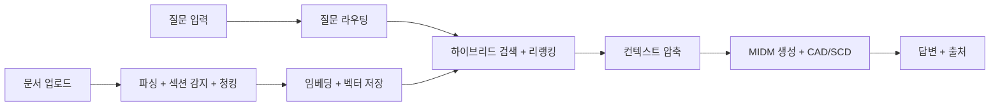

# M-RAG: PPT용 개조식 요약

> 마침표 없이, 슬라이드에 바로 붙여넣을 수 있는 톤
> 문서 기준 2026-04-26

---

## 한눈에 보는 구조

## 한 줄 소개

- 한국어 중심 학술 문서 질의응답과 환각 억제를 위해 검색과 생성 경로를 모듈화한 Modular RAG 시스템

## 해결하려는 문제

- 일반 RAG는 질문 유형이 달라도 같은 흐름으로 처리하는 경우가 많음
- 논문 질의는 섹션 기반 질문, 비교 질문, 인용 추적, 전체 요약처럼 의도가 다름
- 영어 논문을 한국어로 다룰 때 언어 이탈과 환각이 발생하기 쉬움

## 핵심 해법

- 질문 라우터가 질의 의도에 따라 A~F 파이프라인 선택
- Dense와 BM25 결합 검색
- Cross-Encoder 리랭킹 + 컨텍스트 압축
- CAD + SCD 기반 생성 제어
- 인용 추적과 퀴즈 생성까지 단일 시스템으로 연결

## 현재 실행 기준

- 로컬 기본 모델 MIDM Mini
- Base 모델은 대형 GPU 환경에서 선택형 사용
- 양자화 없이 bfloat16 + device_map=auto 사용
- 전체 로컬 실험은 master_run.py 기준 실행

## 연구와 서비스 구분

- 논문 경로는 CAD + SCD 유지가 우선
- 이번 구현에서는 외부 상용 LLM API 연동과 `vLLM` 전환을 진행하지 않음
- 이유는 현재 클레임이 CAD + SCD 기반 생성 제어에 있기 때문
- OpenAI 같은 외부 API는 연결이 쉽지만 CAD + SCD 유지에는 불리
- `vLLM` 은 아직 미구현
- 서비스 경로는 plain generation 기반 외부 추론 서버 분리를 후속 검토 가능
- `vLLM` 기반 환각 억제 RAG는 다음 단계 연구 주제로 분리 가능

## 주요 구성

- Frontend React + TypeScript + Zustand
- Backend FastAPI + SQLAlchemy + JWT
- Retrieval BGE-M3 + BM25 + RRF + Reranker
- Generation MIDM Mini 또는 Base + CAD + SCD
- Storage SQLAlchemy DB SQLite 기본 + PostgreSQL 선택 + ChromaDB + local files

## 발표에 쓰기 좋은 비교 포인트

| 항목 | 현재 기준 |
|---|---|
| 기본 로컬 모델 | MIDM Mini |
| 대형 GPU 확장 | MIDM Base 선택 사용 |
| 검색 방식 | Dense + BM25 + RRF |
| 생성 제어 | CAD + SCD |
| 실행 러너 | master_run.py |

## 산출물

- 결과 JSON 5종
- TABLES.md 요약 표
- 자동 실행 로그

## 문서 위치

- 전체 구조 README.md
- 아키텍처 docs/ARCHITECTURE.md
- 개념 설명 docs/PRESENTATION/CONCEPTS.md
- 배포 가이드 docs/USAGE/DEPLOY.md
