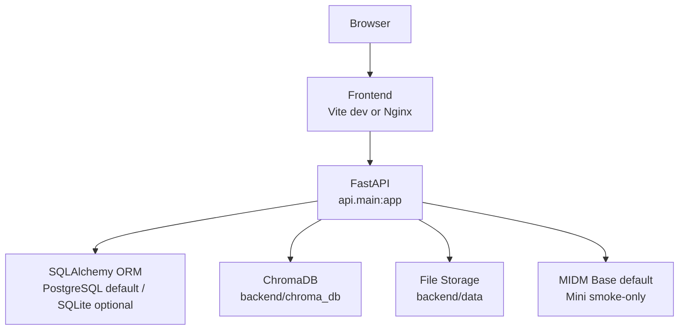

# M-RAG 배포와 실행 가이드

- 문서 기준 2026-04-27
- 현재 기준 연구용 로컬 실행과 GPU 서버 실행 절차 정리

## 배포 구조도



## 로컬 실험 흐름도


## 운영 모드

| 모드 | 기본 생성 모델 | 권장 환경 | 용도 |
|---|---|---|---|
| 로컬 연구 | Base | 24GB 이상 GPU 권장 | 논문 기준 전체 실험 실행 |
| 로컬 시연 | Base | 24GB 이상 GPU 권장 | UI와 API 시연 |
| 로컬 스모크 | Mini | 12GB급 GPU | 최소 기능 점검 |

## 연구 경로와 서비스 경로

- 연구와 논문 검증 경로에서는 현재 생성 구조를 유지
- 이 경로의 핵심은 CAD와 SCD를 포함한 생성 제어
- 따라서 이번 구현에서는 plain generation 전환이나 외부 상용 LLM API 연동, `vLLM` 전환을 진행하지 않음
- 이유는 현재 논문 클레임이 CAD와 SCD 기반 생성 제어를 전제로 하기 때문
- OpenAI 같은 외부 API는 연결이 쉽지만 CAD와 SCD 유지에는 적합하지 않음
- `vLLM` 은 아직 구현되어 있지 않음
- `vLLM` 은 추론 효율 측면의 장점이 있지만 CAD와 SCD, 특히 CAD를 유지하려면 별도 연구와 재구현이 필요
- 서비스 배포 경로에서는 plain generation 기반 외부 추론 서버 분리를 후속 선택지로 검토 가능
- 나중에 `vLLM` 을 붙인다면 먼저 plain generation 서빙 경로를 분리하고, 이후 SCD와 CAD를 단계적으로 재검토하는 순서가 안전

## 기본 원칙

- 기본 모델은 Base
- Mini 모델은 로컬 스모크 검증 전용 선택지
- 양자화는 사용하지 않음
- 전체 로컬 실험 기준 러너는 `backend/scripts/master_run.py`

## 필수 환경변수

```env
LOAD_GPU_MODELS=true
JWT_SECRET_KEY=change-this-secret
GENERATION_MODEL=K-intelligence/Midm-2.0-Base-Instruct
CORS_ALLOW_ORIGINS=http://localhost:3000,http://localhost:5173
CORS_ALLOW_CREDENTIALS=true
LOG_LEVEL=INFO
ENV=development
```

- SQLAlchemy는 유지하고 기본 DB는 PostgreSQL URL 사용
- SQLite는 로컬 임시 점검에서만 명시 전환
- 예시 `DATABASE_URL=sqlite+aiosqlite:///./mrag.db`

## 로컬 실행

### 1 의존성 설치

```powershell
cd C:\Users\KiKi\Desktop\CODE\M_RAG
python -m venv .venv
.venv\Scripts\Activate.ps1
pip install torch --index-url https://download.pytorch.org/whl/cu121
pip install -r backend\requirements.txt
cd frontend
npm ci
cd ..
```

### 2 모델 캐시

```powershell
cd C:\Users\KiKi\Desktop\CODE\M_RAG\backend
python scripts\download_models.py
python scripts\download_models.py --llm-model K-intelligence/Midm-2.0-Base-Instruct
```

### 3 개발 서버

```powershell
cd C:\Users\KiKi\Desktop\CODE\M_RAG\backend
$env:JWT_SECRET_KEY = "change-this-secret"
uvicorn api.main:app --host 0.0.0.0 --port 8000
```

```powershell
cd C:\Users\KiKi\Desktop\CODE\M_RAG\frontend
npm run dev
```

### 4 전체 실험

```powershell
cd C:\Users\KiKi\Desktop\CODE\M_RAG\backend
$env:JWT_SECRET_KEY = "change-this-secret"
$env:LOAD_GPU_MODELS = "true"
python scripts\master_run.py --skip-download
```

## Docker Compose

```powershell
docker compose up --build
```

- GPU 모델을 쓸 때는 `LOAD_GPU_MODELS=true`
- Base 모델을 쓸 때는 `GENERATION_MODEL=K-intelligence/Midm-2.0-Base-Instruct`
- Docker 실행에서도 양자화는 사용하지 않음

## RunPod 또는 원격 GPU 서버

- 무SSH Web Terminal 절차는 `RUNPOD_A100_NO_SSH.md` 우선 사용
- 컨테이너 Pull 방식은 GHCR 이미지 `ghcr.io/<github-owner-lowercase>/m-rag-backend:latest` 기준
- GHCR 패키지가 private 면 RunPod 에서 `docker login ghcr.io` 선행 필요
- GHCR 발행 워크플로우는 `.github/workflows/publish-backend-image.yml`

### 권장 설정

- GPU A100 40GB 또는 동급
- Python 3.10 이상
- HuggingFace 캐시용 별도 볼륨
- `LOAD_GPU_MODELS=true`
- 보조 실행 스크립트는 `backend/scripts/experiments/` 아래에 별도 보존
- `vLLM` 연동은 아직 구현되어 있지 않고 현재는 FastAPI + `modules/generator.py` 직접 로드 구조

### 예시

```bash
docker pull ghcr.io/<github-owner-lowercase>/m-rag-backend:latest
docker run --gpus all -p 8000:8000 \
  -e DATABASE_URL=sqlite+aiosqlite:///./mrag.db \
  -e JWT_SECRET_KEY=mrag-experiment-local-secret-2026 \
  -e GENERATION_MODEL=K-intelligence/Midm-2.0-Base-Instruct \
  -e LOAD_GPU_MODELS=true \
  -e SKIP_MIGRATIONS=true \
  ghcr.io/<github-owner-lowercase>/m-rag-backend:latest
```

## 검증 체크리스트

- `/health` 가 200 응답
- `/docs` 접근 가능
- 로그인 후 `/api/auth/me` 확인 가능
- 문서 업로드 가능
- `/api/chat/query` 응답 가능
- `backend/scripts/master_run.log` 에 완료 문구 확인
- `backend/evaluation/results/TABLES.md` 생성 확인

## 운영 메모

- stale `uvicorn` 정리는 `master_run.py` 가 먼저 시도
- 결과 파일과 실험 PDF는 삭제 전 사용자 확인 필요
- 문서 삭제와 코드 삭제는 사용자 승인 후 진행
