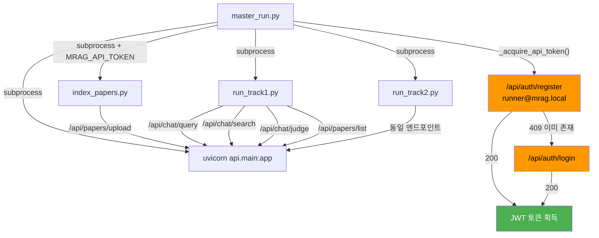

# M-RAG UX/UI 고도화 전략 v3

> 앨리스 파이프라인 영향의 비판적 분석 + 구현 계획

---
우리는 PDF/논문 기반 학습·연구 보조 서비스의 UI/UX를 설계 중이다.

핵심 전제는 다음과 같다.

1. 이 서비스의 중심은 PDF/문서 뷰어와 채팅 기반 RAG이다.
2. NotebookLM과 방향성이 일부 비슷해 보일 수 있지만, 우리는 요약/보고서 중심 서비스가 아니라 “문서 보기 경험”과 “모듈러 RAG 기반 답변 품질”을 핵심 차별점으로 둔다.
3. 사용자는 기본적으로 현재 열어 보고 있는 PDF/문서를 대상으로 질문한다.
4. 사용자가 직접 모듈 A~F를 이해하거나 선택하지 않아도, 시스템이 질문 의도에 따라 적절한 RAG 모듈을 자동 선택해야 한다.
5. UI는 단순해야 한다. 기능은 깊게 제공하되, 버튼·탭·소스 선택 UI를 과하게 늘리지 않는다.
6. PPT 내보내기가 아니라 PDF 내보내기다. 현재 PPT 내보내기처럼 구현되어 있다면 잘못된 방향이다.
7. 참고문헌, arXiv 논문, 외부 논문을 검색해 답변에 활용할 수 있어야 하며, 관련 결과나 생성된 요약/정리/참고문헌 목록은 필요 시 PDF로 내보낼 수 있어야 한다.

현재 고민은 다음과 같다.

모듈 A~F 중 A/B/C는 모듈러 RAG의 존재 이유가 명확하다.  
예를 들어 현재 문서 기반 질의응답, 섹션 특화 질의, 비교, 인용 검색처럼 질문 유형에 따라 검색 전략과 답변 품질이 달라지는 영역은 모듈러 RAG가 필요하다.

하지만 D 모듈은 애매하다.  
추적 검색 자체는 모듈러 RAG와 잘 맞지만, 후속 기능까지 고려하면 별도 기능처럼 보여야 하는지, 백엔드 모듈로만 숨어 있어야 하는지 판단이 필요하다.

E/F는 여러 소스 선택, 긴 답변, 연구 흐름 요약, 다운로드, 다시보기 같은 기능이 필요할 수 있다.  
다만 이를 별도 탭으로 분리하면 UI가 복잡해질 수 있다.  
따라서 E/F처럼 긴 결과물이 필요한 기능을 채팅 답변, 인라인 아티팩트, 전체화면 집중 모드 중 어디까지 분리해야 하는지 설계가 필요하다.

기본 UX 방향은 다음과 같다.

사용자가 PDF를 열고 채팅창에 들어오면, 시작 메시지에서 이 서비스가 할 수 있는 일을 짧게 소개한다.  
다만 A~F 모듈명을 전면에 노출하지 않는다.  
사용자는 자연어로 질문하면 되고, 시스템은 내부적으로 적절한 모듈을 선택한다.

현재 보고 있는 문서를 기본 질문 대상으로 자동 설정한다.  
소스창에 체크박스나 토글을 기본 노출하지 않는다.  
사용자가 매번 소스를 선택하게 하지 않는다.  
우리 서비스는 기본적으로 “한 논문/문서에 집중하는 RAG”이므로, 현재 열려 있는 문서를 중심 컨텍스트로 삼는다.

비교 질문, 참고문헌 검색, 외부 논문 참조처럼 추가 소스가 필요한 경우에만 시스템이 상황 기반으로 제안한다.  
예를 들어 비교 대상이 필요하면 사용자 저장소, 현재 문서의 참고문헌, arXiv/외부 검색 결과에서 후보를 찾는다.  
적절한 후보가 있으면 “이 문서도 함께 볼까요?”처럼 최소한의 선택 UI를 제공한다.  
적절한 후보가 없으면 사용자에게 필요한 최소 질문만 한다.

인용 검색 또는 참고문헌 검색 모듈에서는 핵심 논문을 찾아주고, 해당 논문을 사용자 저장소에 추가할지 물어본다.  
사용자가 저장소에 추가하면 이후 질문, 비교, 연구 흐름 정리에 활용한다.  
사용자가 저장하지 않으면 해당 논문은 현재 답변에만 임시로 사용하고 버린다.

예시 선택지는 다음 정도로 단순해야 한다.

- 이번 답변에만 사용
- 저장소에 추가
- 사용하지 않음

퀴즈 기능은 채팅창에 문제를 10~20개 한 번에 쏟아내는 방식으로 만들지 않는다.  
사용자가 “문제 만들어줘”, “복습 문제 내줘”처럼 요청하면, 채팅 안에 접고 펼칠 수 있는 인라인 아티팩트 형태로 퀴즈를 생성한다.

퀴즈 기본값은 현재 문서의 핵심 섹션을 폭넓게 반영한 10문제다.  
사용자 요청에 따라 5~20문제 범위에서 조절 가능해야 한다.  
필요하면 문제 수, 집중할 내용, 난이도 정도만 짧게 물어본다.

퀴즈 아티팩트는 토글처럼 열고 닫을 수 있어야 한다.  
닫힌 상태에서는 채팅 흐름을 방해하지 않고, 열린 상태에서는 한 문제씩 풀 수 있어야 한다.  
각 문제마다 정답/오답 판정, 해설, 관련 문서 근거 확인, LLM에게 추가 질문이 가능해야 한다.

퀴즈를 별도 상시 탭으로 분리하지 않는다.  
NotebookLM처럼 스튜디오 탭을 따로 두는 방식은 우리 서비스에는 과할 수 있다.  
우리는 퀴즈/요약 정도가 주요 부가 기능이므로, 별도 탭을 계속 노출하기보다는 채팅 안의 인라인 아티팩트로 시작하는 것이 더 적절하다.

다만 퀴즈 아티팩트를 확대하면 전체화면 집중 모드로 전환될 수 있어야 한다.  
이때 별도 탭으로 이동한다는 느낌이 아니라, 현재 흐름 안에서 자연스럽게 퀴즈 풀이에 집중하는 화면이 되어야 한다.  
집중 모드에서는 PDF 뷰어, 소스 목록, 주변 패널을 숨기고 퀴즈 풀이만 보이게 한다.  
옆에 자료가 보이지 않기 때문에 실제 공부와 복습에도 더 적합하다.

퀴즈 다시보기를 위한 별도 보관함, 히스토리 페이지, 퀴즈 관리 탭은 만들지 않는다.  
대신 채팅 스크롤바에 작은 Q 마커를 표시해 이전에 생성한 퀴즈 위치로 바로 돌아갈 수 있게 한다.

Q 마커는 기능 버튼이 아니라 위치 북마크처럼 동작해야 한다.

예:
- Q: 생성된 퀴즈 위치
- Q…: 진행 중인 퀴즈
- Q✓: 완료한 퀴즈

사용자가 Q 마커를 누르면 해당 퀴즈 아티팩트 위치로 이동한다.  
이 방식으로 별도 탭 없이도 퀴즈 재접근성을 확보한다.

요약 기능도 같은 원칙을 따른다.  
요약 결과는 길어질 가능성이 크므로 채팅창에 전부 그대로 출력하지 않는다.  
사용자가 요약을 요청하면 필요한 경우에만 간단한 설정 UI를 띄운다.

설정 항목은 최소화한다.

- 요약 범위
- 분량
- 집중할 관점

요약 결과는 마크다운 형태로 제공한다.  
채팅 안에서는 접고 펼칠 수 있는 인라인 아티팩트로 보여주고, 필요하면 전체화면 집중 모드에서 읽을 수 있게 한다.  
요약 결과는 저장하거나 PDF로 내보낼 수 있어야 한다.

요약이 모듈러 RAG의 핵심 기능인지, 단순 저장/문서화 기능인지도 검토가 필요하다.  
요약 요청이 들어왔을 때 소스 선택 UI를 띄우는 방식도 가능하지만, 기본값은 현재 보고 있는 문서 기준이어야 한다.  
추가 소스가 필요한 요약일 때만 시스템이 관련 소스를 제안한다.

후속 질문 추천은 유지한다.  
답변 아래에 후속 질문 3개를 제안하는 방식은 좋다.  
다만 모든 답변마다 퀴즈/요약 버튼을 붙이는 것은 이상하다.  
퀴즈/요약은 항상 따라붙는 기능이 아니라, 사용자의 의도가 감지될 때만 자연스럽게 등장해야 한다.

탭 구조는 기본 3탭 구조를 유지하는 방향을 우선 검토한다.  
기능별 탭을 계속 추가하지 않는다.  
소스탭을 제외한 주요 작업 탭은 한 번 더 누르면 전체화면 집중 모드로 전환되는 구조를 검토한다.  
이 집중 모드는 퀴즈, 긴 요약, 긴 비교 결과처럼 몰입해서 봐야 하는 결과물에 활용할 수 있다.

비교 질문 UX는 다음 원칙을 따른다.

기본 비교 대상은 현재 보고 있는 문서다.  
사용자가 “이 논문과 비교해줘”라고 하면 시스템이 비교 대상을 찾는다.  
비교 대상 후보는 다음 순서로 찾는다.

1. 사용자 저장소에 있는 문서
2. 현재 문서의 참고문헌
3. arXiv 또는 외부 검색 결과

비교 대상이 명확하지 않으면 최소한의 질문만 한다.  
비교 결과가 짧으면 채팅 답변으로 제공하고, 길면 인라인 아티팩트 또는 전체화면 집중 모드로 제공한다.

정리하면, 사용자는 채팅창에서 자연어로 질문한다.  
시스템은 뒤에서 모듈러 RAG를 선택한다.  
현재 문서가 기본 컨텍스트다.  
추가 소스가 필요할 때만 시스템이 제안한다.  
퀴즈와 요약은 별도 상시 탭이 아니라 채팅 안의 접고 펼칠 수 있는 인라인 아티팩트로 제공한다.  
확대하면 전체화면 집중 모드로 전환한다.  
긴 결과물은 저장하거나 PDF로 내보낼 수 있다.  
참고문헌/arXiv 검색 결과는 저장소에 추가할지 사용자가 선택한다.  
저장하지 않으면 현재 답변에만 임시로 사용한다.

이 전제를 바탕으로 다음을 설계해줘.

1. 전체 IA
2. 현재 3탭 구조의 역할
3. 채팅 중심 UX에서 모듈 A~F가 자연스럽게 작동하는 방식
4. 현재 문서 중심 소스 처리 방식
5. 추가 소스가 필요할 때의 상황 기반 UI
6. 퀴즈 생성, 풀이, 확대, 다시 접근 UX
7. 채팅 스크롤바의 Q 마커 UX
8. 요약 생성, 저장, PDF 내보내기 UX
9. 인용 검색, arXiv 검색, 참고문헌 저장 플로우
10. 비교 질문 처리 UX
11. 긴 결과물을 채팅/인라인 아티팩트/집중 모드로 나누는 기준
12. NotebookLM과 차별화되는 UX 포지셔닝
13. 기능이 많아져도 복잡해 보이지 않게 하는 설계 원칙
14. MVP에서 반드시 구현할 것과 나중으로 미룰 것

주의사항:
- PPT 내보내기가 아니라 PDF 내보내기다.
- 소스 체크박스/토글을 기본 노출하지 않는다.
- 퀴즈/요약 전용 상시 탭을 만들지 않는 방향을 우선 검토한다.
- 모든 답변에 퀴즈/요약 버튼을 붙이지 않는다.
- 모듈 A~F를 사용자가 직접 선택해야 하는 구조로 만들지 않는다.
- 현재 보고 있는 문서를 기본 컨텍스트로 사용한다.
- 외부 논문은 사용자가 저장하기 전까지 임시 컨텍스트로만 사용한다.
- UI가 복잡해지는 지점마다 더 단순한 대안을 함께 제시한다.
- 모호한 부분이 있으면 임의로 확정하지 말고, 필요한 추가 정보를 질문한다.

최종 답변은 추상적인 조언이 아니라, 실제 제품 기획자와 프론트엔드 개발자가 와이어프레임으로 옮길 수 있는 수준의 UX 설계안으로 작성해줘.

## Part 1: 앨리스 파이프라인 영향 — 코드 흐름 추적 기반 분석

### 앨리스 실행 체인 전체도



---

### 위험 포인트 5개 식별 및 분석

#### ⚠️ 위험 1: `User.last_login_at` 컬럼 추가 시 DB 마이그레이션

**코드 근거**: [database.py:79-80](file:///C:/Users/KiKi/Desktop/CODE/M_RAG/backend/api/database.py#L79-L80)
```python
async with engine.begin() as conn:
    await conn.run_sync(Base.metadata.create_all)
```

**문제**: SQLAlchemy의 `create_all`은 **기존 테이블에 새 컬럼을 추가하지 않음**. 앨리스 클라우드에 이미 `users` 테이블이 존재하면, `last_login_at` 컬럼이 생성되지 않아 `UPDATE users SET last_login_at = ...`에서 **OperationalError** 발생 가능.

**완화 전략**:
- `last_login_at`은 `nullable=True, default=None`으로 선언
- 로그인 시 `last_login_at` 갱신 로직에 try/except 추가, 컬럼 미존재 시 graceful skip
- **또는** Alembic 마이그레이션 스크립트 추가: `ALTER TABLE users ADD COLUMN last_login_at DATETIME`
- 앨리스는 매 런마다 **fresh DB**를 사용하므로 (`sqlite+aiosqlite:///./mrag.db`), 실제로는 `create_all`이 전체 테이블을 새로 생성 → **이 경우 문제 없음**
- **PostgreSQL 배포 환경에서만 위험** → Alembic 마이그레이션으로 해결

**결론**: 앨리스 런에서 **문제 없음** (fresh SQLite), 배포 시 Alembic 필요

---

#### ⚠️ 위험 2: Session 모델 추가 시 import 체인

**코드 근거**: [main.py:26-31](file:///C:/Users/KiKi/Desktop/CODE/M_RAG/backend/api/main.py#L26-L31)
```python
from api.auth import SECRET_KEY  # Fail fast when unset
from api.database import get_engine, init_db
from api.routers import auth as auth_router
from api.routers import chat, citations, history as history_router, papers
```

**문제**: `Session` 모델을 `models.py`에 추가하면, `models.py`를 import하는 **모든 모듈**에 간접 영향. 만약 `Session` 모델이 새 라이브러리를 필요로 하거나 구문 에러가 있으면 서버 자체가 기동 실패.

**완화 전략**:
- `Session` 모델은 `models.py`의 기존 패턴(SQLAlchemy Column 사용)을 정확히 따름
- 새 의존성 추가 없음
- `sessions.py` 라우터는 `main.py`에 `app.include_router(sessions.router)`로 등록
- **sessions.py에 구문 에러가 있으면 서버 기동 실패** → 반드시 `py_compile` 검증 후 커밋

**결론**: 구현 후 `py_compile` + 서버 기동 테스트 필수. 모델/라우터 패턴이 기존과 동일하므로 **정상 구현 시 문제 없음**

---

#### ⚠️ 위험 3: 30일 정리 스크립트가 `runner@mrag.local` 계정 삭제

**코드 근거**: [master_run.py:661-663](file:///C:/Users/KiKi/Desktop/CODE/M_RAG/backend/scripts/master_run.py#L661-L663)
```python
email = os.environ.get("MRAG_RUNNER_EMAIL", "runner@mrag.local")
username = os.environ.get("MRAG_RUNNER_USERNAME", "master_runner")
password = os.environ.get("MRAG_RUNNER_PASSWORD", "MragRunner!2026x")
```

**문제**: cleanup 스크립트가 `last_login_at < 30일 전`인 사용자를 삭제하면, 앨리스 실험 전에 생성된 `runner@mrag.local` 계정이 삭제될 수 있음. Paper FK CASCADE로 **인덱싱된 논문 데이터까지 모두 삭제**.

**완화 전략**:
- cleanup 스크립트에 **보호 목록(safelist)** 추가: `runner@mrag.local`은 절대 삭제하지 않음
- 또는 `--exclude-email` 옵션 제공
- 앨리스 런은 **cleanup 스크립트를 실행하지 않음** (master_run.py 15개 스텝에 cleanup 없음)
- cleanup은 **수동 실행 전용** (`python scripts/cleanup_inactive.py --execute`)

**결론**: cleanup 스크립트가 master_run과 **독립적으로** 실행되므로, 앨리스 런 중 자동 트리거 **없음**. 다만 보호 목록은 안전장치로 반드시 구현.

---

#### ⚠️ 위험 4: auth.py 로그인 엔드포인트 응답 스키마 변경

**코드 근거**: [master_run.py:679-680](file:///C:/Users/KiKi/Desktop/CODE/M_RAG/backend/scripts/master_run.py#L679-L680)
```python
data = _json.loads(resp.read().decode("utf-8"))
self.api_token = data["access_token"]
```

**문제**: `_acquire_api_token()`은 응답 JSON에서 `data["access_token"]`만 추출. 만약 auth.py 수정 시 응답 구조를 바꾸면 **KeyError로 토큰 획득 실패 → 앨리스 전체 실패**.

**완화 전략**:
- `TokenResponse` 스키마 (`access_token`, `token_type`, `user`)는 **변경하지 않음**
- `last_login_at` 갱신 로직은 로그인 **성공 후** 내부에서 수행, 응답 스키마에 영향 없음
- 회원 탈퇴 API는 **새 엔드포인트** (`DELETE /api/auth/account`) → 기존 경로 불변

**결론**: 응답 스키마를 건드리지 않으므로 **문제 없음**

---

#### ⚠️ 위험 5: conversations 라우터 추가 시 FastAPI import 에러

**코드 근거**: [main.py:144-148](file:///C:/Users/KiKi/Desktop/CODE/M_RAG/backend/api/main.py#L144-L148)
```python
app.include_router(papers.router)
app.include_router(chat.router)
app.include_router(citations.router)
app.include_router(auth_router.router)
app.include_router(history_router.router)
```

**문제**: `sessions.py` 라우터를 추가할 때 `from api.routers import sessions`를 `main.py`에 추가. 만약 `sessions.py`에 런타임 에러(잘못된 import, 존재하지 않는 모듈 참조)가 있으면 **서버 전체 기동 실패**.

**완화 전략**:
- `sessions.py`는 기존 패턴과 동일한 구조 (APIRouter, Depends, get_db)
- 구현 후 반드시 `py_compile sessions.py` + 실제 서버 기동 검증
- **git에 커밋하기 전** 반드시 `uvicorn api.main:app` 기동 확인

**결론**: 구현 후 검증 절차를 따르면 **문제 없음**

---

### 종합 판정

| 위험 | 앨리스 런 영향 | 배포 환경 영향 | 완화 필요 |
|---|---|---|---|
| DB 마이그레이션 | ❌ 없음 (fresh SQLite) | ⚠️ Alembic 필요 | Alembic 스크립트 |
| Session 모델 import | ❌ 없음 (정상 구현 시) | ❌ 없음 | py_compile 검증 |
| 30일 정리 → runner 삭제 | ❌ 없음 (master_run이 cleanup 미호출) | ⚠️ 수동 실행 시 위험 | 보호 목록 구현 |
| auth 응답 스키마 | ❌ 없음 (스키마 불변) | ❌ 없음 | 없음 |
| 라우터 import 에러 | ❌ 정상 구현 시 없음 | ❌ 정상 구현 시 없음 | 기동 테스트 |

> [!IMPORTANT]
> **앨리스 런에 대한 보증**: master_run.py가 사용하는 API 경로(`/api/auth/register`, `/api/auth/login`, `/api/papers/upload`, `/api/chat/query`, `/api/chat/search`, `/api/chat/judge`, `/api/papers/list`, `/health`)는 모두 **기존 엔드포인트를 수정하지 않는** 변경 계획입니다. 새로 추가하는 것은 `/api/sessions/*`, `/api/conversations/*`, `DELETE /api/auth/account`로, 기존 경로와 충돌하지 않습니다.

---

## Part 2: 구현 계획 (확정 사항 반영)

### 확정된 결정 사항

| 항목 | 결정 |
|---|---|
| 세션 카드 아이콘 | 논문 주제에 따라 자동 선택 |
| 기존 사용자 데이터 | 해당 없음 (미런칭) |
| 세션당 논문 수 제한 | 30편 상한 |
| 회원 탈퇴 확인 방식 | "탈퇴합니다" 텍스트 입력 |
| 30일 정리 방식 | 서버 독립 스크립트 (보호 목록 포함) |
| 비밀번호 찾기 | 보류 |
| 관리자 페이지 | 보류 |

---

### Phase 1: A-F 파이프라인 안내 + 버그 수정 (즉시)

| 파일 | 수정 내용 |
|---|---|
| [MODIFY] `ChatPanel.tsx` | 빈 상태에서 A-F 6개 기능 안내 카드 표시 (아이콘+설명+예시 질문), 클릭 시 해당 질문 전송, pdf 1개 이상 업로드 해야 보이게 해줬음 좋겠음 |
| [MODIFY] `RouteBadge.tsx` | `F` 색상 추가 (`bg-orange-100 text-orange-700 dark:bg-orange-900/30 dark:text-orange-300`) |
| [MODIFY] `FlashcardViewer.tsx` | 영어→한국어: "QUESTION"→"문제", "ANSWER"→"정답", "click to flip"→"클릭하여 뒤집기", "Flip card"→"카드 뒤집기" |
| [MODIFY] `ChatPanel.tsx` | "Export conversation"→"대화 내보내기" |
| [MODIFY] `i18n/index.ts` | 추천 질문 6개로 확장 (파이프라인별), 안내 텍스트 추가 |

---

### Phase 2: 세션 허브 페이지 (NotebookLM 스타일)

**플로우 변경**:
```
Login → SessionHub (카드 그리드)
         ├── [+ 새 세션 만들기] → 논문 업로드 → 세션 생성 → AppLayout
         └── [세션 카드 클릭] → AppLayout (해당 세션의 논문+대화 로드)
```

| 파일 | 내용 |
|---|---|
| [NEW] `backend/api/models.py` 에 `Session` 모델 추가 | `id, user_id, title, icon, collection_name, created_at, updated_at` |
| [NEW] `backend/api/routers/sessions.py` | CRUD: `GET/POST/PATCH/DELETE /api/sessions`, 논문 수 30편 제한 체크 |
| [MODIFY] `backend/api/main.py` | `app.include_router(sessions.router)` 추가 |
| [NEW] `frontend/src/components/session/SessionHub.tsx` | NotebookLM 스타일 카드 그리드 |
| [NEW] `frontend/src/components/session/CreateSessionModal.tsx` | 세션 생성: 논문 드래그 업로드 + 제목 자동생성 |
| [NEW] `frontend/src/stores/sessionStore.ts` | 세션 목록/활성 세션 관리 |
| [MODIFY] `frontend/src/App.tsx` | 인증 후 SessionHub ↔ AppLayout 전환 |
| [MODIFY] `frontend/src/components/layout/TopBar.tsx` | "세션 목록으로" 돌아가기 버튼 |

**자동 아이콘 선택 로직**: 논문 제목에서 키워드 매칭
- NLP/언어 → 📝, AI/ML → 🤖, 의학 → 🏥, 법률 → ⚖️, 기타 → 📄

---

### Phase 3: 회원 탈퇴 + 30일 정리

| 파일 | 내용 |
|---|---|
| [MODIFY] `backend/api/models.py` | `User.last_login_at = Column(DateTime, nullable=True)` |
| [MODIFY] `backend/api/routers/auth.py` | `DELETE /api/auth/account` (body: `{"confirm_text": "탈퇴합니다"}`), 로그인 시 `last_login_at` 갱신 |
| [NEW] `backend/scripts/cleanup_inactive.py` | 30일 미접속 사용자 삭제, `--dry-run`/`--execute`, `runner@mrag.local` 보호 목록 |
| [NEW] `frontend/src/components/auth/DeleteAccountModal.tsx` | "탈퇴합니다" 입력 확인 모달 |
| [MODIFY] `frontend/src/components/layout/TopBar.tsx` | 드롭다운 → 회원 탈퇴 메뉴 추가 |

---

### Phase 4: 대화 DB 영속화

| 파일 | 내용 |
|---|---|
| [NEW] `backend/api/routers/conversations.py` | `GET/POST/DELETE /api/conversations`, `GET /{id}/messages`, `POST /{id}/messages` |
| [MODIFY] `backend/api/main.py` | 라우터 등록 |
| [MODIFY] `frontend/src/stores/chatStore.ts` | API 연동: 로그인 시 fetch, 메시지 DB 저장 |

---

### 검증 절차 (모든 Phase 완료 후)

1. `py_compile` 전체 파일 (models.py, sessions.py, conversations.py, auth.py, main.py)
2. `npx tsc --noEmit` 프론트엔드 빌드
3. `uvicorn api.main:app` 서버 기동 확인
4. `local_verify.py` 실행 (8 논문 검색/생성 정상 확인)
5. 브라우저 전체 흐름 테스트 (세션 생성 → 논문 업로드 → 채팅 → A-F 파이프라인)
6. **앨리스 dry-run 시뮬레이션**: master_run.py의 step 1~5까지 로컬 실행

---

## 실행 순서

| 순서 | Phase | 예상 시간 | 의존성 |
|---|---|---|---|
| 1 | Phase 1: A-F 안내 + 버그 수정 | 20분 | 없음 |
| 2 | Phase 3: 회원 탈퇴 + 30일 정리 | 30분 | 없음 |
| 3 | Phase 2: 세션 허브 | 1.5시간 | 없음 |
| 4 | Phase 4: 대화 영속화 | 1시간 | Phase 2 |
| 5 | 전체 검증 | 30분 | Phase 1~4 |
